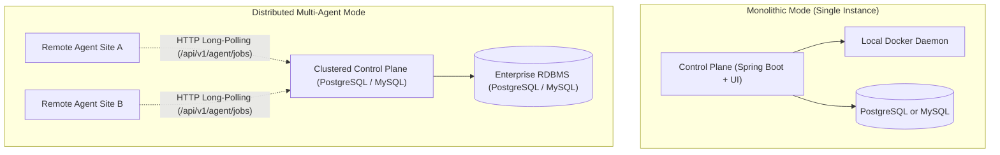

# Architecture Document — 04. Infrastructure & Deployment View

* **Project:** Vectispire — ASPM & Security Control Plane
* **Template:** `bflorat/modele-da` — Architecture Document Template (Bertrand Florat)
* **Status:** Approved · **Version:** 1.1 (2026-08-25 — engine set reconciled with ADR 0014)

---

## 1. Deployment Topology & Physical Architecture

Vectispire supports two complementary deployment topologies:

---

## 2. Database Compatibility Matrix & Flyway Migrations

**Two engines are deployable. A third is a test fixture and cannot be deployed at all** — see
[ADR 0014](../../en/decisions/0014-two-engines-and-a-test-fixture.md), which corrected a supported
set that had said four. Migrations are native SQL under
`src/main/resources/db/migration/common/` (type placeholders per engine) and
`src/main/resources/db/migration/{vendor}/`, managed by **Flyway** ([ADR
0013](../../en/decisions/0013-flyway-multi-dialect-migrations.md), amended by [ADR
0027](../../en/decisions/0027-common-migrations-with-type-placeholders.md)):

| RDBMS Engine | Min. Supported Version | Flyway Dialect | Target Usage |
|---|---|---|---|
| **PostgreSQL** | 14+ | `postgresql` | Recommended production (Enterprise Cluster) |
| **MySQL** | 8.0+ | `mysql` | Alternative production (Cloud / RDS environments) |
| **SQLite** | 3.35+ | `sqlite` | **Not deployable.** The fixture the HTTP test suite runs on: under the shipped `ddl-auto: validate` the application refuses to start, because SQLite's type affinities report a timestamp column back as FLOAT. Its migrations are maintained for the suite alone. |

### 2.1 Schema Integrity & `ddl-auto`
Hibernate's `ddl-auto` setting is strictly set to `validate`. Flyway maintains sole authority over
DDL migrations to prevent schema drift or silent data loss.

---

## 3. Host Docker Daemon Interaction & Confinement

1. **The socket is mounted into no Vectispire container** ([ADR
   0018](../../en/decisions/0018-the-docker-socket-is-never-mounted.md)). A `docker-socket-proxy`
   holds it read-only on an `internal` network shared with the control plane alone, which reaches
   the daemon through it over `DOCKER_HOST`; the agent of the `with-agent` profile has a proxy of
   its own. The proxy allows `PING`, `VERSION`, `INFO`, `CONTAINERS`, `IMAGES` and `POST`, and
   refuses everything else — `EXEC` first among them. No setting may name either proxy or the
   database as a destination: `OutboundUrlGuard` refuses both under every policy.
   The database sits on an `internal` network with the control plane alone and publishes no port,
   and the secrets reach the containers as files under `/run/secrets`, not as environment an
   inspect would return.
2. **That narrows the surface; it does not draw a boundary.** `POST /containers/create` accepts
   `Binds`, and it is the call Vectispire exists to make. Code execution inside the control plane
   can still ask for a container that mounts the host. The boundary is a second machine: a remote
   agent, with `VECTISPIRE_EMBEDDED_WORKER=false` on the control plane, so that the host which can
   be made to run containers is not the host holding `ENCRYPTION_KEY`.
3. **Ephemeral Analyzer Containers**: `ContainerRunner` instantiates isolated containers that
   terminate and self-destruct immediately after execution.

---

## 4. Remote Agent Architecture (`vectispire-agent`)

Remote agents offload scanning closer to isolated corporate network zones:

- **Network Protocol**: Outbound unidirectional communication via HTTP Long-Polling (`GET
  /api/v1/agent/jobs?wait=<seconds>`; `wait` defaults to 0, so an agent that omits it gets an
  immediate answer rather than a held connection).
- **Zero Database Dependencies**: `vectispire-agent` has zero JDBC drivers on its classpath.
- **Key Isolation**: Agent never possesses master `ENCRYPTION_KEY` ([ADR
  0003](../../en/decisions/0003-long-polling-for-agents.md)).
