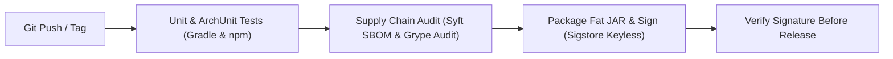

# Architecture Document — 05. Development & Operations View

* **Project:** Vectispire — ASPM & Security Control Plane
* **Template:** `bflorat/modele-da` — Architecture Document Template (Bertrand Florat)
* **Status:** Approved · **Version:** 1.0

---

## 1. Development Environment & Tech Stack

| Component | Technology & Version | Build Tool & Package Manager |
|---|---|---|
| **Backend Control Plane** | JDK 25 / Spring Boot 4.1 | Gradle (Kotlin DSL `build.gradle.kts`) |
| **Frontend Interface** | Node LTS 24 / Angular 21 | npm Workspaces (`package.json` pinned `.nvmrc`) |
| **UI Components** | Optimus UI / Vanilla CSS | Tailwind CSS (Strict confirmations) |
| **Architecture Tests** | ArchUnit 1.3 | Gradle `:vectispire-core:test` |
| **Integration Testing** | Testcontainers — PostgreSQL, MySQL, SQLite fixture | `./gradlew integrationTestAll` |

---

## 2. Architectural Constraints & Automated Validation

### 2.1 Layer Coupling Rules (ArchUnit)
Layer isolation is strictly enforced by ArchUnit in `ArchitectureTest`:
```
domain  ◄──  scanning  ◄──  persistence  ◄──  repositories  ◄──  services  ◄──  api
```
- **Rule 1**: Domain layer must never import Spring framework classes.
- **Rule 2**: Services must not execute raw SQL queries.
- **Rule 3**: `vectispire-agent` module must never include JDBC dependencies on its classpath.

---

## 3. Continuous Integration Pipeline (CI/CD) & Supply Chain Security

The pipeline is [`.github/workflows/`](../../../../.github/workflows/) — `ci.yml`, `nightly.yml`
and `release.yml` — on GitHub, repository `asmolabs/vectispire`. The history is worth a sentence
because it explains the shape: the checks were first written as GitHub Actions while the only
remote was GitLab, so **none of them had ever run**, which the audit of 2026-08-25 established.
They were then rewritten as `.gitlab-ci.yml` to run somewhere, and
rewritten a second time when the project moved to GitHub — a rewrite each way rather than a
translation, because the Docker-in-Docker constraints invert with the daemon's location. The
GitLab file is kept until GitHub's pipeline has been green through a full cycle including a tag,
and it is not maintained.

The pipeline executes the following verification steps:



1. **Supply Chain Audit (`supply-chain`)**: Syft builds an SBOM of the shipped JAR. Grype verifies
   zero fixable High vulnerabilities.
2. **Cryptographic Sigstore Signing**: Releases triggered by `v*` tags are signed keyless with
   Sigstore, and the signature is automatically verified before publishing
   ([AGENTS.md](../../../../AGENTS.md)).

---

## 4. Operational Runbooks & Maintenance Commands

### 4.1 Local Backend Execution Command
```bash
export VECTISPIRE_DB_URL="jdbc:mysql://localhost:3306/vectispire"
export VECTISPIRE_DB_USER="vectispire"
export VECTISPIRE_DB_PASSWORD="vectispire"
# Generated, not copied: a runbook that hands out a fixed key teaches the habit of using one,
# and `docker-compose.yml` already refuses to start without one of your own.
export ENCRYPTION_KEY="$(openssl rand -base64 32)"
export VECTISPIRE_BOOTSTRAP_USERNAME="admin"
export VECTISPIRE_BOOTSTRAP_PASSWORD="AdminVectispire2026!"
cd vectispire-java && ./gradlew :vectispire-core:bootRun
```

### 4.2 Angular Frontend Dev Server
```bash
npm run start --workspace @vectispire/frontend
```

### 4.3 Multi-Engine Integration Campaign
```bash
cd vectispire-java && ./gradlew integrationTestAll
```
*(Validates control plane behavior across PostgreSQL and MySQL, with SQLite as the test fixture).*
