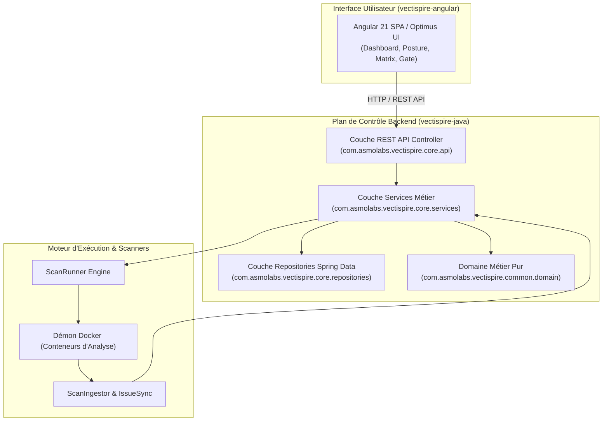

# Dossier d'Architecture — 01. Vue Applicative

* **Projet :** Vectispire — ASPM & Control Plane de Sécurité
* **Modèle :** `bflorat/modele-da` — Modèle de Dossier d'Architecture (Bertrand Florat)
* **Statut :** Validé · **Version :** 1.0

---

## 1. Description Générale & Périmètre Applicatif

Vectispire est une plateforme d'**Application Security Posture Management (ASPM)** et d'attestation de conformité. Son rôle est de surveiller de manière continue la sécurité applicative de cibles (dépôts Git et images de conteneurs Docker), d'agréger les résultats issus de multiples scanners (SCA, Secrets, IaC, SAST) et de suivre les vulnérabilités d'un scan à l'autre sous forme de **backlog réconcilié**.

### 1.1 Objectifs Fonctionnels Majeurs
1. **Inventaire SBOM & Analyse de Vulnérabilités (SCA)** : Détection des paquets obsolètes et vulnérables via Syft & Grype.
2. **Détection Multi-Moteurs de Secrets** : Détection couplée via Gitleaks et Betterleaks avec déduplication par emplacement `(filePath + line)`.
3. **Analyse IaC & SAST** : Analyse de la configuration d'infrastructure (Checkov) et du code source (Semgrep).
4. **Qualité de Code & Revue IA** : Évaluation de la dette technique et intégration d'un module de revue de code assistée par IA (Ollama local).
5. **Quality Gate & Attestation CI/CD** : Moteur de décision déterministe (`POST /api/v1/gate`) évaluant le passage des builds.
6. **Conformité Réglementaire** : Matrices de conformité globales et par dépôt pour NIS 2, DORA, ISO 27001 et PCI-DSS.

---

## 2. Découpage en Composants Applicatifs



### 2.1 Modules Applicatifs Principaux

- **`vectispire-core`** : Backend principal Spring Boot 4.1 contenant les API REST, la logique métier, la gestion des baux de leadership, les tâches cron et le scellement d'audit.
- **`vectispire-common`** : Bibliothèque partagée contenant les modèles de domaine purs (`Finding`, `Issue`, `ScanArtifacts`), les algorithmes d'empreinte (`IssueFingerprint`) et le moteur `ScanRunner`.
- **`vectispire-agent`** : Agent distant autonome léger communiquant exclusivement via HTTP Long-Polling.
- **`vectispire-angular`** : Frontend Single Page Application développé en Angular 21 et Optimus UI.

---

## 3. Modèle de Données & Rapprochement (Finding vs Issue)

Une règle fondamentale régit le modèle de données de Vectispire :

```
Finding (Constat brut d'un scan)  ──►  Empreinte SHA-256  ──►  Issue (Cycle de vie réconcilié)
```

- **`Finding` (Constat)** : Élément renvoyé par un scanner lors d'un scan donné. Immuable et éphémère.
- **`Issue` (Problème suivi)** : Problème persistant à travers les scans. Il conserve sa date de première détection (`first_seen`), le nombre d'apparitions (`times_seen`), son statut (`OPEN`/`RESOLVED`) et l'historique des qualifications VEX (`NOT_AFFECTED`, `IN_TRIAGE`).

### 3.1 Calcul de l'Empreinte (`IssueFingerprint`)
L'empreinte déterministe qui identifie une `Issue` est calculée par :
```
sha256( target_id + type + rule_or_cve_id + purl_or_package + file_path )
```

---

## 4. Interfaces & Flux de Communication

1. **API REST Interne (`/api/v1/*`)** : Échange JSON entre le frontend Angular et Spring Boot.
2. **Interface Quality Gate (`POST /api/v1/gate`)** : Endpoint dédié aux pipelines CI/CD retournant le verdict de conformité.
3. **Protocol Long-Polling Agent (`GET /api/v1/agents/jobs?wait=30`)** : Canal d'échange entre les agents distants et le plan de contrôle.
