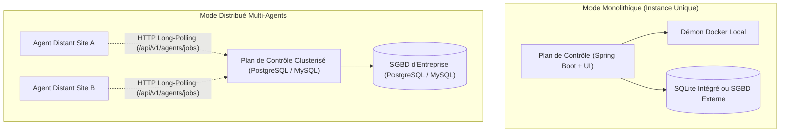

# Dossier d'Architecture — 04. Vue Infrastructure & Déploiement

* **Projet :** Vectispire — ASPM & Control Plane de Sécurité
* **Modèle :** `bflorat/modele-da` — Modèle de Dossier d'Architecture (Bertrand Florat)
* **Statut :** Validé · **Version :** 1.0

---

## 1. Topologie de Déploiement & Architecture Physique

Vectispire prend en charge deux topologies de déploiement complémentaires :

---

## 2. Matrice de Compatibilité SGBD & Migrations Flyway

Vectispire prend en charge 2 moteurs de bases de données relationnelles avec des scripts SQL natifs
par dialecte (`src/main/resources/db/migration/{vendor}/`) gérés par **Flyway** ([ADR
0013](../../fr/decisions/0013-flyway-multi-dialect-migrations.md)) :

| Moteur de SGBD | Version Min. Supportée | Dialecte Flyway | Usage Cible |
|---|---|---|---|
| **PostgreSQL** | 14+ | `postgresql` | Production recommandée (Cluster d'Entreprise) |
| **MySQL** | 8.0+ | `mysql` | Production alternative (Environnements Cloud / RDS) |
| **SQLite** | 3.35+ | `sqlite` | Démonstrations, évaluation locale et mode embarqué autonome |

### 2.1 Intégrité du Schéma & `ddl-auto`
Le paramètre Hibernate `ddl-auto` est obligatoirement maintenu à `validate`. Seul Flyway détient
l'autorité sur le schéma DDL pour prévenir toute divergence ou perte silencieuse de données.

---

## 3. Interaction avec le Démon Docker & Confinement

1. **Montage du Socket Docker (`/var/run/docker.sock`)** : Seul le plan de contrôle (ou le processus
   agent) communique avec le démon Docker via le socket hôte.
2. **Conteneurs d'Analyse Éphémères** : `ContainerRunner` instancie des conteneurs isolés qui
   s'arrêtent et se détruisent immédiatement après le traitement.

---

## 4. Architecture des Agents Distants (`vectispire-agent`)

L'agent distant permet de déporter le scan au plus près des réseaux d'entreprise isolés :

- **Canal Réseau** : Communication unidirectionnelle sortante via HTTP Long-Polling (`GET
  /api/v1/agents/jobs?wait=30`).
- **Aucune dépendance DB** : `vectispire-agent` ne possède aucun composant JDBC sur son classpath.
- **Sécurité des clés** : L'agent ne détient jamais la clé maître `ENCRYPTION_KEY` ([ADR
  0003](../../fr/decisions/0003-long-polling-for-agents.md)).
