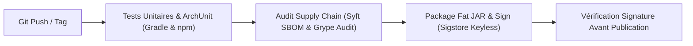

# Dossier d'Architecture — 05. Vue Développement & Exploitation

* **Projet :** Vectispire — ASPM & Control Plane de Sécurité
* **Modèle :** `bflorat/modele-da` — Modèle de Dossier d'Architecture (Bertrand Florat)
* **Statut :** Validé · **Version :** 1.0

---

## 1. Environnement de Développement & Stack Technique

| Composant | Technologie & Version | Outil de Build & Gestionnaire |
|---|---|---|
| **Backend Control Plane** | JDK 25 / Spring Boot 4.1 | Gradle (Kotlin DSL `build.gradle.kts`) |
| **Frontend Interface** | Node LTS 24 / Angular 21 | npm Workspaces (`package.json` pinned `.nvmrc`) |
| **Composants UI** | Optimus UI / Vanilla CSS | Tailwind CSS (Strict confirmations) |
| **Tests d'Architecture** | ArchUnit 1.3 | Gradle `:vectispire-core:test` |
| **Tests d'Intégration** | Testcontainers (4 SGBD) | `./gradlew integrationTestAll` |

---

## 2. Contraintes d'Architecture & Validation Automatisée

### 2.1 Couplage Inter-Couches (ArchUnit)
L'isolation des couches d'architecture est vérifiée automatiquement par ArchUnit dans
`ArchitectureTest` :
```
domain  ◄──  scanning  ◄──  persistence  ◄──  repositories  ◄──  services  ◄──  api
```
- **Règle 1** : Une couche de domaine ne doit jamais importer de classes Spring.
- **Règle 2** : Un service ne doit pas exécuter de SQL brut.
- **Règle 3** : Le module `vectispire-agent` ne doit jamais inclure de dépendances JDBC sur son
  classpath.

---

## 3. Chaîne d'Intégration Continue (CI/CD) & Sécurité Supply Chain

Le pipeline d'intégration continue exécute automatiquement les étapes de validation suivantes :



1. **Audit de la Supply Chain (`supply-chain`)** : Syft construit un SBOM du JAR produit. Grype
   vérifie l'absence de vulnérabilités High fixables.
2. **Signature Cryptographique Sigstore** : Les releases publiées lors des tags `v*` sont signées
   sans clé avec Sigstore, et la signature est vérifiée automatiquement avant toute publication
   ([AGENTS.md](../../../../AGENTS.md)).

---

## 4. Procédures d'Exploitation & Maintenance

### 4.1 Script de Lancement Local Backend & Database
```bash
export VECTISPIRE_DB_URL="jdbc:mysql://localhost:3306/vectispire"
export VECTISPIRE_DB_USER="vectispire"
export VECTISPIRE_DB_PASSWORD="vectispire"
export ENCRYPTION_KEY="dGVzdC1lbmNyeXB0aW9uLWtleS0zMi1ieXRlcyEh"
export VECTISPIRE_BOOTSTRAP_USERNAME="admin"
export VECTISPIRE_BOOTSTRAP_PASSWORD="AdminVectispire2026!"
cd vectispire-java && ./gradlew :vectispire-core:bootRun
```

### 4.2 Lancement du Frontend Angular
```bash
npm run start --workspace @vectispire/frontend
```

### 4.3 Validation Complète Multi-Engines (Campagne d'Intégration)
```bash
cd vectispire-java && ./gradlew integrationTestAll
```
*(Valide le comportement du plan de contrôle sur PostgreSQL et MySQL, avec SQLite comme fixture de
test).*
