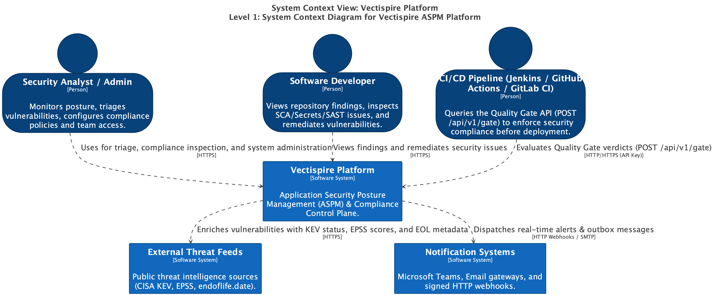
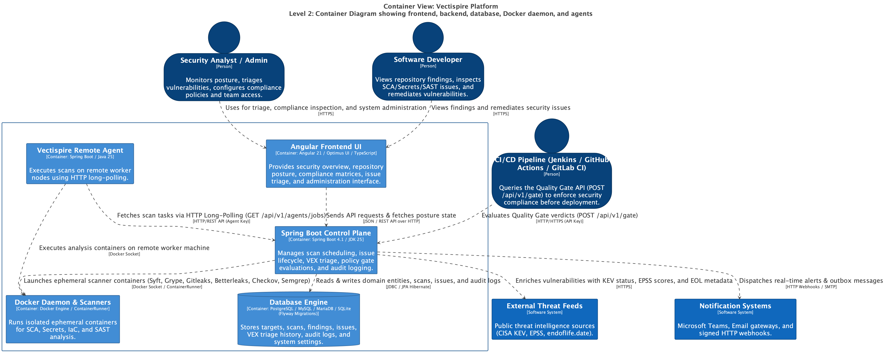
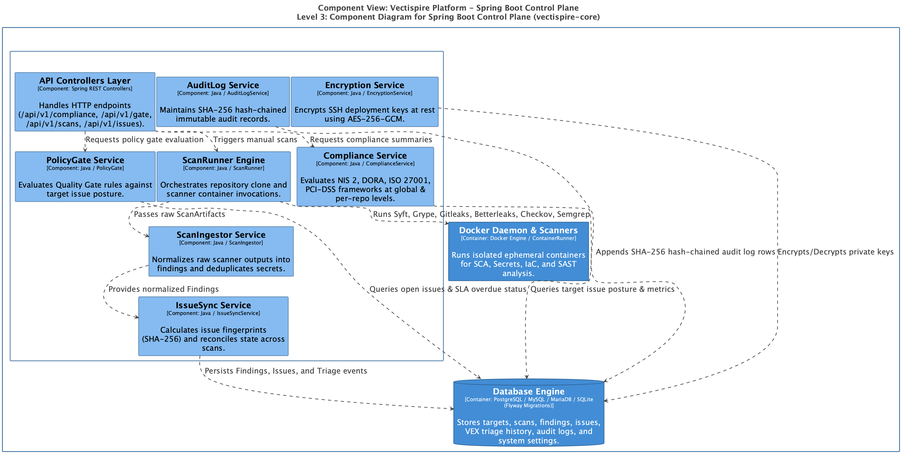

# Modélisation C4 & Diagrammes Structurizr DSL (Génération PNG)

Ce répertoire contient la définition d'architecture système au format **Structurizr DSL** ([`workspace.dsl`](workspace.dsl)) ainsi que les diagrammes PNG exportés automatiquement.

---

## 🖼️ Diagrammes Générés (PNG)

### 1. Niveau 1 : Contexte Système (*System Context*)


---

### 2. Niveau 2 : Conteneurs (*Containers*)


---

### 3. Niveau 3 : Composants Backend (*Components*)


---

## ⚡ Générer / Re-générer les PNG de la build

Pour régénérer automatiquement l'ensemble des diagrammes PNG à partir du modèle `workspace.dsl`, lancez simplement la commande suivante :

```bash
npm run c4:generate
```

*(Ou en exécutant le script [`scripts/generate-c4-diagrams.sh`](../../../scripts/generate-c4-diagrams.sh)).*

### 🎨 Visualiser les diagrammes interactifs avec Structurizr Lite :

```bash
docker run --rm -it -p 8080:8080 -v $(pwd)/docs/architecture/c4:/structurizr structurizr/lite
```
Puis ouvrez votre navigateur sur **`http://localhost:8080`**.
