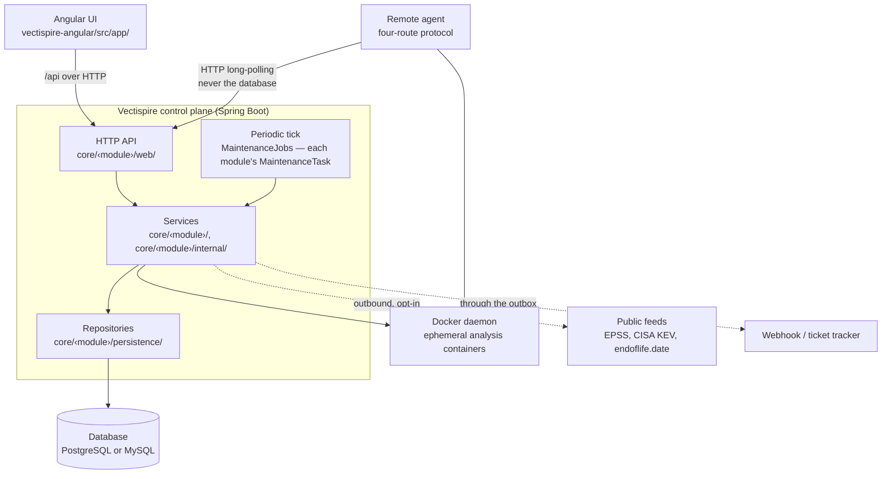
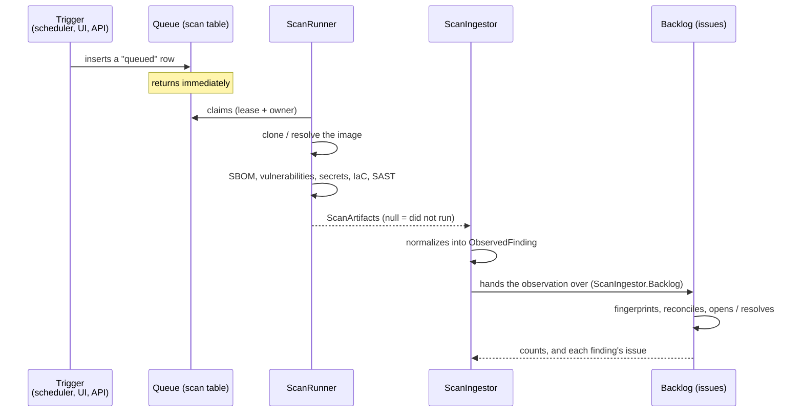

# 01 — Overview

## What Vectispire does

Vectispire watches the security of a set of **targets** — Git repositories and container images — by
periodically putting them through a battery of analyzers, and tracks what it finds **from one scan
to the next**.

That last point is what separates it from a script that runs Grype in CI. A scanner returns a list;
Vectispire returns a **backlog**: what appeared, what was triaged and by whom, what has been sitting
there for six scans, what has gone away. A report says what exists today; a backlog says what
changed, which is the only information anyone acts on.

Targets are scanned one by one, but organisations read them by product: a **solution** holds
**projects**, and a project references the repositories that make it up — each repository in at
most one project, and "no project" treated as a group of its own
([0023](decisions/0023-solutions-projects-and-repositories.md)). A grant may name a project, and
per-project figures are computed over the repositories the reader may see.

The second use is the **compliance verdict**: `POST /api/v1/gate` tells a build pipeline whether a
target passes, according to an explicit policy. This is where Vectispire stops being a dashboard and
becomes a decision.

Three principles shape everything else.

**Everything is local.** The analyzers run in ephemeral containers on the same machine, with the
network cut off when the tool has nothing to fetch. No source code leaves. This is not a constraint
endured: it is what makes the tool deployable where application security is actually a question, and
it is why the Semgrep rules are bundled rather than downloaded ([decision
0006](decisions/0006-semgrep-rules-written-here.md)).

**The default deployment is one process and one file.** A single `docker run` and the tool is up.
Everything distributed — several instances, remote agents, a server engine — is possible, and
refused at startup when the configuration does not allow it ([04](04-runtime-and-deployment.md)).

**What was not observed is not clean.** An analyzer that crashes has found nothing, and mistaking
its silence for an empty result declares the target fixed. This distinction runs through the whole
codebase ([decision 0007](decisions/0007-none-is-not-an-empty-list.md)).

## The pieces



**Two artifacts, one API.** A Spring Boot backend and an Angular front end; the browser now talks to
the same HTTP API that a CI pipeline or a remote agent talks to.

### Modules, and the layers inside them

The control plane is packaged as **vertical modules, one per domain** (decisions
[0028](decisions/0028-vertical-modules.md) and [0029](decisions/0029-core-domains-become-modules.md)):
the foundation (`settings`, `outbound`, `crypto`, `audit`, `outbox`, `reporting`, `maintenance`),
the core domains `targets`, `scanning` and `issues`, and `access`, `agents`, `ai`, `compliance`,
`exports`, `gate`, `inventory`, `notifications`, `posture`, `rules`, `siem`, `threatintel`, `tickets`
— with `platform` on top, the shell that composes several domains for the settings screen and holds
the foundation's routes. Each is a package of its own:

```
core/<module>/               its API: the services other modules call, their views, its events
core/<module>/web/           its controllers
core/<module>/internal/      how the API is built
core/<module>/persistence/   its entities and its repositories
```

The packages by layer — `core/api/`, `core/services/`, `core/repositories/`, `core/persistence/` —
are gone; `core/config/` (the datasource, the engines' setup, the JSON mapper, the schedulers) is the
one package outside a module. The layers hold inside each module:

```
web/ ──► module root + internal/ ──► persistence/ ──► database
                   │                      │
                   └──────────┬───────────┘
                              ▼
                           domain/          (pure, depends on nothing)
```

One rule, and it is what makes the whole thing testable: **a layer only knows the one below it.**
A controller calls its module's API, never its `internal` or `persistence` package; a module reaches
another only through that module's root, or one of the three named interfaces the migration
declared (`access`'s route markers and principal, and the query records of `scanning` and `issues`).
The domains depend on each other in one direction, over the foundation every domain may use, and each
module's `package-info` lists what it may use. **Spring Modulith verifies the boundaries and fails the
build** — a cycle between modules, a reach into another module's internals, a dependency the list does
not carry ([decision 0030](decisions/0030-modulith-verifies-the-module-boundaries.md)); `ArchitectureTest`
keeps the layers inside each module. What Modulith sees is [05](05-modularity.md).

## The path of a scan



### The analyzers

| Step | Tool | Network | Produces |
|---|---|---|---|
| SBOM | `anchore/syft` | open (registry, daemon) | component inventory |
| Vulnerabilities | `anchore/grype` | open (vulnerability database) | `vulnerability` findings |
| Secrets | `gitleaks` | **cut off** | `secret` findings |
| IaC | `bridgecrew/checkov` | **cut off** | `iac` findings |
| Source code | `semgrep/semgrep` | **cut off** | `sast` and `quality` findings |
| Licenses | *(none)* | — | derived from the SBOM |
| End of life | endoflife.date | outbound, opt-in | `eol` findings |
| AI review | local Ollama | local, opt-in | `ai_review` findings |
