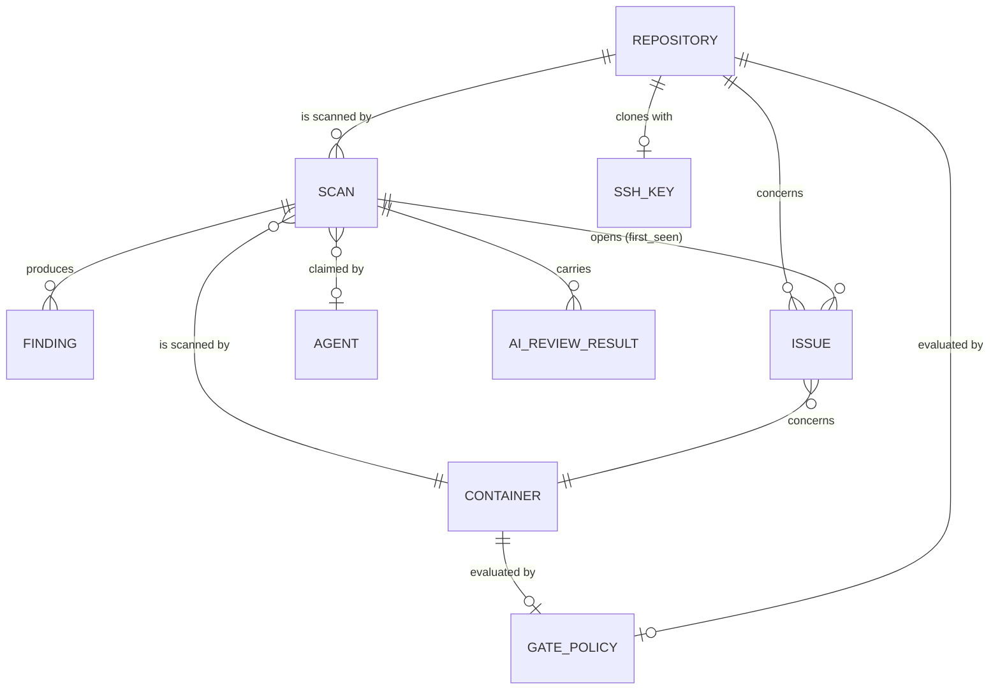
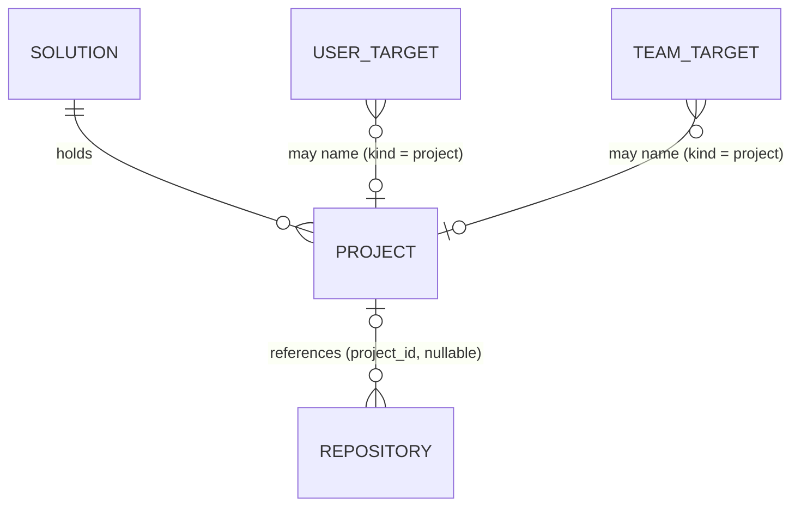
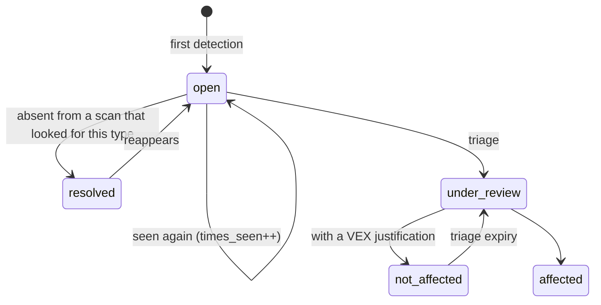

# 02 — Data model

## The distinction everything rests on: finding and issue

This is the one thing to understand before touching this schema.

- A **`Finding`** is what an analyzer said, during **one** scan. It is immutable and disposable.
  Re-running the scan produces a new one.
- An **`Issue`** is the same problem **tracked across scans**. It has a first detection, a
  times-seen counter, a state, a triage decision and its author.



**The diagram is a deliberate subset: eleven tables of forty-one.** It shows the scan path,
because that is the part whose shape has to be understood before the schema can be touched. The rest
— ticketing, the API inventory, threat intelligence, SIEM configuration, sessions, settings, the
audit log — hangs off it without changing it. `SchemaParityIntegrationTest` is what keeps the count
honest, and it once asserted twenty-six against a tree of thirty-three: an exact number in a
document is a number nobody updates.

## Solutions, projects, and what a grant names



A repository belongs to **at most one** project, through a nullable `t_repository.project_id`
rather than a link table, so that a figure adds up to one project without double counting
([0023](decisions/0023-solutions-projects-and-repositories.md)). Existing repositories start with
no project; nothing is inferred. Deleting a project sets its repositories back to no project and
revokes its grants; a solution is deleted only when it holds no project.

Grants live in `t_user_target` and `t_team_target` as `(target_kind, target_id)`, and the kind may
be `repository`, `container` or `project` — never a solution. A project grant is not copied into
repository grants: `VisibilityService` resolves it into the project's repositories **at each
request**, so the `Visibility` every query receives is still a set of targets.

## The fingerprint

An issue's identity across scans, computed by `buildFingerprint`:

```
sha256( target, type, identifier, purl-or-package-name, file-path )
```

## An issue's life cycle



## The migrations

Managed by Flyway under `vectispire-java/vectispire-core/src/main/resources/db/migration/`: native
SQL, read from `common/` and then from the engine's own directory (`postgresql`, `mysql`, `sqlite`).
From V40 on, a migration that differs only by column types is written once in `common/` with the
type placeholders `MigrationDialect` spells per engine; one whose structure diverges is written per
engine ([ADR 0027](decisions/0027-common-migrations-with-type-placeholders.md)).
