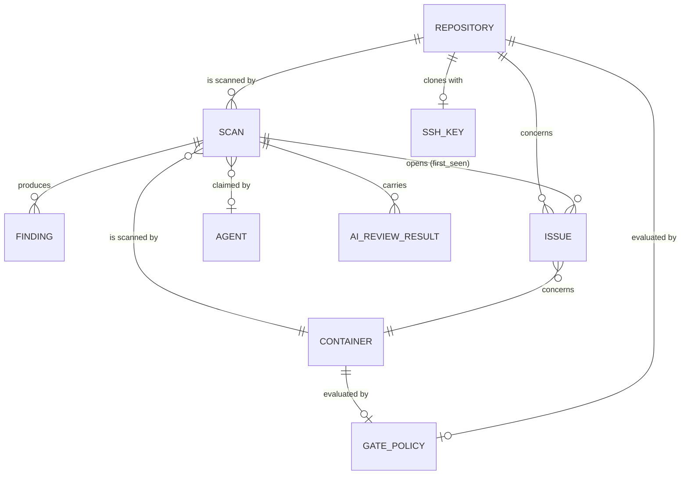
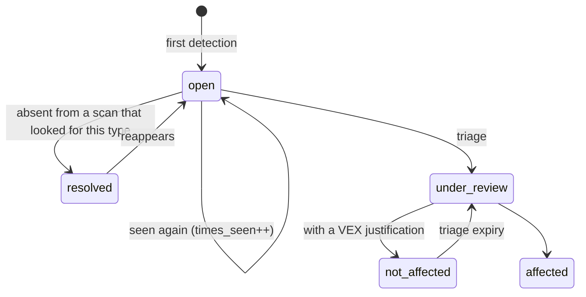

# 02 — Data model

## The distinction everything rests on: finding and issue

This is the one thing to understand before touching this schema.

- A **`Finding`** is what an analyzer said, during **one** scan. It is immutable and disposable. Re-running the scan produces a new one.
- An **`Issue`** is the same problem **tracked across scans**. It has a first detection, a times-seen counter, a state, a triage decision and its author.



## The fingerprint

An issue's identity across scans, computed by `buildFingerprint`:

```
sha256( target, type, identifier, purl-or-package-name, file-path )
```

## An issue's life cycle



## The migrations

Managed by Flyway under `vectispire-java/vectispire-core/src/main/resources/db/migration/{vendor}/` (`postgresql`, `mysql`, `sqlite`), with dialect-specific native SQL scripts ensuring complete fidelity on each database engine.
