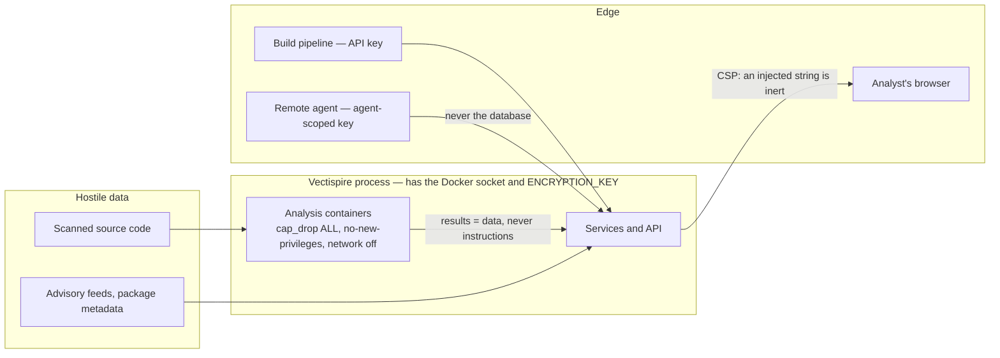

# 03 — Security

Vectispire is a security tool, which does not make it secure: it makes it **interesting to attack**. It holds deployment keys, it has the Docker socket, it displays strings produced by hostile code, and it returns a verdict someone has an interest in making lie.

## Assets and Assets Protection

| Asset | Where | Consequence of a leak |
|---|---|---|
| SSH deployment keys | `ssh_key`, AES-GCM encrypted | read access to every watched repository |
| `ENCRYPTION_KEY` | environment, or a file it names | decrypts **all** the keys above |
| Access to the Docker socket | process | root-equivalent on the host |
| The gate verdict | `issue`, `gate_policy` | a build that should have failed passes |
| Raw gitleaks reports | `scan.cves`, purged | **secrets in clear text** |
| Audit log | `audit_log`, chained | erases history |

## Trust boundaries

