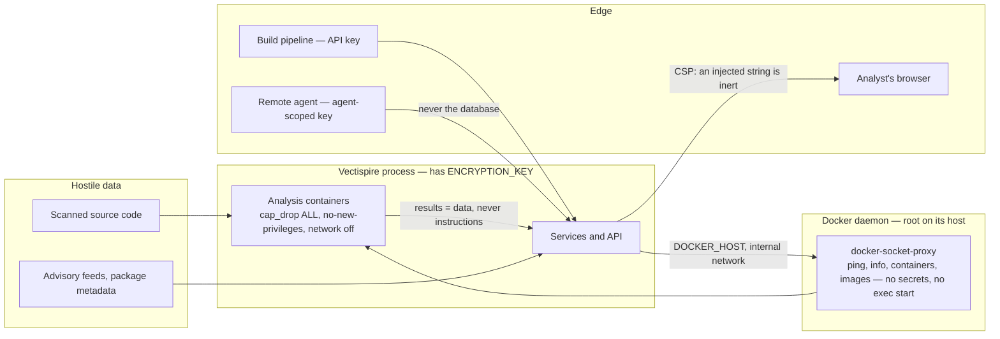

# 03 — Security

> The formal analysis is separate and longer: the
> **[STRIDE threat model](../security/en/STRIDE_THREAT_MODEL.en.md)** walks each category with the
> control that answers it. This page is the shape of the problem; that one is the enumeration.

Vectispire is a security tool, which does not make it secure: it makes it **interesting to attack**.
It holds deployment keys, it reaches a Docker daemon, it displays strings produced by hostile code,
and it returns a verdict someone has an interest in making lie.

## Assets and Assets Protection

| Asset | Where | Consequence of a leak |
|---|---|---|
| SSH deployment keys | `ssh_key`, AES-GCM encrypted | read access to every watched repository |
| `ENCRYPTION_KEY` | environment, or a file it names | decrypts **all** the keys above |
| Access to the Docker daemon | through `docker-socket-proxy`, never the socket file ([0018](decisions/0018-the-docker-socket-is-never-mounted.md)) | root-equivalent on the host that runs it |
| The gate verdict | `issue`, `gate_policy` | a build that should have failed passes |
| Raw gitleaks reports | `scan.cves`, purged | **secrets in clear text** |
| Audit log | `audit_log`, chained | erases history |

## Trust boundaries

## Who sees what

Every read that names a target is narrowed by a `Visibility`, resolved once per request by
`VisibilityService`: everything for an administrator or a role with a global scope, otherwise the
**union** of what the account was granted directly and what its teams were granted, **intersected**
with the credential's own restriction. A grant names a repository, an image or a **project**; a
project grant is resolved at that moment into the repositories filed in the project
([0023](decisions/0023-solutions-projects-and-repositories.md)), so filing a repository into a
project grants it at once to the project's holders, and moving it out revokes it at once — the audit
entry for the move says so. What reaches the queries is still a set of targets, and a target the
reader may not see answers 404, exactly like one that does not exist.

## Three boundaries worth naming separately

**The daemon is the one that is narrowed rather than closed.** No Vectispire container mounts
`/var/run/docker.sock`; a proxy holds it and allows the six API groups Vectispire calls. But
`POST /containers/create` accepts `Binds`, and it is the call the product exists to make — so code
execution inside the control plane can still reach the host. The boundary that actually separates
the two is a second machine: a remote agent, with `VECTISPIRE_EMBEDDED_WORKER=false` here.
[Decision 0018](decisions/0018-the-docker-socket-is-never-mounted.md) says this at length,
including what it does not buy.

**Handing back a scan result is the highest-integrity operation there is.** Artifacts that are
present and empty mean "analysed, found nothing", which resolves the target's whole backlog of that
type — correctly, per [0007](decisions/0007-none-is-not-an-empty-list.md). An operator may
therefore pin an Ed25519 public key on an agent's row, out of band; that agent's results must then
carry a signature over the scan id and the exact body. The key is deliberately **not** one the agent
announces: a signature checked against a key its signer published on the same channel proves only
what the bearer token already proved. A stolen API key can claim tasks; it cannot declare a target
clean.

**A forwarded header is worth the peer that sent it.** `X-Forwarded-For` decides who is
rate-limited and `X-Forwarded-Proto` decides whether a deployment key may travel to an agent, and
both are honoured only from an address named in `vectispire.security.trusted-proxies`. Empty — the
default — means only a genuinely encrypted connection counts, so an agent behind a TLS-terminating
proxy is refused until an operator declares that proxy. The refusal is the safe direction.
