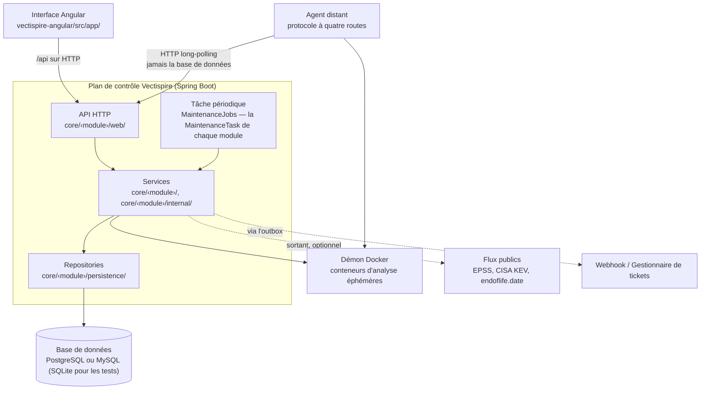
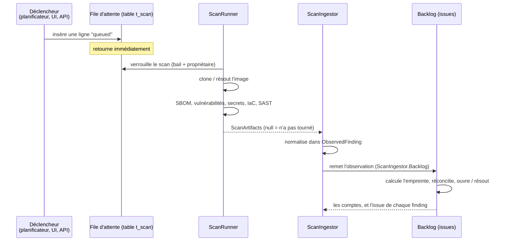

# 01 — Vue d'ensemble

## Ce que fait Vectispire

Vectispire surveille la sécurité d'un ensemble de **cibles** — dépôts Git et images de conteneurs —
en les soumettant périodiquement à une batterie d'analyseurs, et suit ce qu'il trouve **d'un scan à
l'autre**.

Ce dernier point est ce qui le différencie d'un simple script exécutant Grype en CI. Un analyseur
renvoie une liste ; Vectispire renvoie un **backlog** : ce qui est apparu, ce qui a été qualifié et
par qui, ce qui est présent depuis six scans, ce qui a disparu. Un rapport dit ce qui existe
aujourd'hui ; un backlog dit ce qui a changé, ce qui est la seule information sur laquelle on agit.

Les cibles sont analysées une à une, mais les organisations les lisent par produit : une
**solution** contient des **projets**, et un projet référence les dépôts qui le composent — chaque
dépôt dans un projet au plus, et « sans projet » traité comme un groupe à part entière
([0023](decisions/0023-solutions-projects-and-repositories.md)). Une attribution peut nommer un
projet, et les chiffres par projet sont calculés sur les dépôts que le lecteur a le droit de voir.

Le second usage est le **verdict de conformité** : `POST /api/v1/gate` indique à un pipeline de
build si une cible passe les contrôles selon une politique explicite. C'est là que Vectispire cesse
d'être un tableau de bord pour devenir une décision.

Trois principes façonnent tout le reste :

**Tout est local.** Les analyseurs s'exécutent dans des conteneurs éphémères sur la même machine,
avec le réseau coupé lorsque l'outil n'a rien à récupérer. Aucun code source ne sort. Ce n'est pas
une contrainte subie : c'est ce qui rend l'outil déployable là où la sécurité applicative est
réellement un sujet, et c'est pourquoi les règles Semgrep sont intégrées au binaire plutôt que
téléchargées ([décision 0006](decisions/0006-semgrep-rules-written-here.md)).

**Le déploiement par défaut est un seul processus et un seul fichier.** Un simple `docker run` et
l'outil est opérationnel. Tout ce qui est distribué — plusieurs instances, agents distants, un
moteur serveur — est possible, et refusé au démarrage lorsque la configuration ne le permet pas
([04](04-runtime-and-deployment.md)).

**Ce qui n'a pas été observé n'est pas sain.** Un analyseur qui plante n'a rien trouvé, et confondre
son silence avec un résultat vide revient à déclarer la cible corrigée. Cette distinction traverse
l'ensemble de la codebase ([décision 0007](decisions/0007-none-is-not-an-empty-list.md)).

## Les composants



**Deux artefacts, une seule API.** Un backend Spring Boot et un frontend Angular ; le navigateur
dialogue avec la même API HTTP que les pipelines CI et les agents distants.

### Les modules, et les couches à l'intérieur

Le plan de contrôle est découpé en **modules verticaux, un par domaine** (décisions
[0028](decisions/0028-vertical-modules.md) et [0029](decisions/0029-core-domains-become-modules.md)) :
le socle (`settings`, `outbound`, `crypto`, `audit`, `outbox`, `reporting`, `maintenance`), les
domaines cœur `targets`, `scanning` et `issues`, et `access`, `agents`, `ai`, `compliance`, `exports`,
`gate`, `inventory`, `notifications`, `posture`, `rules`, `siem`, `threatintel`, `tickets` — avec
`platform` au-dessus, la coque qui compose plusieurs domaines pour l'écran des paramètres et porte les
routes du socle. Chacun est un paquet à lui :

```
core/<module>/               son API : les services que les autres modules appellent, leurs vues, ses événements
core/<module>/web/           ses contrôleurs
core/<module>/internal/      ce dont l'API est faite
core/<module>/persistence/   ses entités et ses repositories
```

Les paquets par couche — `core/api/`, `core/services/`, `core/repositories/`, `core/persistence/` —
ont disparu ; `core/config/` (la source de données, le réglage des moteurs, le mapper JSON, les
ordonnanceurs) est le seul paquet hors module. Les couches tiennent à l'intérieur de chaque module :

```
web/ ──► racine du module + internal/ ──► persistence/ ──► base de données
                    │                           │
                    └─────────────┬─────────────┘
                                  ▼
                               domain/          (pur, ne dépend de rien)
```

Une règle stricte garantit la testabilité : **une couche ne connaît que la couche située
immédiatement en dessous.** Un contrôleur appelle l'API de son module, jamais son paquet `internal`
ni `persistence` ; un module n'en atteint un autre que par la racine de celui-ci, ou par l'une des
trois interfaces nommées que la migration a déclarées (les marqueurs de route et le principal
d'`access`, et les enregistrements de requêtes de `scanning` et d'`issues`). Les
domaines dépendent les uns des autres dans un seul sens, au-dessus du socle que tous peuvent utiliser.
`ArchitectureTest` refuse un cycle entre domaines, une dépendance que le tableau n'autorise pas, et un
accès aux internes d'un autre module ; le tableau est dans la
[décision 0026](decisions/0026-services-are-grouped-by-domain.md), avec les arêtes que les modules ont
révélées dans la 0028 et la 0029. Spring Modulith est dans le build en mode observation seulement — ce
qu'il voit, et qu'il ne signale plus rien, c'est le [05](05-modularity.md).

## Le déroulement d'un scan



### Les analyseurs

| Étape | Outil | Réseau | Produit |
|---|---|---|---|
| SBOM | `anchore/syft` | ouvert (registre, démon) | inventaire des composants |
| Vulnérabilités | `anchore/grype` | ouvert (base de vulnérabilités) | constats `vulnerability` |
| Secrets | `gitleaks` | **coupé** | constats `secret` |
| IaC | `bridgecrew/checkov` | **coupé** | constats `iac` |
| Code source | `semgrep/semgrep` | **coupé** | constats `sast` et `quality` |
| Licences | *(aucun)* | — | dérivé du SBOM |
| Fin de vie | endoflife.date | sortant, optionnel | constats `eol` |
| Revue IA | Ollama local | local, optionnel | constats `ai_review` |
