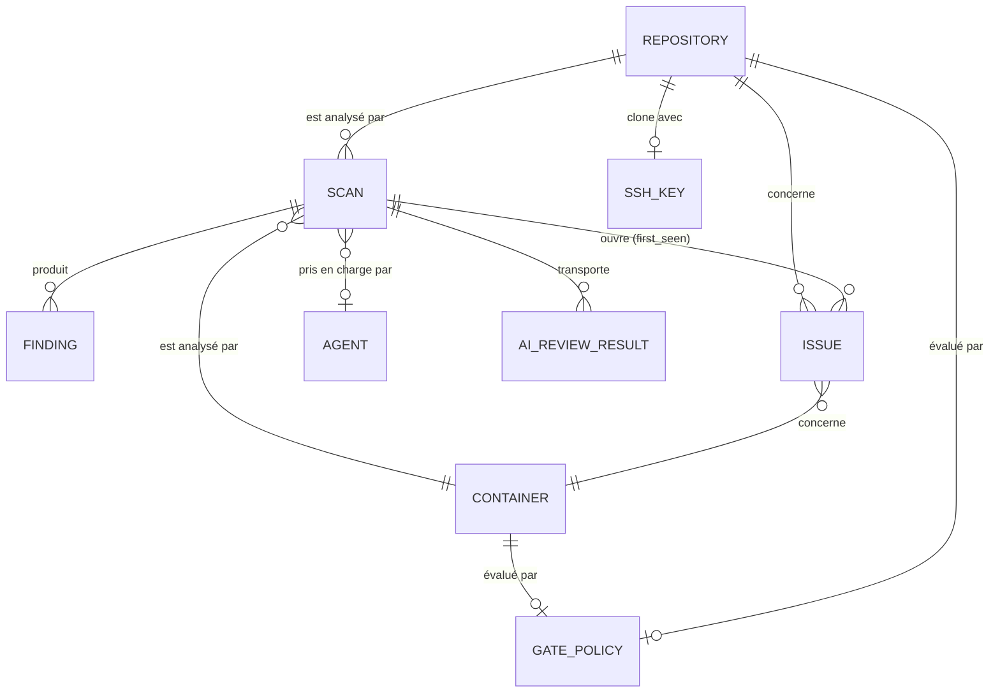
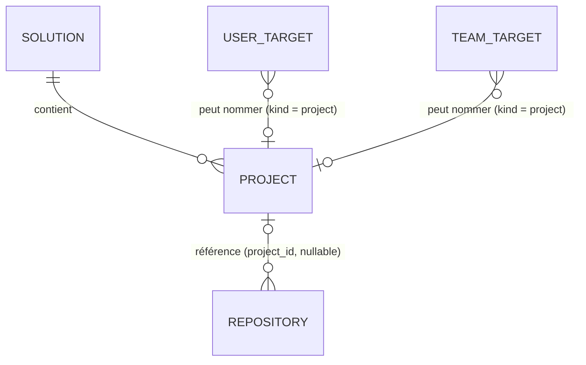
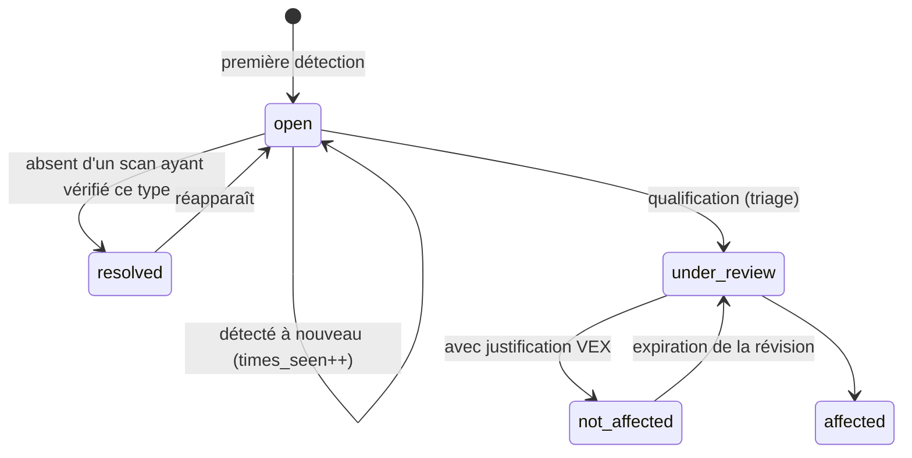

# 02 — Modèle de données

## La distinction fondamentale : Finding vs Issue

C'est le concept essentiel à comprendre avant de manipuler ce schéma :

- Un **`Finding`** (Constat) est ce qu'un analyseur a renvoyé au cours d'**un seul scan**. Il est
  immuable et jetable. Exécuter un nouveau scan produit un nouveau constat.
- Une **`Issue`** (Problème) est le même problème **suivi d'un scan à l'autre**. Elle possède une
  date de première détection, un compteur d'occurrences, un état (`OPEN`/`RESOLVED`), une décision
  de triage VEX et son auteur.



**Le diagramme est un sous-ensemble délibéré : onze tables sur quarante et une.** Il montre le chemin
d'une analyse, parce que c'est la partie dont il faut comprendre la forme avant de toucher au
schéma. Le reste — la billetterie, l'inventaire d'API, le renseignement sur les menaces, la
configuration SIEM, les sessions, les paramètres, le journal d'audit — s'y raccroche sans le
modifier. C'est `SchemaParityIntegrationTest` qui tient le compte honnête, et il a un jour affirmé
vingt-six contre un arbre de trente-trois : un nombre exact dans un document est un nombre que
personne ne met à jour.

## Solutions, projets, et ce qu'une attribution nomme



Un dépôt appartient à **un projet au plus**, par une colonne `t_repository.project_id` nullable
plutôt qu'une table de liaison, pour qu'un chiffre s'additionne à un seul projet sans double
comptage ([0023](decisions/0023-solutions-projects-and-repositories.md)). Les dépôts existants
démarrent sans projet ; rien n'est déduit. Supprimer un projet ramène ses dépôts à « sans projet »
et révoque ses attributions ; une solution n'est supprimée que lorsqu'elle ne contient plus aucun
projet.

Les attributions vivent dans `t_user_target` et `t_team_target` sous la forme
`(target_kind, target_id)`, et le type peut être `repository`, `container` ou `project` — jamais une
solution. Une attribution de projet n'est pas recopiée en attributions de dépôts :
`VisibilityService` la résout en dépôts du projet **à chaque requête**, si bien que la `Visibility`
reçue par chaque requête reste un ensemble de cibles.

## L'empreinte (Fingerprint)

L'identité d'une issue entre plusieurs scans est calculée par `IssueFingerprint` :

```
sha256( target, type, identifier, purl-or-package-name, file-path )
```

## Cycle de vie d'une Issue



## Les migrations

Gérées par Flyway dans `vectispire-java/vectispire-core/src/main/resources/db/migration/{vendor}/`
(`postgresql`, `mysql`, `sqlite`) avec des scripts SQL natifs par dialecte assurant une fidélité
parfaite sur chaque moteur de base de données.
