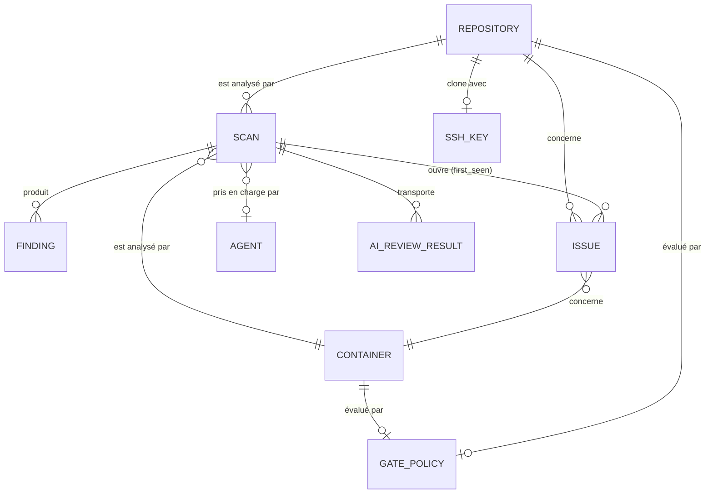
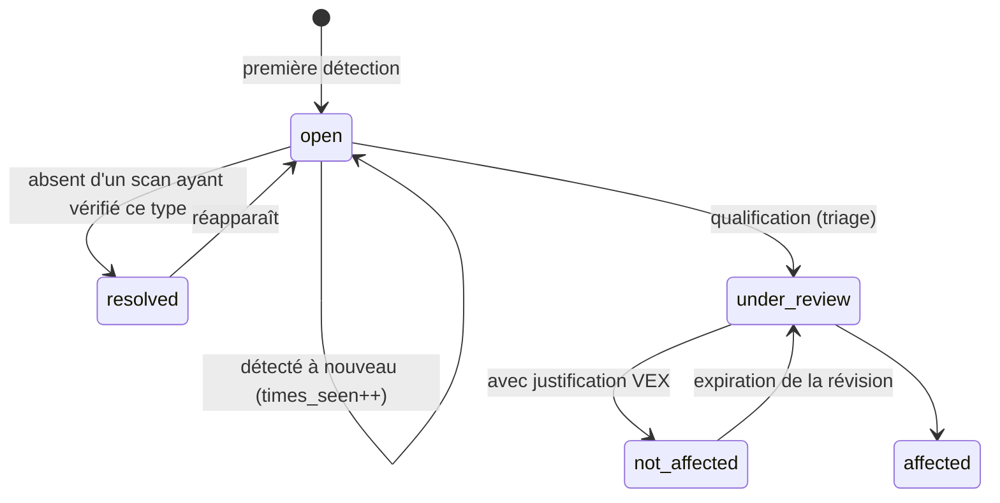

# 02 — Modèle de données

## La distinction fondamentale : Finding vs Issue

C'est le concept essentiel à comprendre avant de manipuler ce schéma :

- Un **`Finding`** (Constat) est ce qu'un analyseur a renvoyé au cours d'**un seul scan**. Il est immuable et jetable. Exécuter un nouveau scan produit un nouveau constat.
- Une **`Issue`** (Problème) est le même problème **suivi d'un scan à l'autre**. Elle possède une date de première détection, un compteur d'occurrences, un état (`OPEN`/`RESOLVED`), une décision de triage VEX et son auteur.



## L'empreinte (Fingerprint)

L'identité d'une issue entre plusieurs scans est calculée par `IssueFingerprint` :

```
sha256( target, type, identifier, purl-or-package-name, file-path )
```

## Cycle de vie d'une Issue



## Les migrations

Gérées par Flyway dans `vectispire-java/vectispire-core/src/main/resources/db/migration/{vendor}/` (`postgresql`, `mariadb`, `mysql`, `sqlite`) avec des scripts SQL natifs par dialecte assurant une fidélité parfaite sur chaque moteur de base de données.
