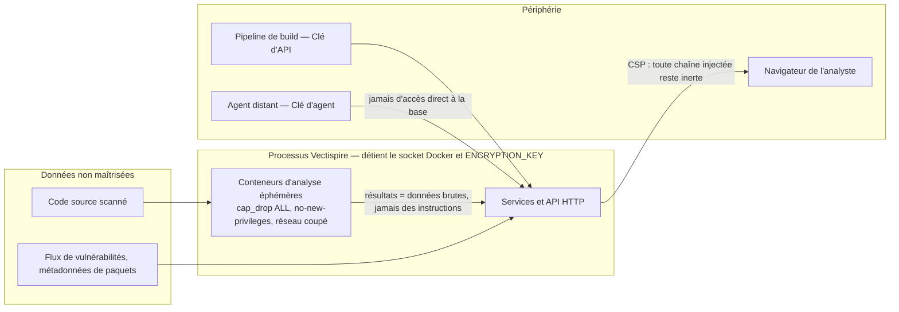

# 03 — Sécurité

> L'analyse formelle est séparée et plus longue : le
> **[modèle de menaces STRIDE](../security/fr/STRIDE_THREAT_MODEL.fr.md)** parcourt chaque
> catégorie avec le contrôle qui y répond. Cette page donne la forme du problème ; celle-là en
> donne l'énumération.

Vectispire est un outil de sécurité, ce qui ne le rend pas automatiquement invulnérable : cela le
rend **intéressant à attaquer**. Il stocke des clés de déploiement, détient l'accès au démon Docker,
affiche des chaînes générées par du code potentiellement hostile, et renvoie un verdict de
conformité qu'un attaquant pourrait chercher à falsifier.

## Actifs sensibles et protection

| Actif | Emplacement | Conséquence d'une fuite |
|---|---|---|
| Clés de déploiement SSH | `ssh_key`, chiffrées en AES-GCM | Accès en lecture à tous les dépôts suivis |
| `ENCRYPTION_KEY` | Variable d'environnement ou fichier | Déchiffre **l'ensemble** des clés d'accès |
| Accès au socket Docker | Processus backend / agent | Équivalent de l'accès `root` sur l'hôte |
| Verdict du Quality Gate | `issue`, `gate_policy` | Un build vulnérable passe le contrôle CI/CD |
| Rapports bruts de secrets | `scan.cves` (purgés par rétention) | **Secrets et jetons d'API en clair** |
| Journal d'audit | `audit_log` (chaîne de hachage) | Altération de l'historique d'actions |

## Frontières de confiance

