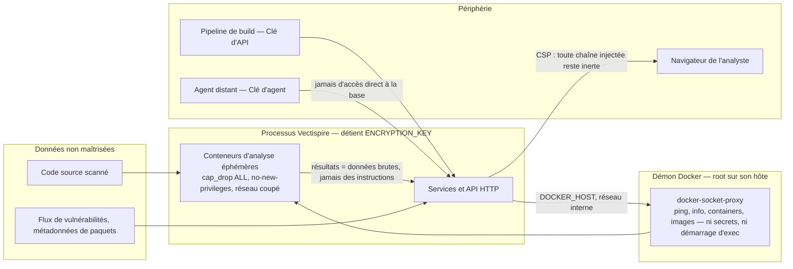

# 03 — Sécurité

> L'analyse formelle est séparée et plus longue : le
> **[modèle de menaces STRIDE](../security/fr/STRIDE_THREAT_MODEL.fr.md)** parcourt chaque
> catégorie avec le contrôle qui y répond. Cette page donne la forme du problème ; celle-là en
> donne l'énumération.

Vectispire est un outil de sécurité, ce qui ne le rend pas automatiquement invulnérable : cela le
rend **intéressant à attaquer**. Il stocke des clés de déploiement, détient l'accès au démon Docker,
affiche des chaînes générées par du code potentiellement hostile, et renvoie un verdict de
conformité qu'un attaquant pourrait chercher à falsifier.

## Actifs sensibles et protection

| Actif | Emplacement | Conséquence d'une fuite |
|---|---|---|
| Clés de déploiement SSH | `ssh_key`, chiffrées en AES-GCM | Accès en lecture à tous les dépôts suivis |
| `ENCRYPTION_KEY` | Variable d'environnement ou fichier | Déchiffre **l'ensemble** des clés d'accès |
| Accès au démon Docker | Via `docker-socket-proxy`, jamais le fichier socket ([0018](decisions/0018-the-docker-socket-is-never-mounted.md)) | Équivalent de l'accès `root` sur l'hôte qui l'exécute |
| Verdict du Quality Gate | `issue`, `gate_policy` | Un build vulnérable passe le contrôle CI/CD |
| Rapports bruts de secrets | `scan.cves` (purgés par rétention) | **Secrets et jetons d'API en clair** |
| Journal d'audit | `audit_log` (chaîne de hachage) | Altération de l'historique d'actions |

## Frontières de confiance

## Trois frontières qui méritent d'être nommées à part

**Le démon est celle que l'on rétrécit, pas celle que l'on ferme.** Aucun conteneur Vectispire ne
monte `/var/run/docker.sock` ; un proxy le détient et n'autorise que les six groupes d'API que
Vectispire appelle. Mais `POST /containers/create` accepte des `Binds`, et c'est l'appel dont le
produit vit — une exécution de code dans le plan de contrôle atteint donc encore l'hôte. La
frontière qui sépare réellement les deux est une deuxième machine : un agent distant, avec
`VECTISPIRE_EMBEDDED_WORKER=false` ici. La
[décision 0018](decisions/0018-the-docker-socket-is-never-mounted.md) le dit en détail, y compris ce
que cela n'achète pas.

**Rendre le résultat d'un scan est l'opération à plus fort impact intégrité du produit.** Des
artefacts présents et vides signifient « analysé, rien trouvé », ce qui résout tout le backlog de la
cible pour ce type — correctement, selon [0007](decisions/0007-none-is-not-an-empty-list.md). Un
opérateur peut donc épingler une clé publique Ed25519 sur la ligne d'un agent, hors bande ; les
résultats de cet agent doivent alors porter une signature couvrant l'identifiant du scan et le corps
exact. La clé n'est délibérément **pas** annoncée par l'agent : une signature vérifiée contre une
clé que son signataire a publiée sur le même canal ne prouve que ce que le jeton porteur prouvait
déjà. Une clé API volée réclame des tâches ; elle ne déclare pas une cible propre.

**Un en-tête transmis vaut le pair qui l'a envoyé.** `X-Forwarded-For` décide qui est plafonné et
`X-Forwarded-Proto` décide si une clé de déploiement peut voyager vers un agent : les deux ne sont
honorés que depuis une adresse nommée dans `vectispire.security.trusted-proxies`. Vide — le défaut —
signifie que seule une connexion réellement chiffrée compte, donc un agent derrière un proxy qui
termine TLS est refusé tant qu'un opérateur n'a pas déclaré ce proxy. Le refus est le bon sens de
défaillance.
