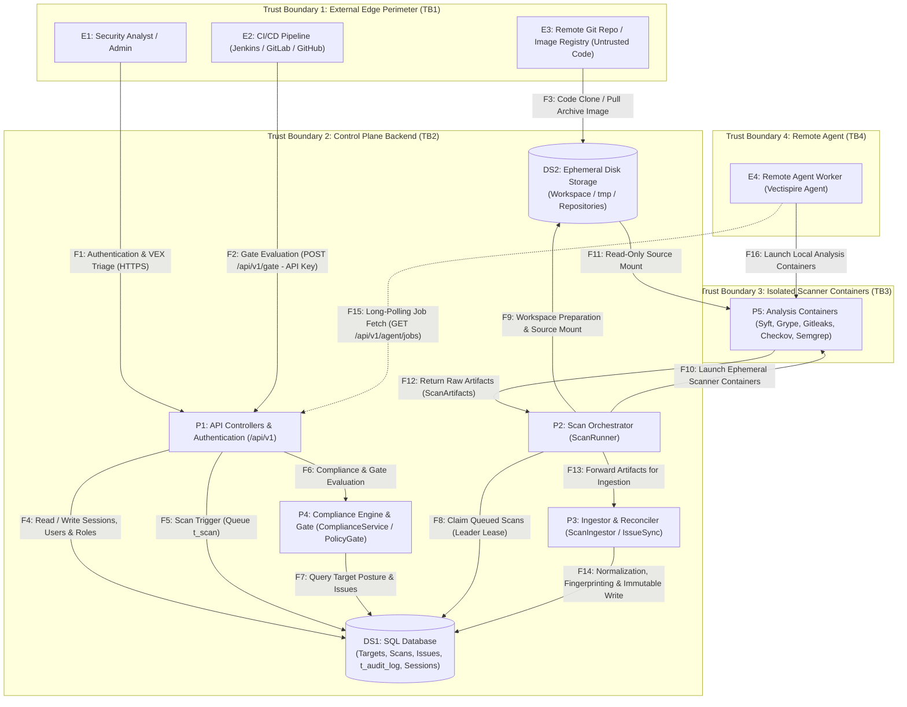

# DFD-Based STRIDE Threat Model — Vectispire

This document presents the formal threat model for **Vectispire** based on **Data Flow Diagram
(DFD)** modeling and **STRIDE Risk Mapping per Individual System Entity**.

---

## 1. Data Flow Diagram (DFD)

---

## 2. STRIDE Threat Matrix per Individual Entity

---

### Entity E1: Security Analyst / Admin

| STRIDE Category | Threat Scenario / Attack Vector | Potential Impact | Implemented Control & Mitigation |
|---|---|---|---|
| **Spoofing** | User session impersonation via JWT cookie theft or brute-force on `/api/v1/auth/login`. | Unauthorized admin dashboard access, falsification of VEX triage. | Passwords hashed with **Argon2id** (high memory cost), attempt tracking in `t_login_attempt` with rate limiting, encrypted DB sessions (`t_session`). |
| **Repudiation** | User changing a critical vulnerability triage to `NOT_AFFECTED` then denying having performed the action. | Lack of accountability in risk sign-off. | Mandatory recording of `user_id`, ISO timestamp, and immutable writing to `t_issue_triage_event` and `t_audit_log`. |
| **Elevation of Privilege** | Restricted user attempting to access admin endpoints or credential management. | Bypassing Role-Based Access Control (RBAC). | Spring Security `@PreAuthorize` annotations and strict role verification (`ROLE_ADMIN` vs `ROLE_USER`) on sensitive endpoints. |

---

### Entity E2: CI/CD Pipeline (Jenkins / GitLab / GitHub Actions)

| STRIDE Category | Threat Scenario / Attack Vector | Potential Impact | Implemented Control & Mitigation |
|---|---|---|---|
| **Spoofing** | Theft of a CI/CD integration API token stored in pipeline secrets. | Fraudulent Gate API queries and security posture exfiltration. | API keys stored strictly as **Argon2id hashes** (`vectispire_`), configurable expiration, and strict permission scopes. |
| **Information Disclosure** | Leakage of confidential details in Quality Gate responses (`POST /api/v1/gate`). | Disclosing unresolved vulnerability details to unauthorized parties. | Gate response payload contains only binary verdict (`PASSED`/`FAILED`), broken policies, and issue counts—no cleartext secrets or code. |

---

### Entity E3: Remote Git Repository / Container Image (Untrusted Code)

| STRIDE Category | Threat Scenario / Attack Vector | Potential Impact | Implemented Control & Mitigation |
|---|---|---|---|
| **Tampering** | Scanned repository embedding a malicious `.gitleaks.toml` configuration to ignore secret detection. | Concealing security flaws and bypassing audit controls. | **Server-side enforced configuration**: `SecretsScanner` passes an internal `--config` and ignore target repo configs ([ADR 0006](../../en/decisions/0006-semgrep-rules-written-here.md)). |
| **Elevation of Privilege** | Exploit attempt in scanner container parser to escape to host via Docker socket. | Complete takeover of the Vectispire host machine. | **No scanner container mounts the Docker socket**. Execution with `cap_drop: ALL`, `no-new-privileges`, and `read-only` source mounts. |

---

### Entity E4: Remote Agent Worker (Vectispire Agent)

| STRIDE Category | Threat Scenario / Attack Vector | Potential Impact | Implemented Control & Mitigation |
|---|---|---|---|
| **Spoofing** | Unauthorized agent attempting to connect to control plane to claim scan jobs. | Source code exfiltration or scan result falsification. | Mandatory token authentication via revocable agent keys (`t_agent`) and exclusive HTTP Long-Polling protocol (`/api/v1/agent/jobs`). |
| **Elevation of Privilege** | Compromised remote agent attempting to execute SQL queries directly on central database. | Unauthorized reading/modification of enterprise database. | **Strict agent architectural isolation (`vectispire-agent`)**: zero JDBC drivers or DB dependencies on agent classpath. Agent does not possess `ENCRYPTION_KEY` ([ADR 0003](../../en/decisions/0003-long-polling-for-agents.md)). |

---

### Entity E5: Identity Provider (OIDC sign-on, SCIM 2.0 provisioning)

*Added after the first version of this model: neither federation nor provisioning existed when the
entities above were drawn, and an entity that is not drawn is not reasoned about.*

| STRIDE Category | Threat Scenario / Attack Vector | Potential Impact | Implemented Control & Mitigation |
|---|---|---|---|
| **Spoofing** | An identity from the provider claiming a Vectispire account it was never granted, or a second subject binding to a name that already belongs to someone. | Silent takeover of an existing account, including an administrator's. | Sign-on is a **binding, not a provisioning**: an identity with no account is refused and logged (`Single sign-on refused: no account named …`), and a name already bound to another subject is refused rather than rebound. |
| **Elevation of Privilege** | An IdP administrator raising a role through SCIM rather than through Vectispire, bypassing its own four-eyes and audit path. | Role change with no Vectispire-side accountability. | `/scim/v2/Users` is `@RequiresAdministrator`: the provisioning channel is not a way around the role checks, it sits behind the same one. |
| **Repudiation** | A privilege granted through the provider leaving no trace on this side. | A change nobody here can account for. | Provisioning writes through the same services as the human path, so `t_audit_log` records it with its actor. |

---

### Entity E6: External Issue Tracker (Jira, GitLab, GitHub, ServiceNow webhooks)

*Also added afterwards. This is the only inbound entry point reachable without an account, which
is the whole reason it is worth a table of its own.*

| STRIDE Category | Threat Scenario / Attack Vector | Potential Impact | Implemented Control & Mitigation |
|---|---|---|---|
| **Spoofing** | Anyone on the network posting a forged webhook to move a triage decision. | An unpatched vulnerability marked resolved by a stranger. | `WebhookAuthenticity` verifies each provider's own convention — `X-Gitlab-Token` verbatim, GitHub's HMAC over the raw body, a shared token for the trackers that sign nothing — with `MessageDigest.isEqual` throughout, because this endpoint answers unauthenticated callers and a byte-by-byte comparison would make the secret guessable. |
| **Spoofing** | The same, on a deployment that has not configured a secret. | The above, unmitigated. | **Deliberately open**: an unset secret leaves the route unauthenticated rather than refusing traffic, because tightening it at upgrade would stop existing triage synchronisation *silently* — worse than the defect it closes. `Setting.TICKET_WEBHOOK_SECRET` is the switch, and this row is the reason to use it. |
| **Tampering** | A replayed legitimate payload re-applying a decision that has since been reversed. | A reopened issue silently re-resolved. | **Not mitigated.** Recorded here rather than left to be discovered: nothing in the verification is nonce- or timestamp-bound. |

---

### Process P1: REST API Controllers & Backend Security Layer

| STRIDE Category | Threat Scenario / Attack Vector | Potential Impact | Implemented Control & Mitigation |
|---|---|---|---|
| **Denial of Service** | HTTP request flooding on login or scan trigger endpoints. | Application server thread exhaustion and platform unavailability. | Asynchronous scan queuing via `t_scan`, IP rate-limiting, and database leader leases (`t_leader_lease`). |
| **Information Disclosure** | Sensitive information leak via exception stack traces on API errors. | Internal structural disclosure or library version leaks. | Global Spring exception handling (`@ControllerAdvice`) returning sanitized JSON error responses. |

---

### Process P2: Scan Orchestrator (`ScanRunner`)

| STRIDE Category | Threat Scenario / Attack Vector | Potential Impact | Implemented Control & Mitigation |
|---|---|---|---|
| **Elevation of Privilege** | Orchestrator using host SSH key to clone unauthorized Git repositories. | Unauthorized cloning of confidential private repos not assigned to the target. | **Partially mitigated, and the residual risk is accepted rather than absent.** A key attached to a target wins: `t_ssh_key` holds it encrypted, and a repository with its own key never touches the host's. But `host-ssh` is **`true` by default** — an earlier version of this table said `false`, which was never true — so a repository with *no* key falls back to the host's `~/.ssh`, which `docker-compose.yml` mounts read-only into the control plane and the agent. On a single-team install that key already reaches every target. **On a shared install, set `VECTISPIRE_HOST_SSH=false`**: with the fallback on, adding a URL is enough to have Vectispire clone it with an identity nobody attached to it. Pinned by `ScanningDefaultsTest` so the default cannot move unnoticed. |
| **Denial of Service** | Massive repository or infinite loop in SAST rule blocking orchestrator indefinitely. | Worker thread hang and cancellation of subsequent scans. | Enforced resource caps (RAM limit, CPU quota) and execution timeouts applied per container by `ContainerRunner`. |

---

### Process P3: Ingestor & Reconciler (`ScanIngestor` / `IssueSyncService`)

| STRIDE Category | Threat Scenario / Attack Vector | Potential Impact | Implemented Control & Mitigation |
|---|---|---|---|
| **Tampering** | Crashed scanner returning empty list `[]`, causing backlog issues to be resolved. | Silent resolution of unpatched vulnerabilities in historical tracking. | **"None is not empty" principle** ([ADR 0007](../../en/decisions/0007-none-is-not-an-empty-list.md)): Failed scan step returns `Optional.empty()` and leaves backlog intact. |
| **Tampering** | Duplicate issue injection during scanner output processing. | Backlog clutter and loss of existing VEX qualifications. | Deterministic fingerprinting ([`IssueFingerprint`](../../../../vectispire-java/vectispire-common/src/main/java/com/asmolabs/vectispire/common/domain/issues/IssueFingerprint.java)) with location deduplication `(filePath + line)`. |

---

### Process P4: Compliance Engine & Quality Gate (`ComplianceService` / `PolicyGate`)

| STRIDE Category | Threat Scenario / Attack Vector | Potential Impact | Implemented Control & Mitigation |
|---|---|---|---|
| **Tampering** | Attempting to alter Gate verdict result stored in the database. | Deploying a vulnerable component into production. | Verdicts computed dynamically & deterministically in memory by `PolicyGateService` with no stored mutable verdict state. |
| **Information Disclosure** | Exposing regulatory compliance posture (NIS 2, DORA, ISO 27001) to unauthorized users. | Disclosing organizational security weaknesses. | Strict visibility filtering (`VisibilityService`) and role-restricted access to PDF compliance export reports. |

---

### Process P5: Isolated Analysis Containers (Syft, Grype, Gitleaks, Checkov, Semgrep)

| STRIDE Category | Threat Scenario / Attack Vector | Potential Impact | Implemented Control & Mitigation |
|---|---|---|---|
| **Information Disclosure** | Analyzer container attempting to transmit scanned source code or secrets to external servers. | Exfiltration of intellectual property and valid tokens. | **Total network isolation (`network: none`)** for code and secret scanner containers (Gitleaks, Checkov, Semgrep). |
| **Elevation of Privilege** | Compromised analyzer binary attempting to write to host filesystem. | Host filesystem alteration. | Source directory mounted **read-only (`read-only`)**, unprivileged execution with `cap_drop: ALL`. |

---

### Data Store DS1: Relational SQL Database (`t_repository`, `t_issue`, `t_audit_log`, `t_ssh_key`)

| STRIDE Category | Threat Scenario / Attack Vector | Potential Impact | Implemented Control & Mitigation |
|---|---|---|---|
| **Information Disclosure** | Theft of private SSH keys during a SQL database dump or leaked backup. | Compromise of enterprise Git access credentials. | Mandatory encryption at rest for SSH keys and integration secrets using **AES-256-GCM** via `EncryptionService`. |
| **Information Disclosure** | Indefinite retention of raw secret scanner reports (`Gitleaks`) containing cleartext tokens. | Token leaks upon direct database read. | Automatic raw payload purging (`scan.cves`) by retention task. `Finding` and `Issue` entities store **only file path and line number**—never cleartext secret values. |
| **Tampering** | Malicious deletion or modification of rows in `t_audit_log`. | Erasure of administrative action evidence. | **SHA-256 Hash Chain** linking each audit entry to the preceding one. `verifyIntegrity()` detects chain breaks immediately. |

---

### Data Store DS2: Ephemeral Disk Storage (`Workspace` / `tmp`)

| STRIDE Category | Threat Scenario / Attack Vector | Potential Impact | Implemented Control & Mitigation |
|---|---|---|---|
| **Information Disclosure** | Temporary cloning directories left on host disk after scan completion. | Local reading of source code or secrets by other system processes. | Guaranteed recursive cleanup of `Workspace` folder in `finally` block in `ScanRunner`. |
| **Tampering** | Modifying cloned source code in temporary directory before scanner execution. | Falsification of analysis findings. | Workspace created in secure temporary folder with strict permissions (`0700`) accessible only by Vectispire process user. |

---

### Data Flows in Transit (Data Flows: F1 to F16)

| DFD Flow | STRIDE Category | Threat Scenario / Attack Vector | Potential Impact | Implemented Control & Mitigation |
|---|---|---|---|---|
| **F1, F2 (HTTP API)** | **Information Disclosure** | Interception of credentials or API tokens in transit over network. | Theft of user sessions or CI API tokens. | Mandatory HTTPS with TLS 1.3/1.2 and strict security headers (HSTS, CSP, X-Content-Type-Options). |
| **F12, F14 (Ingestion)** | **Tampering** | Injecting duplicate issues or altering findings during DB transit. | Backlog clutter and loss of VEX triage state. | Deterministic fingerprinting ([`IssueFingerprint`](../../../../vectispire-java/vectispire-common/src/main/java/com/asmolabs/vectispire/common/domain/issues/IssueFingerprint.java)) with location deduplication `(filePath + line)`. |
| **F15 (Long-Polling Agent)** | **Elevation of Privilege** | Remote agent attempting SQL injection via job fetching stream. | SQL injection and direct database access. | Agent communicates exclusively via structured JSON DTOs over REST API with zero JDBC or direct SQL access ([ADR 0003](../../en/decisions/0003-long-polling-for-agents.md)). |
