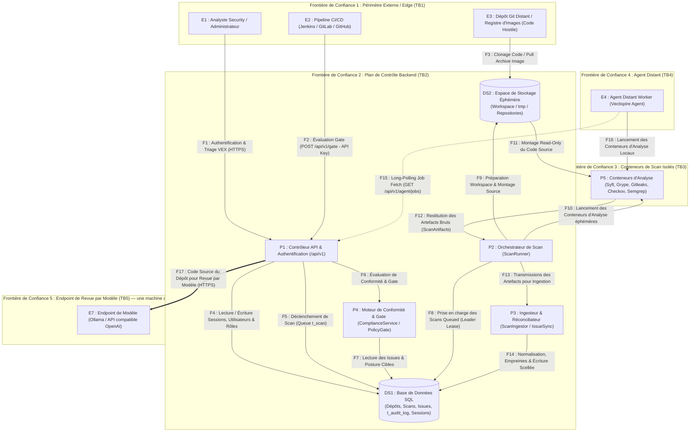

# Modélisation des Menaces STRIDE basée sur DFD (Data Flow Diagram) — Vectispire

Ce document présente l'analyse formelle des menaces de **Vectispire** basée sur la modélisation par
**Diagramme de Flux de Données (DFD)** et la cartographie des risques **STRIDE par Entité
Individuelle du Système**.

---

## 1. Diagramme de Flux de Données (DFD - Data Flow Diagram)

---

## 2. Matrice des Menaces STRIDE par Entité Individuelle

---

### Entité E1 : Analyste Security / Administrateur

| Catégorie STRIDE | Scénario de Menace / Vecteur d'Attaque | Impact Potentiel | Mesure de Contrôle & Mitigation Implémentée |
|---|---|---|---|
| **Spoofing** | Usurpation de session utilisateur par vol de cookie JWT ou attaque par force brute sur l'endpoint `/api/v1/auth/login`. | Accès non autorisé au dashboard d'administration, falsification des triages VEX. | Mots de passe hachés en **Argon2id** (coût mémoire élevé), suivi des tentatives dans `t_login_attempt` avec blocage automatique, sessions chiffrées en DB (`t_session`). |
| **Repudiation** | Un utilisateur modifie la qualification d'une vulnérabilité critique en `NOT_AFFECTED` puis nie en être l'auteur. | Absence de responsabilité et impossibilité d'imputer la validation d'un risque. | Enregistrement obligatoire du `user_id`, horodatage ISO et écriture immuable dans `t_issue_triage_event` et dans le journal scellé `t_audit_log`. |
| **Elevation of Privilege** | Un utilisateur au rôle restreint tente d'accéder aux fonctionnalités d'administration ou de gestion des clés. | Contournement du contrôle d'accès basé sur les rôles (RBAC). | Contrôle de sécurité strict Spring Security `@PreAuthorize` et validation du champ `role` (`ROLE_ADMIN` vs `ROLE_USER`) sur chaque endpoint sensible. |

---

### Entité E2 : Pipeline CI/CD (Jenkins / GitLab / GitHub Actions)

| Catégorie STRIDE | Scénario de Menace / Vecteur d'Attaque | Impact Potentiel | Mesure de Contrôle & Mitigation Implémentée |
|---|---|---|---|
| **Spoofing** | Vol d'un jeton d'API d'intégration CI/CD stocké dans les secrets du pipeline. | Interrogation frauduleuse des API de Gate et exfiltration de la posture de sécurité des projets. | Clés d'API stockées sous forme de **hash Argon2id** (`vectispire_`), expirations configurables et périmètres (scopes) stricts. |
| **Information Disclosure** | Fuite d'informations confidentielles dans la réponse de l'évaluation du Quality Gate (`POST /api/v1/gate`). | Divulgation de la liste des vulnérabilités non corrigées à des tiers non autorisés. | La réponse du Gate ne contient que le verdict binaire (`PASSED`/`FAILED`), les règles enfreintes et les compteurs d'issues, sans divulguer les secrets ou codes sources. |

---

### Entité E3 : Dépôt Git Distant / Image de Conteneur (Code Hostile)

| Catégorie STRIDE | Scénario de Menace / Vecteur d'Attaque | Impact Potentiel | Mesure de Contrôle & Mitigation Implémentée |
|---|---|---|---|
| **Tampering** | Le code scanné inclut un fichier de configuration `.gitleaks.toml` malveillant pour ignorer la détection des secrets. | Masquage de failles de sécurité et contournement des contrôles d'audit. | **Règles imposées côté serveur** : `SecretsScanner` exécute un `--config` interne et ignorent la configuration du dépôt scanné ([ADR 0006](../../fr/decisions/0006-semgrep-rules-written-here.md)). |
| **Elevation of Privilege** | Tentative d'exploitation d'une faille du parser de l'analyseur pour s'échapper du conteneur et accéder au socket Docker hôte. | Prise de contrôle totale du serveur hôte Vectispire. | **Aucun conteneur d'analyse ne monte le socket Docker**. Exécution avec `cap_drop: ALL`, `no-new-privileges` et montage du répertoire source en lecture seule (`read-only`). |

---

### Entité E4 : Agent Distant Worker (Vectispire Agent)

| Catégorie STRIDE | Scénario de Menace / Vecteur d'Attaque | Impact Potentiel | Mesure de Contrôle & Mitigation Implémentée |
|---|---|---|---|
| **Spoofing** | Un agent non autorisé tente de se connecter au plan de contrôle pour récupérer des travaux de scan. | Exfiltration du code des projets ou falsification des rapports d'analyse. | Authentification obligatoire par jeton d'agent révoquable (`t_agent`) et protocole exclusif HTTP Long-Polling (`/api/v1/agent/jobs`). |
| **Elevation of Privilege** | Un agent distant compromis tente d'exécuter des requêtes SQL directement sur la base de données centrale. | Lecture/modification non autorisée de la base de données d'entreprise. | **Isolation stricte de l'agent (`vectispire-agent`)** : aucun pilote JDBC ni dépendance DB n'existe sur le classpath de l'agent. L'agent ne possède pas la clé `ENCRYPTION_KEY` ([ADR 0003](../../fr/decisions/0003-long-polling-for-agents.md)). |
| **F17 (Revue par modèle)** | **Information Disclosure** | Le seul flux qui emporte le *code source analysé* hors du processus. Qu'il franchisse ou non la frontière du patrimoine est un réglage — c'est précisément pourquoi la traversée est listée à part de l'extrémité E7. | Perte de confidentialité du code au profit de qui exploite la destination. | Destination résolue et refusée sauf si interne, à chaque appel ; l'exception est un acquittement nominatif estampillé par le serveur. Voir **E7**. |

---

### Entité E5 : Fournisseur d'identité (connexion OIDC, provisionnement SCIM 2.0)

*Ajoutée après la première version de ce modèle : ni la fédération ni le provisionnement
n'existaient quand les entités ci-dessus ont été dessinées, et une entité qu'on ne dessine pas est
une entité sur laquelle on ne raisonne pas.*

| Catégorie STRIDE | Scénario de menace / Vecteur | Impact potentiel | Contrôle implémenté |
|---|---|---|---|
| **Spoofing** | Une identité du fournisseur revendique un compte Vectispire qu'on ne lui a jamais accordé, ou un second sujet se lie à un nom déjà attribué. | Prise de contrôle silencieuse d'un compte existant, administrateur compris. | La connexion est un **rattachement, pas un provisionnement** : une identité sans compte est refusée et journalisée (`Single sign-on refused: no account named …`), et un nom déjà lié à un autre sujet est refusé plutôt que re-lié. |
| **Elevation of Privilege** | Un administrateur de l'IdP élève un rôle par SCIM plutôt que par Vectispire, contournant son quatre-yeux et son journal. | Changement de rôle sans imputabilité côté Vectispire. | `/scim/v2/Users` porte `@RequiresAdministrator` : le canal de provisionnement n'est pas un détour autour des contrôles de rôle, il est derrière le même. |
| **Repudiation** | Un privilège accordé via le fournisseur ne laisse aucune trace ici. | Un changement dont personne ici ne peut rendre compte. | Le provisionnement écrit par les mêmes services que le chemin humain, donc `t_audit_log` l'enregistre avec son acteur. |

---

### Entité E6 : Outil de ticketing externe (webhooks Jira, GitLab, GitHub, ServiceNow)

*Ajoutée après coup également. C'est le seul point d'entrée joignable sans compte, et c'est toute
la raison pour laquelle il mérite son propre tableau.*

| Catégorie STRIDE | Scénario de menace / Vecteur | Impact potentiel | Contrôle implémenté |
|---|---|---|---|
| **Spoofing** | N'importe qui sur le réseau poste un webhook forgé pour déplacer une décision de triage. | Une vulnérabilité non corrigée marquée résolue par un inconnu. | `WebhookAuthenticity` vérifie la convention propre à chaque fournisseur — `X-Gitlab-Token` verbatim, le HMAC de GitHub sur le corps brut, un jeton partagé pour ceux qui ne signent rien — avec `MessageDigest.isEqual` partout : ce point d'entrée répond à des appelants non authentifiés, et une comparaison octet par octet rendrait le secret devinable. |
| **Spoofing** | Le même, sur un déploiement sans secret configuré. | Le précédent, non mitigé. | **Ouvert délibérément** : un secret non configuré laisse la route non authentifiée plutôt que de refuser le trafic, car durcir à la montée de version arrêterait la synchronisation de triage existante **en silence** — pire que le défaut qu'on ferme. `Setting.TICKET_WEBHOOK_SECRET` est l'interrupteur, et cette ligne est la raison de s'en servir. |
| **Tampering** | Un payload légitime rejoué ré-applique une décision entre-temps annulée. | Un constat rouvert silencieusement re-résolu. | **Non mitigé.** Consigné ici plutôt que laissé à découvrir : rien dans la vérification n'est lié à un nonce ni à un horodatage. |

---

### Entité E7 : Endpoint de revue par modèle (Ollama, ou une API compatible OpenAI)

*Ajoutée en dernier, alors qu'elle aurait dû l'être en premier. C'est le seul flux qui fait sortir
du processus **le code source analysé**, et le modèle n'en portait aucune entrée — ni ici, ni dans
la vue sécurité — pendant plusieurs audits. Elle est listée comme entité externe même lorsque
l'opérateur l'héberge lui-même : « la destination est une machine que je contrôle » est une valeur
de configuration, pas une propriété de la conception.*

| Catégorie STRIDE | Scénario de Menace / Vecteur d'Attaque | Impact Potentiel | Mesure de Contrôle & Mitigation Implémentée |
|---|---|---|---|
| **Information Disclosure** | L'endpoint est une adresse publique : la source de chaque dépôt scanné — les dépôts privés, et les secrets qui y sont encore commités — quitte le patrimoine dans un corps de requête, sous la politique de rétention et la juridiction d'un tiers. | Perte complète de la confidentialité du code, en silence et dépôt par dépôt. | La garde sortante applique `INTERNAL_REQUIRED` par défaut : `OutboundPost.validate` **résout le nom** et refuse une adresse publique au lieu de reconnaître un motif dans la chaîne. La lever exige `Setting.AI_REVIEW_ALLOW_REMOTE`, dont l'aide dit ce qu'elle coûte. Revalidée à **chaque revue** (`AiReview.validatedUrl`), et pas seulement à l'enregistrement : une ligne écrite directement en base ne la contourne pas. |
| **Repudiation** | Personne ne peut dire qui a décidé que le code pouvait sortir, ni quand — l'interrupteur est un booléen, et un booléen n'a pas d'auteur. | Une question sans réponse au premier audit qui la pose. | `AI_REVIEW_RISK_ACKNOWLEDGED_BY` / `_AT` sont estampillés **par le serveur** depuis la session authentifiée et son horloge, refusés sur le fil (`SettingsController.update`), et effacés quand l'interrupteur repasse à zéro. `t_audit_log` porte le même événement et n'est jamais purgé. |
| **Spoofing** | Une destination du réseau interne qui n'est pas le modèle — une faute de frappe, ou un DNS déplacé sous le déploiement. | Code source posté à ce qui répond. | Partiellement mitigé. La garde prouve que l'adresse est interne, pas que l'hôte est celui qu'on visait. L'épinglage TLS existe via `PinnedHttpSender` mais n'est pas exigé pour cette destination. |
| **Tampering** | L'endpoint renvoie des constats sur lesquels l'opérateur agit ; compromis, il peut masquer une vraie vulnérabilité ou en inventer une. | Effort de remédiation mal dirigé, ou vrai problème écarté. | La revue est **consultative et additive** : les constats d'`AiReview` n'effacent jamais ceux d'un scanner, et le verdict de gate est calculé sans eux ([ADR 0005](../../fr/decisions/0005-quality-never-blocks-the-gate.md)). |
| **Denial of Service** | Un endpoint lent ou indisponible qui retient le chemin de requête ouvert. | Les revues s'accumulent ; l'écran qui en a demandé une attend. | `AI_REVIEW_TIMEOUT_SECONDS` borne chaque appel, et une revue en échec vaut `Optional.empty()` plutôt qu'un résultat vide ([ADR 0007](../../fr/decisions/0007-none-is-not-an-empty-list.md)) — le rapport dit que la revue n'a pas tourné au lieu d'en montrer une propre. |
| **Information Disclosure** | La clé d'API d'un endpoint tiers lue dans la table des réglages ou sur un écran. | Un compte que quelqu'un d'autre peut dépenser. | `AI_REVIEW_OPENAI_KEY` est `Sensitivity.ENCRYPTED` : écrite uniquement par `PUT /settings/ai-openai-key`, qui la chiffre, refusée par la route générique des réglages, et renvoyée par aucune route — un écran apprend qu'une clé existe, jamais laquelle. |

---

### Processus P1 : Contrôleur API REST & Couche de Sécurité Backend

| Catégorie STRIDE | Scénario de Menace / Vecteur d'Attaque | Impact Potentiel | Mesure de Contrôle & Mitigation Implémentée |
|---|---|---|---|
| **Denial of Service** | Bombardement de requêtes HTTP sur l'API d'authentification ou de déclenchement de scans. | Épuisement des threads du serveur d'applications et indisponibilité de la plateforme. | Traitement asynchrone des scans via la table `t_scan`, rate-limiting par IP et baux de leadership (`t_leader_lease`). |
| **Information Disclosure** | Fuite d'informations sensibles via les traces d'erreurs (stack traces) lors d'exceptions API. | Divulgation de la structure interne de l'application ou des versions de bibliothèques. | Gestion globale des exceptions Spring (`@ControllerAdvice`) retournant des réponses d'erreur JSON normalisées et assainies. |

---

### Processus P2 : Orchestrateur de Scan (`ScanRunner`)

| Catégorie STRIDE | Scénario de Menace / Vecteur d'Attaque | Impact Potentiel | Mesure de Contrôle & Mitigation Implémentée |
|---|---|---|---|
| **Elevation of Privilege** | L'orchestrateur utilise la clé SSH du serveur hôte pour cloner des dépôts réservés. | Clonage non autorisé de projets confidentiels non assignés à la cible. | **Partiellement mitigé, et le risque résiduel est accepté plutôt qu'absent.** Une clé attachée à une cible l'emporte : `t_ssh_key` la conserve chiffrée, et un dépôt disposant de sa propre clé ne touche jamais à celle de l'hôte. Mais `host-ssh` vaut **`true` par défaut** — une version antérieure de ce tableau annonçait `false`, ce qui n'a jamais été le cas — si bien qu'un dépôt *sans* clé retombe sur le `~/.ssh` de l'hôte, que `docker-compose.yml` monte en lecture seule dans le plan de contrôle et dans l'agent. Sur une installation mono-équipe, cette clé atteint déjà toutes les cibles. **Sur une installation partagée, poser `VECTISPIRE_HOST_SSH=false`** : avec le repli actif, ajouter une URL suffit pour que Vectispire la clone avec une identité que personne ne lui a attachée. Épinglé par `ScanningDefaultsTest`, pour que le défaut ne bouge pas en silence. |
| **Denial of Service** | Un projet gigantesque ou une boucle infinie dans une règle SAST bloque l'orchestrateur indéfiniment. | Blocage du worker et annulation des scans suivants. | Limites de ressources strictes (RAM max, CPU quota) et timeout d'exécution appliqués sur chaque conteneur par `ContainerRunner`. |

---

### Processus P3 : Ingesteur & Réconciliateur (`ScanIngestor` / `IssueSyncService`)

| Catégorie STRIDE | Scénario de Menace / Vecteur d'Attaque | Impact Potentiel | Mesure de Contrôle & Mitigation Implémentée |
|---|---|---|---|
| **Tampering** | Un scanner plante et renvoie une liste vide `[]`, entraînant la clôture du backlog d'issues. | Suppression silencieuse des failles non corrigées dans le suivi historique. | **Principe "None is not empty"** ([ADR 0007](../../fr/decisions/0007-none-is-not-an-empty-list.md)) : Un scan échoué renvoie `Optional.empty()` et laisse le backlog inchangé. |
| **Tampering** | Injection de doublons d'issues lors du traitement des résultats des scanners. | Pollution du backlog et perte des qualifications VEX existantes. | Calcul d'empreinte unique déterministe ([`IssueFingerprint`](../../../../vectispire-java/vectispire-common/src/main/java/com/asmolabs/vectispire/common/domain/issues/IssueFingerprint.java)) avec déduplication par emplacement `(filePath + line)`. |

---

### Processus P4 : Moteur de Conformité & Quality Gate (`ComplianceService` / `PolicyGate`)

| Catégorie STRIDE | Scénario de Menace / Vecteur d'Attaque | Impact Potentiel | Mesure de Contrôle & Mitigation Implémentée |
|---|---|---|---|
| **Tampering** | Tentative de modification du résultat du verdict de Gate dans la base de données. | Passage en production d'un composant vulnérable. | Les verdicts sont calculés de manière dynamique et déterministe en mémoire par `PolicyGateService` sans stocker de verdict modifiable en base. |
| **Information Disclosure** | Exposition des scores de conformité réglementaire (NIS 2, DORA, ISO 27001) à des utilisateurs non autorisés. | Divulgation de faiblesses organisationnelles à des tiers. | Filtrage strict par visibilité (`VisibilityService`) et restriction d'accès aux rapports d'exportation PDF. |

---

### Processus P5 : Conteneurs d'Analyse Isolés (Syft, Grype, Gitleaks, Checkov, Semgrep)

| Catégorie STRIDE | Scénario de Menace / Vecteur d'Attaque | Impact Potentiel | Mesure de Contrôle & Mitigation Implémentée |
|---|---|---|---|
| **Information Disclosure** | Le conteneur d'analyse tente de transmettre le code source ou les secrets détectés vers un serveur externe. | Exfiltration de la propriété intellectuelle et d'identifiants valides. | **Isolation réseau totale (`network: none`)** pour tous les conteneurs d'analyse de secrets (Gitleaks), IaC (Checkov) et SAST (Semgrep). |
| **Elevation of Privilege** | Un binaire d'analyse compromis tente de modifier le système de fichiers de l'hôte. | Altération du système de fichiers du serveur. | Répertoire source monté en **lecture seule (`read-only`)**, exécution sous utilisateur non privilégié avec `cap_drop: ALL`. |

---

### Stockage DS1 : Base de Données Relational SQL (`t_repository`, `t_issue`, `t_audit_log`, `t_ssh_key`)

| Catégorie STRIDE | Scénario de Menace / Vecteur d'Attaque | Impact Potentiel | Mesure de Contrôle & Mitigation Implémentée |
|---|---|---|---|
| **Information Disclosure** | Vol des clés SSH privées lors d'un dump de la base de données SQL ou d'une sauvegarde leakée. | Compromission des accès Git de l'entreprise. | Chiffrement obligatoire au repos de toutes les clés SSH et secrets d'intégration en **AES-256-GCM** via `EncryptionService`. |
| **Information Disclosure** | Conservation indéfinie des rapports bruts de secrets (`Gitleaks`) contenant des jetons en clair. | Fuite d'identifiants valides en cas d'accès direct à la base. | Purge automatique des payloads bruts (`scan.cves`) par la tâche de rétention. Les entités `Finding` et `Issue` ne conservent **que le fichier et la ligne**, jamais la valeur du secret en clair. |
| **Tampering** | Suppression ou modification malveillante d'entrées du journal d'audit (`t_audit_log`). | Effacement des traces d'actions d'administration répréhensibles. | **Chaîne de hachage SHA-256** reliant chaque entrée à la précédente. La méthode `verifyIntegrity()` décèle immédiatement toute rupture. |

---

### Stockage DS2 : Espace de Stockage Éphémère (`Workspace` / `tmp`)

| Catégorie STRIDE | Scénario de Menace / Vecteur d'Attaque | Impact Potentiel | Mesure de Contrôle & Mitigation Implémentée |
|---|---|---|---|
| **Information Disclosure** | Maintien des répertoires temporaires de clonage sur le disque hôte après la fin de l'analyse. | Lecture locale du code source ou de secrets par d'autres processus système. | Nettoyage récursif garanti du dossier `Workspace` dans le bloc `finally` de `ScanRunner`. |
| **Tampering** | Modification du code source cloné dans l'espace temporaire avant l'exécution du scanner. | Falsification des constats d'analyse. | L'espace de travail est créé dans un répertoire temporaire sécurisé avec des permissions strictes (`0700`) accessibles uniquement par l'utilisateur du processus Vectispire. |

---

### Flux de Données en Transit — les flux dont le *transit* porte une menace propre

*L'intitulé disait ici « Data Flows : F1 à F16 » au-dessus de cinq lignes, ce qui se lit au premier
regard comme seize flux analysés. Ce n'est pas ce qu'est cette section. Chaque flux du diagramme
**est** analysé — à ses deux extrémités, dans les matrices d'entités, de processus et de magasins
de données ci-dessus, là où une menace visant `P5` ou `DS2` a sa place. Ce qui suit est l'ensemble
plus restreint où la traversée elle-même est l'exposition, indépendamment de ce qui se trouve à
chaque bout. Les autres ne sont délibérément pas répétés ici.*

| Flux DFD | Catégorie STRIDE | Scénario de Menace / Vecteur d'Attaque | Impact Potentiel | Mesure de Contrôle & Mitigation Implémentée |
|---|---|---|---|---|
| **F1, F2 (API HTTP)** | **Information Disclosure** | Interception des identifiants ou des jetons d'API en transit sur le réseau. | Vol de sessions utilisateur ou de jetons d'accès CI. | Communication HTTPS obligatoire avec TLS 1.3/1.2 et en-têtes de sécurité stricts (HSTS, CSP, X-Content-Type-Options). |
| **F12, F14 (Ingestion)** | **Tampering** | Injection de doublons d'issues ou altération des constats lors du transfert vers la base. | Pollution du backlog et perte des décisions VEX. | Empreinte déterministe ([`IssueFingerprint`](../../../../vectispire-java/vectispire-common/src/main/java/com/asmolabs/vectispire/common/domain/issues/IssueFingerprint.java)) avec déduplication par emplacement `(filePath + line)`. |
| **F15 (Long-Polling Agent)** | **Elevation of Privilege** | Un agent distant tente d'injecter des instructions SQL à travers le flux de récupération de tâches. | Injection SQL et accès direct aux données. | L'agent communique exclusivement au format JSON DTO structuré via l'API REST sans aucun accès JDBC ou SQL direct ([ADR 0003](../../fr/decisions/0003-long-polling-for-agents.md)). |
