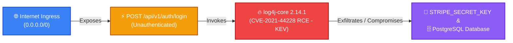

# Attack Path Visualizer Integration Guide

Vectispire's **Interactive Attack Path Visualizer** models and correlates isolated vulnerability findings into realistic end-to-end exploit scenarios.

It helps security teams, CISOs, and engineers immediately distinguish between theoretical security debt and **critical vulnerabilities that are actively exploitable from the public Internet**.

---

## 🎯 The Topological Exploit Flow

Vectispire maps architecture along a 4-echelon exposure chain:

$$\text{1. Ingress / Internet Exposure} \longrightarrow \text{2. Unauthenticated API Endpoint} \longrightarrow \text{3. Vulnerable Component (RCE)} \longrightarrow \text{4. High-Value Asset / Database}$$

```mermaid
flowchart LR
    A["🌐 Internet Ingress\n(0.0.0.0/0)"] -->|Exposes| B["⚡ POST /api/v1/auth/login\n(Unauthenticated)"]
    B -->|Invokes| C["🔥 log4j-core 2.14.1\n(CVE-2021-44228 RCE - KEV)"]
    C -->|Exfiltrates / Compromises| D["🔑 STRIPE_SECRET_KEY &\n🗄️ PostgreSQL Database"]

    style A fill:#3b82f6,stroke:#1d4ed8,stroke-width:2px,color:#fff
    style B fill:#f59e0b,stroke:#b45309,stroke-width:2px,color:#fff
    style C fill:#ef4444,stroke:#b91c1c,stroke-width:2px,color:#fff
    style D fill:#8b5cf6,stroke:#6d28d9,stroke-width:2px,color:#fff
```

---

## 🚀 Key Capabilities

1. **Multi-Source Real-Time Correlation**:
   * **API Attack Surface (`ApiInventory`)**: Identifies public and unauthenticated HTTP endpoints (`authRequired = false`).
   * **Exploitability**: Prioritizes critical vulnerabilities (`CVSS >= 9.0`, CISA KEV catalog, RCE descriptions). Reachability is **not** a criterion: Vectispire runs no call-graph analysis (`ReachabilityAnalyzer`, never wired, was removed), so the issue's `reachability` column reads `UNKNOWN` everywhere, and the graph no longer reads it to admit, rank or flag a node. A hop is exploitable when an unauthenticated route stands in front of the component.
   * **Crown Jewels & Data Sinks (`Gitleaks` / `SAST`)**: Uncovered plaintext secrets, cloud keys, database connection strings.

2. **Interactive Topological Graph**:
   * Multi-column layout showing entry-to-asset propagation.
   * Quick filter: *"Show only directly exploitable critical paths"*.
   * Node Inspector: Click any node to view its EPSS probability, source file and CVSS score.

3. **Attack Scenarios & Prioritized Remediation**:
   * Step-by-step guidance to break the exploit chain (lock down unauthenticated API routes, upgrade vulnerable libraries, isolate internal network segments).

4. **Topological Risk Score (0 to 100)**:
   * Quantitative score measuring exposure, exploitability, and potential asset impact.

---

## 📡 REST API Endpoints

* `GET /api/v1/attack-paths/repositories/{repoId}`: Retrieves full attack path graph and scenarios for a repository.
* `GET /api/v1/attack-paths/overview`: Fleet-wide summary of exploitable critical attack chains.
