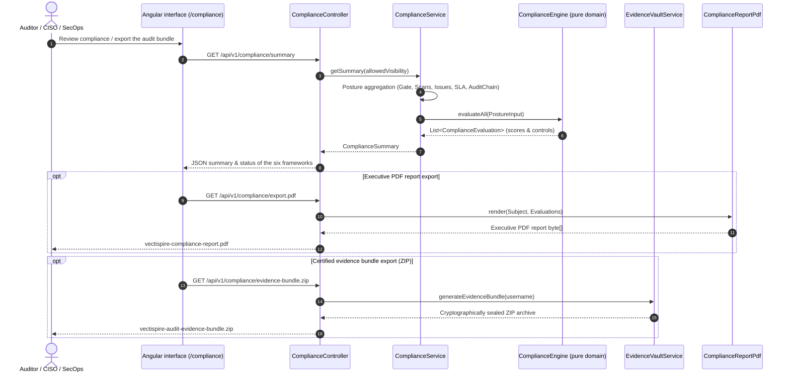

# Regulatory Compliance Calculation Engine

Vectispire's regulatory compliance module (`ComplianceEngine`, `ComplianceService`, `EvidenceVaultService`, `ComplianceReportPdf`) continuously and automatically evaluates your organization's security posture against five major international regulatory frameworks:

- **NIS 2 Directive** (EU 2022/2555 — Cybersecurity Risk-Management & Supply Chain Security)
- **DORA** (EU 2022/2554 — Digital Operational Resilience Act for Financial Entities)
- **ISO/IEC 27001:2022** (Information Security Management Systems — Annex A Controls)
- **PCI-DSS v4.0** (Payment Card Industry Data Security Standard)
- **Cyber Resilience Act (EU CRA)** (European Cyber Resilience Act for Digital Products)
- **SOC 2 Type II** (AICPA Trust Services Criteria — Security, Availability & Confidentiality)

---

## 1. Compliance Architecture & Data Flow



**The evaluation happens in the pure domain, and that is the point.** `ComplianceEngine` takes a
`PostureInput` and returns evaluations; it touches no database, no clock and no framework, so
every control it scores is exhaustively testable without a server. A compliance figure produced by
a query would be a second implementation of the rule, agreeing with the first until the day a
control changed.

---

## 2. Supported Frameworks & Controls

| Framework | Control Code | Title | Assessment Category |
|---|---|---|---|
| **NIS 2** | `NIS2-ART21-VULN` | Vulnerability Handling & Remediation | `VULNERABILITY_MANAGEMENT` |
| **NIS 2** | `NIS2-ART21-SUPPLY` | Supply Chain Security & Software Bill of Materials | `SUPPLY_CHAIN` |
| **NIS 2** | `NIS2-ART21-CRYPTO` | Cryptography & Secrets Management | `SECRETS_MANAGEMENT` |
| **NIS 2** | `NIS2-ART21-GOV` | Security Governance & Gate Enforcement | `GOVERNANCE` |
| **DORA** | `DORA-ART09-ICT` | ICT Risk Management & Continuous Testing | `VULNERABILITY_MANAGEMENT` |
| **DORA** | `DORA-ART11-THIRD` | Third-Party ICT Risk & Dependency Governance | `SUPPLY_CHAIN` |
| **DORA** | `DORA-ART13-SECRETS` | Access Control & Secret Leakage Prevention | `SECRETS_MANAGEMENT` |
| **DORA** | `DORA-ART16-INCIDENT` | Audit Trail & Evidence Retention | `AUDIT_AND_LOGGING` |
| **ISO 27001** | `ISO-A.8.8` | Management of Technical Vulnerabilities | `VULNERABILITY_MANAGEMENT` |
| **ISO 27001** | `ISO-A.8.28` | Secure Coding Practices | `SECURE_CODING` |
| **ISO 27001** | `ISO-A.8.9` | Configuration & Infrastructure-as-Code Security | `INFRASTRUCTURE_AS_CODE` |
| **ISO 27001** | `ISO-A.5.15` | Access Control & Secrets Protection | `SECRETS_MANAGEMENT` |
| **PCI-DSS** | `PCI-REQ-6.3` | Security in Software Development | `SECURE_CODING` |
| **PCI-DSS** | `PCI-REQ-6.4` | Public Vulnerability Remediation | `VULNERABILITY_MANAGEMENT` |
| **PCI-DSS** | `PCI-REQ-6.5` | Protection against Software Flaws & Secrets | `SECRETS_MANAGEMENT` |
| **PCI-DSS** | `PCI-REQ-10.2` | Audit Log Implementation | `AUDIT_AND_LOGGING` |
| **EU CRA** | `CRA-ART11-NOTIF` | 24h CSIRT / ENISA Notification for Actively Exploited Flaws (KEV/EPSS) | `VULNERABILITY_MANAGEMENT` |
| **EU CRA** | `CRA-ART10-SBOM` | Machine-Readable SBOM Delivery (CycloneDX & SPDX) | `SUPPLY_CHAIN` |
| **EU CRA** | `CRA-ART10-LIFECYCLE` | Component Security Support & End-of-Life Tracking (EOL) | `SUPPLY_CHAIN` |
| **EU CRA** | `CRA-ART10-VULN` | Continuous Vulnerability Remediation & Security Updates | `VULNERABILITY_MANAGEMENT` |
| **SOC 2** | `SOC2-CC6.8` | Preventing Unauthorized Changes & Malicious Code | `SECURE_CODING` |
| **SOC 2** | `SOC2-CC7.1` | Vulnerability Assessment & Threat Detection | `VULNERABILITY_MANAGEMENT` |
| **SOC 2** | `SOC2-CC6.6` | Logical Access & Secrets Management | `SECRETS_MANAGEMENT` |
| **SOC 2** | `SOC2-CC7.2` | Security Incident Monitoring & Audit Logging | `AUDIT_AND_LOGGING` |

---

## 3. Assessment Categories & Mathematical Scoring Formulas

Each compliance control maps to an evaluation category evaluated with strict, deterministic rules:

### ① Vulnerability Management (`VULNERABILITY_MANAGEMENT`)
Base score starts at **100 points**, with progressive deductions:
$$\text{Score} = \max\Big(0,\; 100 - P_{\text{critical}} - P_{\text{kev}} - P_{\text{sla}} - P_{\text{high}}\Big)$$

- **Open Critical CVEs**: $-20\text{ pts}$ per finding (capped at $-50\text{ pts}$):
  $$P_{\text{critical}} = \min(50,\, N_{\text{critical}} \times 20)$$
- **CISA KEV (Actively exploited vulnerabilities)**: $-15\text{ pts}$ per finding (capped at $-30\text{ pts}$):
  $$P_{\text{kev}} = \min(30,\, N_{\text{kev}} \times 15)$$
- **SLA Breaches (Overdue)**: $-10\text{ pts}$ per overdue finding (capped at $-40\text{ pts}$):
  $$P_{\text{sla}} = \min(40,\, N_{\text{overdue}} \times 10)$$
- **High Severity Backlog**: If $N_{\text{high}} > 5$, a fixed deduction of $-10\text{ pts}$ is applied.

---

### ② Supply Chain Security & SBOM (`SUPPLY_CHAIN`)
Evaluates active Software Bill of Materials (SBOM) generation via Syft/Grype across monitored repositories and containers:
$$\text{Score} = \text{round}\left(\frac{N_{\text{targets with active SBOM}}}{N_{\text{total monitored targets}}} \times 100\right)$$

---

### ③ Secrets Management (`SECRETS_MANAGEMENT`)
- **0 exposed plaintext secrets**: $\text{Score} = 100$, Status = **`COMPLIANT`**.
- **$\ge 1$ plaintext secret** (API token, private key, credential):
  $$\text{Score} = \max(0,\; 100 - N_{\text{secrets}} \times 25)$$
  **Status = `NON_COMPLIANT` immediately.** Any leaked secret triggers non-compliance.

---

### ④ Secure Coding Practices / SAST (`SECURE_CODING`)
Evaluates static code analysis findings detected by Semgrep on custom source code:
- If 0 SAST flaws: $\text{Score} = 100$.
- If SAST flaws present:
  $$\text{Score} = \max(20,\; 100 - N_{\text{sast}} \times 5)$$

---

### ⑤ Infrastructure-as-Code Security (`INFRASTRUCTURE_AS_CODE`)
Evaluates deployment and cloud manifest misconfigurations (Terraform, Kubernetes, Dockerfile):
- If 0 IaC misconfigurations: $\text{Score} = 100$.
- If IaC misconfigurations present:
  $$\text{Score} = \max(30,\; 100 - N_{\text{iac}} \times 10)$$

---

### ⑥ Governance & Quality Gate Enforcement (`GOVERNANCE`)
Measures the ratio of monitored targets satisfying blocking release Gate policies:
$$\text{Score} = \text{round}\left(\frac{N_{\text{gate passing targets}}}{N_{\text{total targets}}} \times 100\right)$$

---

### ⑦ Tamper-Evident Audit Logging (`AUDIT_AND_LOGGING`)
Verifies cryptographic HMAC-SHA256 hash-chain integrity of all audit log entries:
- **Chain intact and verified**: $\text{Score} = 100$, Status = **`COMPLIANT`**.
- **Tampering or broken chain detected**: $\text{Score} = 0$, Status = **`NON_COMPLIANT`**.

---

## 4. Status Determination & Aggregation

### Control Status Thresholds
$$\text{Control Status} = \begin{cases} 
\text{COMPLIANT} & \text{if } \text{Score} \ge 90 \\
\text{PARTIAL} & \text{if } 60 \le \text{Score} < 90 \\
\text{NON\_COMPLIANT} & \text{if } \text{Score} < 60 
\end{cases}$$

### Framework Overall Score
$$\text{Overall Score} = \text{round}\left(\frac{1}{K} \sum_{i=1}^{K} \text{Score}(\text{Control}_i)\right)$$

### Framework Overall Status
1. **`NON_COMPLIANT`**: If **any single control** fails ($N_{\text{non\_compliant}} > 0$) OR if overall score $< 70\%$.
2. **`PARTIAL`**: If no controls fail completely, but at least one control is partial ($N_{\text{partial}} > 0$) OR if overall score $< 95\%$.
3. **`COMPLIANT`**: Only when **100% of controls are compliant** AND overall score $\ge 95\%$.

---

## 5. Certified Audit Evidence Vault

Vectispire exports cryptographically sealed evidence packages ready for external auditors:
- **Executive PDF Report (`/api/v1/compliance/export.pdf`)**: Posture digest, scores across all 5 frameworks, 20 controls, and prioritized remediation roadmap.
- **Evidence Bundle ZIP (`/api/v1/compliance/evidence-bundle.zip`)**:
  - `manifest.json` & `manifest.json.sig`: Sealed evidence manifest with detached Cosign signature (ECDSA P-256).
  - `00_vectispire_public_key.pub`: Active instance public key for independent auditor verification.
  - `01_compliance_frameworks.json`: Continuous compliance assessments across NIS 2, DORA, ISO 27001, PCI-DSS, EU CRA.
  - `02_immutable_audit_log.jsonl`: Sealed HMAC-SHA256 audit trail.
  - `03_triage_and_exemptions.json`: Four-eyes triage registry and risk acceptances.
  - `04_attestations/`: in-toto attestations and signed DSSE envelopes (RFC 9615).
  - `05_openvex_advisory.json` & `.sig`: OpenVEX v0.2.0 document and detached signature.
  - `06_csaf_2_0_vex.json` & `.sig`: Standardized OASIS CSAF 2.0 security advisory and signature.
  - `07_license_compliance.json`: License inventory & copyleft governance.
  - `08_cyclonedx_1_5_vex.json` & `.sig`: CycloneDX 1.5 SBOM with BOM-linked VEX statements and signature.

### 5.1 What the audit trail proves, and what it does not

An evidence bundle is read by somebody who will sign something on the strength of it, so the
limits of the audit chain belong here rather than only in the source.

**What the chain proves.** Each entry carries the hash of the previous one over its own fields,
NUL-separated and with the timestamp canonicalised to the millisecond. Modifying a past row breaks
every hash that follows it, so **selective** editing is detectable — which is the realistic threat
when the interesting row is one among thousands.

**What it does not prove.** The chain does not make the log immutable: whoever can write the table
can recompute every hash from the edited row onward, and the result verifies perfectly.
Specifically, **the deletion of an entry nobody descends from is undetectable** — the last one
written, or the tip of a concurrent branch. Nothing points at it, so nothing is missing once it is
gone. That is the entry an attacker removes, and it is stated plainly here because an assessor who
discovers it unaided is right to discount the rest of the report.

That concession is deliberate and its reason is worth stating: requiring a strictly linear chain
made two instances writing in the same instant fork it, and a perfectly honest log declared itself
broken. A false alarm in an integrity control is worse than useless — you learn to ignore it, and
it then covers the real ones. Closing the case in-database would mean serializing every audit
write behind every other.

**What closes it.** The **audit mirror** (`vectispire.audit.mirror-path`): a second copy, appended
outside the database, one NDJSON line per entry. `/api/v1/audit-log/verify` compares the two and
reports `missingFromTable` — entries the mirror holds and the table no longer does, which *is* the
deleted-leaf case. The mirror does not make the copy unforgeable; it forces the edit to be made
**twice, in two media, with two sets of permissions**, and a log collector normally ships it off
the host within seconds, beyond the reach of whoever holds the database.

An in-database checkpoint would not substitute for it. Whoever can write the audit table can
rewrite a checkpoint table consistently, so it would move the problem one level up while looking
like evidence.

**The report says which of the two you have.** With no mirror configured, the
`AUDIT_AND_LOGGING` controls (`DORA-ART16-INCIDENT`, `PCI-REQ-10.2`) are capped at **PARTIAL**
whatever the chain says, with the reason above as the control's detail. A green tick against an
audit control whose deletion case is open is precisely the kind of conclusion this document
exists not to produce.

---

## 6. VEX Interoperability (OpenVEX, OASIS CSAF 2.0 & CycloneDX VEX)

Vectispire supports the full trio of international VEX standards:
- **Upstream VEX Ingestion (`POST /api/v1/vex/ingest`)**: Automatically ingests upstream supplier **OpenVEX**, **CSAF 2.0**, and **CycloneDX 1.5/1.6 VEX** statements, cascading automated triage for unaffected components with full audit provenance.
- **OASIS CSAF 2.0 Export (`/api/v1/csaf/...`)**: Generates automated machine-readable security advisories for release scans and aggregate fleet inventory.
- **CycloneDX 1.5/1.6 BOM-Linked VEX Export (`/api/v1/cyclonedx/...`)**: Generates industry-standard CycloneDX SBOMs enriched with component-level VEX analysis and justification.

---

## 7. Four-Eyes Risk Exemption Governance

To satisfy the strict requirements of DORA (Art. 9/13), NIS 2 and ISO 27001 (A.8.8) on
exemptions and risk acceptances:

1. **`SECURITY_CHAMPION` role**:
   - A security delegate inside the development teams (`administrative = false`, `globalSecurityScope = false`).
   - Entitled to review and approve technical exemptions (`canApproveTriage = true`).

2. **`PENDING_APPROVAL` status**:
   - Any exemption request (`not_affected` / `accepted_risk`) raised by a developer (`USER`) moves automatically to `PENDING_APPROVAL`.
   - **Until the request is approved, the CI/CD deployment gate keeps failing** (`isSettled() == false`).

3. **Requester ≠ approver**:
   - The approval is refused when the approving account is the one recorded as having requested the exemption. Without this the control is a role gate rather than a four-eyes one, and an assessor reading DORA Art. 9 or NIS 2 Art. 21 literally is right to reject it.

4. **Dual authorisation & audit trail**:
   - Approval by a `SECURITY_CHAMPION`, `CISO` or `ADMIN` records a sealed audit event with origin `"approval"`.

---

## 8. Cryptographic Artifact Signing (Cosign & DSSE RFC 9615)

Vectispire integrates **SLSA Level 3 / Sigstore** non-repudiable cryptographic signing for all software supply chain artifacts:

- **Key Pair**: ECDSA P-256 (`secp256r1`) with SHA-256 digest.
- **Public Key Endpoint**: `GET /api/v1/crypto/public-key.pub` (publicly accessible for automated auditor verification).
- **DSSE Envelopes**: in-toto attestations packaged into RFC 9615 Dead Simple Signing Envelopes (`application/vnd.in-toto+json`).
- **Detached Cosign Signatures**: All SBOM and VEX deliverables in Evidence Vault carry companion `.sig` files.
- **CLI Verification**:
  ```bash
  cosign verify-blob --key vectispire-signing-key.pub --signature manifest.json.sig manifest.json
  ```

---

## 9. SBOM Drift & Diff Viewer

The SBOM comparison engine (`SbomDiffService`, `SbomDiffController`) provides deterministic dependency change tracking across software releases and scan executions:

- **API Endpoints**:
  - `GET /api/v1/sbom/diff?fromScanId={id1}&toScanId={id2}`: Comprehensive differential report between two scans.
  - `GET /api/v1/sbom/diff/latest?repoId={id}`: Automatic differential report across the two most recent scans of a target.
- **Computed Metrics**:
  - **Added / Removed Components**: Identifies newly introduced libraries or pruned dependencies.
  - **Version & License Changes**: Detects package updates and license compliance drifts (e.g. silent relicensing to GPL/AGPL).
  - **Net CVE Balance**: Pinpoints newly introduced vulnerabilities vs. resolved CVEs.

---

## 10. Security Debt & High-Impact Remediation (*High-Impact Fixes*)

The remediation optimization engine (`SecurityDebtService`, `SecurityDebtController`) translates technical findings into actionable engineering hours and prioritizes maximum-ROI actions:

- **API Endpoints**:
  - `GET /api/v1/remediation/debt`: Posture-wide estimated remediation effort in person-hours and person-days.
  - `GET /api/v1/remediation/high-impact-fixes`: Prioritized list of root library updates ranked by security leverage score.
- **Effort Calibration** — every counted finding type carries an estimate, and the buckets sum to the total:
  - Minor dependency update: ~0.8h - 1.5h
  - Secret revocation & rotation: 2.0h
  - Source code refactoring (SAST and quality): 2.5h
  - IaC misconfiguration fix: 1.0h
  - Licence conflict (replace the dependency, or obtain an exception): 3.0h
  - End-of-life component (a migration, not an edit): 4.0h

  AI review findings are excluded from the report altogether — from the issue count as well as
  from the estimate. Their severity is produced by a local model reading a repository that may be
  hostile, so costing them would let a repository inflate its own remediation estimate.
- **Leverage Formula (Security ROI)**:
  $$\text{Leverage} = \frac{N_{\text{Resolved CVEs}} \times 2.0 + N_{\text{Critical}} \times 3.0 + N_{\text{High}} \times 1.5}{\text{Estimated Effort (h)}}$$
  Highlights root dependency upgrades that resolve the highest concentration of CVEs across the entire fleet in a single engineering step.

