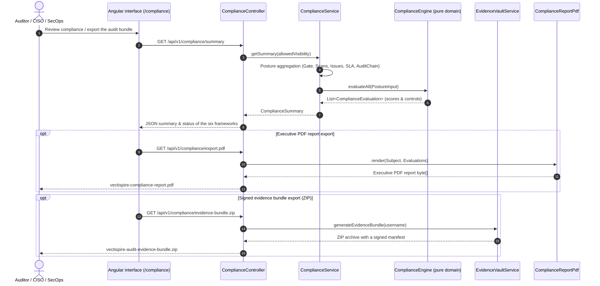

# Compliance evaluation

Vectispire's compliance module (`ComplianceEngine`, `ComplianceService`, `EvidenceVaultService`, `ComplianceReportPdf`) maps what the scans observe, and what the platform itself has switched on, onto a small set of technical controls named after six frameworks:

- **NIS 2 Directive** (EU 2022/2555 — Cybersecurity Risk-Management & Supply Chain Security)
- **DORA** (EU 2022/2554 — Digital Operational Resilience Act for Financial Entities)
- **ISO/IEC 27001:2022** (Information Security Management Systems — Annex A Controls)
- **PCI-DSS v4.0** (Payment Card Industry Data Security Standard)
- **Cyber Resilience Act (EU CRA)** (European Cyber Resilience Act for Digital Products)
- **SOC 2** (AICPA Trust Services Criteria — Security, Availability & Confidentiality)

**What this covers, and what it does not.** Each framework is represented by **four** technical
controls — 24 in all (§2) — each scored from scan observations
(vulnerabilities, secrets, SAST, IaC, SBOM presence, gate verdicts) or from this instance's own audit
trail, and capped by platform settings (§4). The frameworks
themselves are far larger: Annex A of ISO/IEC 27001:2022 alone holds ninety-three controls, most about
governance, people, suppliers and physical security, which no scanner observes; Vectispire measures
a few of its technological ones. A `COMPLIANT` status here means "this technical control, as
Vectispire measures it, holds on the observed estate", not that the organisation complies with the
framework. **It prepares an assessment; it is not one.** SOC 2 in particular is an auditor's report
(a Type II covers the operating effectiveness of controls over a period): Vectispire produces
evidence an auditor may use, never the report.

---

## 1. Compliance Architecture & Data Flow


```mermaid
sequenceDiagram
    autonumber
    actor Auditor as Auditor / CISO / SecOps
    participant UI as Angular interface (/compliance)
    participant Ctrl as ComplianceController
    participant Svc as ComplianceService
    participant Engine as ComplianceEngine (pure domain)
    participant Vault as EvidenceVaultService
    participant PDF as ComplianceReportPdf

    Auditor->>UI: Review compliance / export the audit bundle
    UI->>Ctrl: GET /api/v1/compliance/summary
    Ctrl->>Svc: getSummary(allowedVisibility)
    Svc->>Svc: Posture aggregation (Gate, Scans, Issues, SLA, AuditChain)
    Svc->>Engine: evaluateAll(PostureInput)
    Engine-->>Svc: List<ComplianceEvaluation> (scores & controls)
    Svc-->>Ctrl: ComplianceSummary
    Ctrl-->>UI: JSON summary & status of the six frameworks

    opt Executive PDF report export
        UI->>Ctrl: GET /api/v1/compliance/export.pdf
        Ctrl->>PDF: render(Subject, Evaluations)
        PDF-->>Ctrl: Executive PDF report byte[]
        Ctrl-->>Auditor: vectispire-compliance-report.pdf
    end

    opt Signed evidence bundle export (ZIP)
        UI->>Ctrl: GET /api/v1/compliance/evidence-bundle.zip
        Ctrl->>Vault: generateEvidenceBundle(username)
        Vault-->>Ctrl: ZIP archive with a signed manifest
        Ctrl-->>Auditor: vectispire-audit-evidence-bundle.zip
    end
```

**The evaluation happens in the pure domain, and that is the point.** `ComplianceEngine` takes a
`PostureInput` and returns evaluations; it touches no database, no clock and no framework, so
every control it scores is exhaustively testable without a server. A compliance figure produced by
a query would be a second implementation of the rule, agreeing with the first until the day a
control changed. It also makes the result reproducible: the same posture input yields the same
verdict.

---

## 2. Supported Frameworks & Controls

| Framework | Control Code | Title | Assessment Category |
|---|---|---|---|
| **NIS 2** | `NIS2-ART21-VULN` | Vulnerability Handling & Remediation | `VULNERABILITY_MANAGEMENT` |
| **NIS 2** | `NIS2-ART21-SUPPLY` | Supply Chain Security & Software Bill of Materials | `SUPPLY_CHAIN` |
| **NIS 2** | `NIS2-ART21-CRYPTO` | Cryptography & Secrets Management | `SECRETS_MANAGEMENT` |
| **NIS 2** | `NIS2-ART21-GOV` | Security Governance & Gate Enforcement | `GOVERNANCE` |
| **DORA** | `DORA-ART09-ICT` | ICT Risk Management & Continuous Testing | `VULNERABILITY_MANAGEMENT` |
| **DORA** | `DORA-ART11-THIRD` | Third-Party ICT Risk & Dependency Governance | `SUPPLY_CHAIN` |
| **DORA** | `DORA-ART13-SECRETS` | Access Control & Secret Leakage Prevention | `SECRETS_MANAGEMENT` |
| **DORA** | `DORA-ART16-INCIDENT` | Audit Trail & Evidence Retention | `AUDIT_AND_LOGGING` |
| **ISO 27001** | `ISO-A.8.8` | Management of Technical Vulnerabilities | `VULNERABILITY_MANAGEMENT` |
| **ISO 27001** | `ISO-A.8.28` | Secure Coding Practices | `SECURE_CODING` |
| **ISO 27001** | `ISO-A.8.9` | Configuration & Infrastructure-as-Code Security | `INFRASTRUCTURE_AS_CODE` |
| **ISO 27001** | `ISO-A.5.15` | Access Control & Secrets Protection | `SECRETS_MANAGEMENT` |
| **PCI-DSS** | `PCI-REQ-6.3` | Security in Software Development | `SECURE_CODING` |
| **PCI-DSS** | `PCI-REQ-6.4` | Public Vulnerability Remediation | `VULNERABILITY_MANAGEMENT` |
| **PCI-DSS** | `PCI-REQ-6.5` | Protection against Software Flaws & Secrets | `SECRETS_MANAGEMENT` |
| **PCI-DSS** | `PCI-REQ-10.2` | Audit Log Implementation | `AUDIT_AND_LOGGING` |
| **EU CRA** | `CRA-ART11-NOTIF` | Actively Exploited Vulnerabilities — Art. 14(1) (CISA KEV) | `VULNERABILITY_MANAGEMENT` |
| **EU CRA** | `CRA-ART10-SBOM` | Machine-Readable SBOM — Annex I, Part II (1) | `SUPPLY_CHAIN` |
| **EU CRA** | `CRA-ART10-LIFECYCLE` | Third-Party Components & Support Period — Art. 13(5), 13(8) | `SUPPLY_CHAIN` |
| **EU CRA** | `CRA-ART10-VULN` | Vulnerability Handling & Security Updates — Annex I, Part II (2); Art. 13(8) | `VULNERABILITY_MANAGEMENT` |
| **SOC 2** | `SOC2-CC6.8` | Preventing Unauthorized Changes & Malicious Code | `SECURE_CODING` |
| **SOC 2** | `SOC2-CC7.1` | Vulnerability Assessment & Threat Detection | `VULNERABILITY_MANAGEMENT` |
| **SOC 2** | `SOC2-CC6.6` | Logical Access & Secrets Management | `SECRETS_MANAGEMENT` |
| **SOC 2** | `SOC2-CC7.2` | Security Incident Monitoring & Audit Logging | `AUDIT_AND_LOGGING` |

**The CRA codes predate the adopted text.** `CRA-ART10-…` and `CRA-ART11-…` follow the article
numbering of the 2022 proposal. Regulation (EU) 2024/2847 as adopted places the manufacturer's
obligations in Article 13, vulnerability handling in Annex I Part II, and the reporting of actively
exploited vulnerabilities in Article 14 — applicable since 11 September 2026, the rest of the
Regulation from 11 December 2027. The codes are identifiers stored with every declaration and
assessment, so they are kept; the titles cite the adopted text, and the titles are what counts.

**A control is scored by its category, and only by it.** The title says which requirement of the
framework the control relates to; the score comes from the category's formula in §3, the same for
every control of that category. Two consequences worth reading literally:

- `CRA-ART11-NOTIF` is a vulnerability-management score — open critical, CISA KEV-listed, overdue
  and high-severity vulnerabilities. Those are what an Article 14 notification would start from;
  the notification itself is neither made nor tracked by Vectispire, and EPSS does not enter the
  score.
- `CRA-ART10-LIFECYCLE`, like `CRA-ART10-SBOM`, `NIS2-ART21-SUPPLY` and `DORA-ART11-THIRD`, is the
  share of targets carrying an SBOM. End-of-life findings are reported elsewhere (the issue backlog)
  and do not enter this score.

---

## 3. Assessment categories and scoring formulas

Each control's score comes from its category:

### ① Vulnerability Management (`VULNERABILITY_MANAGEMENT`)
Base score starts at **100 points**, with progressive deductions:
$$\text{Score} = \max\Big(0,\; 100 - P_{\text{critical}} - P_{\text{kev}} - P_{\text{sla}} - P_{\text{high}}\Big)$$

- **Open Critical CVEs**: $-20\text{ pts}$ per finding (capped at $-50\text{ pts}$):
  $$P_{\text{critical}} = \min(50,\, N_{\text{critical}} \times 20)$$
- **CISA KEV (Actively exploited vulnerabilities)**: $-15\text{ pts}$ per finding (capped at $-30\text{ pts}$):
  $$P_{\text{kev}} = \min(30,\, N_{\text{kev}} \times 15)$$
- **SLA Breaches (Overdue)**: $-10\text{ pts}$ per overdue finding (capped at $-40\text{ pts}$):
  $$P_{\text{sla}} = \min(40,\, N_{\text{overdue}} \times 10)$$
- **High Severity Backlog**: If $N_{\text{high}} > 5$, a fixed deduction of $-10\text{ pts}$ is applied.

---

### ② Supply Chain Security & SBOM (`SUPPLY_CHAIN`)
The share of monitored targets for which a scan has recorded a component inventory (an SBOM, produced by Syft):
$$\text{Score} = \text{round}\left(\frac{N_{\text{targets with active SBOM}}}{N_{\text{total monitored targets}}} \times 100\right)$$

---

### ③ Secrets Management (`SECRETS_MANAGEMENT`)
- **0 exposed plaintext secrets**: $\text{Score} = 100$, Status = **`COMPLIANT`**.
- **$\ge 1$ plaintext secret** (API token, private key, credential):
  $$\text{Score} = \max(0,\; 100 - N_{\text{secrets}} \times 25)$$
  **Status = `NON_COMPLIANT` immediately.** Any leaked secret triggers non-compliance.

---

### ④ Secure Coding Practices / SAST (`SECURE_CODING`)
Evaluates static code analysis findings detected by Semgrep on custom source code:
- If 0 SAST flaws: $\text{Score} = 100$.
- If SAST flaws present:
  $$\text{Score} = \max(20,\; 100 - N_{\text{sast}} \times 5)$$

---

### ⑤ Infrastructure-as-Code Security (`INFRASTRUCTURE_AS_CODE`)
Evaluates deployment and cloud manifest misconfigurations (Terraform, Kubernetes, Dockerfile):
- If 0 IaC misconfigurations: $\text{Score} = 100$.
- If IaC misconfigurations present:
  $$\text{Score} = \max(30,\; 100 - N_{\text{iac}} \times 10)$$

---

### ⑥ Governance & Quality Gate Enforcement (`GOVERNANCE`)
Measures the ratio of monitored targets satisfying blocking release Gate policies:
$$\text{Score} = \text{round}\left(\frac{N_{\text{gate passing targets}}}{N_{\text{total targets}}} \times 100\right)$$

---

### ⑦ Tamper-Evident Audit Logging (`AUDIT_AND_LOGGING`)
Verifies the audit log's SHA-256 hash chain — each entry carries the hash of the previous one, unkeyed, so that a selective modification or deletion breaks every hash after it (tamper-evident, not immutable: see 5.1):
- **Chain intact and verified**: $\text{Score} = 100$, Status = **`COMPLIANT`**.
- **Tampering or broken chain detected**: $\text{Score} = 0$, Status = **`NON_COMPLIANT`**.

---

## 4. Status Determination & Aggregation

### Control Status Thresholds
$$\text{Control Status} = \begin{cases} 
\text{COMPLIANT} & \text{if } \text{Score} \ge 90 \\
\text{PARTIAL} & \text{if } 60 \le \text{Score} < 90 \\
\text{NON\_COMPLIANT} & \text{if } \text{Score} < 60 
\end{cases}$$

### No data (`NO_DATA`)
While no target has been scanned successfully, every control of categories ① to ⑥ reads **`NO_DATA`**,
score 0 — no measurement, not a measured zero: each is scored on the estate, and an estate nobody
looked at has no findings to count. ⑦ reads this instance's own chain and is measured. A framework with
any `NO_DATA` control reads `NO_DATA` itself, score 0: scored on ⑦ alone it would present the
platform's sign-in policy as the estate's posture. The statement of applicability sets a declaration
evidenced here against `NO_DATA` as `UNEVIDENCED`, never `CONSISTENT`.

### Coverage cap
Four categories are scored on the absence of findings — ① vulnerabilities, ③ secrets, ④ secure coding
and ⑤ IaC — and a target nobody looked at has no findings. Once part of the estate is observed, each of
their controls, in every framework that maps one (ISO 27001 A.8.8, A.5.15, A.8.28 and A.8.9, and the
controls of the same categories in NIS 2, DORA, PCI DSS, CRA and SOC 2), is capped by coverage:

- **a target never scanned** makes the control **`NON_COMPLIANT`**;
- **a target last scanned outside the freshness window** (the `compliance_freshness_days` setting, 0
  to switch it off) makes it at best **`PARTIAL`**;
- the score is at most the share of targets observed inside the window, and the detail says so in the
  same words for every capped control: *"Assessment covers 1/10 target(s) observed within 30 days — 9
  target(s) have never been scanned."*

A cap, not a penalty: an unobserved target is unassessed, not less compliant. "Observed" means the
target has a successful scan, not that a given step produced in it — the per-step record
(`examined_types`) is kept for repositories only and is absent from every scan older than it, so
counting on it would read containers and older scans as unexamined. The security checklists measure
per step. ② and ⑥ are ratios over every target, so a never-scanned one already counts against them.

### Framework Overall Score
$$\text{Overall Score} = \text{round}\left(\frac{1}{K} \sum_{i=1}^{K} \text{Score}(\text{Control}_i)\right)$$

### Framework Overall Status
1. **`NON_COMPLIANT`**: If **any single control** fails ($N_{\text{non\_compliant}} > 0$) OR if overall score $< 70\%$.
2. **`PARTIAL`**: If no controls fail completely, but at least one control is partial ($N_{\text{partial}} > 0$) OR if overall score $< 95\%$.
3. **`COMPLIANT`**: Only when **100% of controls are compliant** AND overall score $\ge 95\%$.

---

### Platform caps

Some controls rest on a capability of this instance rather than on the estate. When the capability
is off, the control is capped — its score lowered to the ceiling below and its status at best
**`PARTIAL`** (a `NON_COMPLIANT` or `NO_DATA` control keeps its status) — and the detail names the
setting to change. Several caps on one control keep the lowest ceiling.

| Platform state | Ceiling | Controls capped |
|---|---|---|
| No encryption key (`ENCRYPTION_KEY` / `ENCRYPTION_KEY_FILE`): credentials Vectispire stores cannot be encrypted at rest | 60 | ③ secrets: `NIS2-ART21-CRYPTO`, `ISO-A.5.15`, `DORA-ART13-SECRETS`, `PCI-REQ-6.5`, `SOC2-CC6.6` |
| No audit mirror (`vectispire.audit.mirror-path`): deleting the newest audit entry is undetectable (§5.1) | 70 | ⑦ audit: `DORA-ART16-INCIDENT`, `PCI-REQ-10.2`, `SOC2-CC7.2` |
| No identity provider (`VECTISPIRE_OIDC_ISSUER`): every account signs in with a local password and no second factor, so the name on an audit entry is only as good as that password | 65 | ⑦ audit: same three controls |
| An identity provider is configured and local password sign-in is still open beside it (`VECTISPIRE_PASSWORD_LOGIN` not `false`): the realm's second factor can be walked around | 85 | ⑦ audit: same three controls |
| Four-eyes approval off (`triage_four_eyes_required`): whoever raises an exemption can grant it | 75 | ⑥ governance: `NIS2-ART21-GOV` |

Whether key custody is external (Vault Transit) is recorded but caps nothing.

---

## 5. Evidence bundle

Vectispire exports a PDF report and a ZIP bundle whose manifest and main documents are signed with
the instance's key (§8):
- **Executive PDF Report (`/api/v1/compliance/export.pdf`)**: Posture digest, scores across all 6 frameworks, 24 controls, and prioritized remediation roadmap.
- **Evidence Bundle ZIP (`/api/v1/compliance/evidence-bundle.zip`)**:
  - `manifest.json` & `manifest.json.sig`: the manifest of the bundle, with a detached Cosign signature (ECDSA P-256).
  - `00_vectispire_public_key.pub`: the instance's public key, **for convenience only**. A key carried inside the bundle it verifies proves nothing about the bundle — whoever altered the bundle replaces the key too. Verify the signatures against a key obtained out of band: `GET /api/v1/crypto/public-key.pub` on the instance, or a copy pinned before this bundle existed.
  - `01_compliance_frameworks.json`: the evaluation of the 24 controls of the six frameworks (NIS 2, DORA, ISO 27001, PCI-DSS, EU CRA, SOC 2).
  - `02_immutable_audit_log.jsonl`: the audit trail, each entry chained to the previous one by an unkeyed SHA-256 hash. Tamper-evident rather than immutable, whatever the file name says (5.1); the name is kept because it is the archive's layout.
  - `03_triage_and_exemptions.json`: Four-eyes triage registry and risk acceptances.
  - `04_attestations/`: in-toto attestations and signed DSSE envelopes, for the twenty most recent completed scans the caller may see. The **subject is the scan's SBOM**, named by its SHA-256 — the only artefact a scan records by digest (it stores neither the commit nor the image digest, so `commitSha` is null). The **gate verdict** is the one the gate recorded for the target between that scan and the next, with its policy source, version and date; absent when no pipeline asked. KEV and secret counts are the scan's own. A scan that cannot be attested — not completed, or no SBOM — ships a `scan_<id>_not_attested.txt` saying why instead of a statement with the gap filled in.
  - `05_openvex_advisory.json` & `.sig`: OpenVEX v0.2.0 document and detached signature.
  - `06_csaf_2_0_vex.json` & `.sig`: Standardized OASIS CSAF 2.0 security advisory and signature.
  - `07_license_compliance.json`: License inventory & copyleft governance.
  - `08_cyclonedx_1_5_vex.json` & `.sig`: CycloneDX 1.5 SBOM with BOM-linked VEX statements and signature.
  - `09_gate_verdict_register.json`: every answer the release gate returned — monthly continuity, totals, and each refusal in full.
  - `10_exception_register.json`: risk acceptances and dismissals with author, justification, approver and expiry, lapsed ones flagged.
  - `11_remediation_timeliness.json`: time to fix against each deadline — share within target, median, 90th percentile, overdue backlog, oldest open item.
  - `12_control_coverage.json`: which languages the installed rules reach, and the freshness window applied to `01` — what a zero finding count does and does not mean.
  - `13_statement_of_applicability.json`: the declaration of applicability per framework, each control reconciled against its measured status.
  - `14_compliance_progression.json`: each framework's verdict month by month, with the estate that produced it.

  Sections `01`–`08` describe what the estate contains; `09`–`13` are the process evidence — that
  the controls operated over the period — and `14` whether that operation improved.

  **An integration key restricted to some targets receives a narrower bundle.** Every section is
  built within the caller's allowance; for such a key the licence summary (`07`) covers its targets
  only, and the two sections that describe the whole estate and cannot be narrowed — the audit trail
  (`02`) and the compliance progression (`14`) — are left out. The manifest (version 1.4) lists them
  under `withheld`, each with its reason, and `totalAuditLogEntries` is then `null` rather than a
  count of entries the archive does not carry. A session or an unrestricted export key receives the
  whole bundle.

### 5.1 What the audit trail proves, and what it does not

An evidence bundle is read by somebody who will sign something on the strength of it, so the
limits of the audit chain belong here rather than only in the source.

**What the chain proves.** Each entry carries the hash of the previous one over its own fields,
NUL-separated and with the timestamp canonicalised to the millisecond. Modifying a past row breaks
every hash that follows it, so **selective** editing is detectable — which is the realistic threat
when the interesting row is one among thousands.

**What it does not prove.** The chain does not make the log immutable: whoever can write the table
can recompute every hash from the edited row onward, and the result verifies perfectly.
Specifically, **the deletion of an entry nobody descends from is undetectable** — the last one
written, or the tip of a concurrent branch. Nothing points at it, so nothing is missing once it is
gone. That is the entry an attacker removes, and it is stated plainly here because an assessor who
discovers it unaided is right to discount the rest of the report.

That concession is deliberate and its reason is worth stating: requiring a strictly linear chain
made two instances writing in the same instant fork it, and a perfectly honest log declared itself
broken. A false alarm in an integrity control is worse than useless — you learn to ignore it, and
it then covers the real ones. Concurrent writers no longer fork the chain — every audit write now
takes the `t_audit_chain_head` lock first (V66) — but that orders the writers; it does not make a
deletion visible. Whoever can delete the newest row can also move the head back, and nothing inside
the database remembers that the row existed.

**What closes it.** The **audit mirror** (`vectispire.audit.mirror-path`): a second copy, appended
outside the database, one NDJSON line per entry. `/api/v1/audit-log/verify` compares the two and
reports `missingFromTable` — entries the mirror holds and the table no longer does, which *is* the
deleted-leaf case. The mirror does not make the copy unforgeable; it forces the edit to be made
**twice, in two media, with two sets of permissions**, and a log collector normally ships it off
the host within seconds, beyond the reach of whoever holds the database.

An in-database checkpoint would not substitute for it. Whoever can write the audit table can
rewrite a checkpoint table consistently, so it would move the problem one level up while looking
like evidence.

**The report says which of the two you have.** With no mirror configured, the
`AUDIT_AND_LOGGING` controls (`DORA-ART16-INCIDENT`, `PCI-REQ-10.2`, `SOC2-CC7.2`) are capped at
**PARTIAL** (score 70 at most) whatever the chain says, with the reason above as the control's
detail; the sign-in policy caps them further (§4, *Platform caps*). A green tick against an
audit control whose deletion case is open is precisely the kind of conclusion this document
exists not to produce.

---

## 6. VEX import and export (OpenVEX, CSAF 2.0, CycloneDX VEX)

### Import
`POST /api/v1/vex/ingest`, or **Import VEX** on `/compliance`, reads an upstream **OpenVEX** or
**CycloneDX VEX** document (the format is detected; a CycloneDX document's declared spec version is
not inspected, so 1.5 and 1.6 are both accepted). **CSAF is exported, not imported.** A document no
format can read is refused with the reason, never answered with an empty success.

Each `not_affected` statement is applied to the open issues carrying that vulnerability identifier
**that the uploader can see**. An import is a triage decision taken by the person who uploads it:
the decision is recorded under the uploader's name, the document's author goes into the comment,
**four-eyes applies exactly as in the interface** (a caller who may not approve leaves the issues
pending approval), and one audit entry records the import. The platform governor role cannot
import.

### Export
- **OpenVEX**: `GET /api/v1/vex/scans/{scanId}/openvex.json`, `GET /api/v1/vex/aggregate.json`.
- **OASIS CSAF 2.0**: `GET /api/v1/csaf/scans/{scanId}/csaf.json` (per scan),
  `GET /api/v1/csaf/aggregate.json` (the estate the caller sees).
- **CycloneDX 1.5 with BOM-linked VEX**: `GET /api/v1/cyclonedx/scans/{scanId}/cyclonedx-vex.json`,
  `GET /api/v1/cyclonedx/projects/{projectId}/cyclonedx-vex.json`, `GET /api/v1/cyclonedx/aggregate.json`.

---

## 7. Four-eyes approval of exemptions

Exemptions and risk acceptances — the part of DORA (Art. 9/13), NIS 2 and ISO 27001 (A.8.8) this
workflow bears on — follow a four-eyes rule while `triage_four_eyes_required` is on (the default):

1. **`SECURITY_CHAMPION` role**:
   - A security delegate inside the development teams (`administrative = false`, `globalSecurityScope = false`).
   - Entitled to review and approve technical exemptions (`canApproveTriage = true`).

2. **`PENDING_APPROVAL` status**:
   - Any exemption request (`not_affected` / `accepted_risk`) raised by a developer (`USER`) moves automatically to `PENDING_APPROVAL`.
   - **Until the request is approved, the CI/CD deployment gate keeps failing** (`isSettled() == false`).

3. **Requester ≠ approver**:
   - The approval is refused when the approving account is the one recorded as having requested the exemption. Without this the control is a role gate rather than a four-eyes one, and an assessor reading DORA Art. 9 or NIS 2 Art. 21 literally is right to reject it.

4. **Dual authorisation & audit trail**:
   - Approval by a `SECURITY_CHAMPION`, `CISO` or `ADMIN` records an audit entry with origin `"approval"`.

---

## 8. Cryptographic Artifact Signing (Cosign & DSSE)

Vectispire signs the documents it produces — SBOMs, VEX, CSAF, evidence bundles — with a Cosign-compatible key, so a reader can check they come from this instance unaltered. This is document signing, not a SLSA build level: the provenance of Vectispire's own releases is a separate matter, described in the installation guide under *Verifying a release*.

- **Key Pair**: ECDSA P-256 (`secp256r1`) with SHA-256 digest.
- **Public Key Endpoint**: `GET /api/v1/crypto/public-key.pub` (publicly accessible for automated auditor verification).
- **DSSE Envelopes**: in-toto attestations packaged into Dead Simple Signing Envelopes (DSSE, signed over the specification's pre-authentication encoding) (`application/vnd.in-toto+json`).
- **Detached Cosign Signatures**: The VEX and SBOM documents in the evidence bundle carry companion `.sig` files.
- **CLI Verification**:
  ```bash
  cosign verify-blob --key vectispire-signing-key.pub --insecure-ignore-tlog=true \
    --signature manifest.json.sig manifest.json
  ```
  `--insecure-ignore-tlog=true` is required: Vectispire signs with its own key and publishes nothing to the Rekor transparency log, which cosign otherwise consults first — without the flag it answers *signature not found in transparency log* for a document that is correctly signed. The check that matters, the signature against the published key, is still made: a modified file is refused.

---

## 9. SBOM Drift & Diff Viewer

The SBOM comparison engine (`SbomDiffService`, `SbomDiffController`) compares the components recorded by two scans:

- **API Endpoints**:
  - `GET /api/v1/sbom/diff?fromScanId={id1}&toScanId={id2}`: difference between two scans.
  - `GET /api/v1/sbom/diff/latest?repoId={id}`: Automatic differential report across the two most recent scans of a target.
- **Computed Metrics**:
  - **Added / Removed Components**: Identifies newly introduced libraries or pruned dependencies.
  - **Version & License Changes**: Detects package updates and license compliance drifts (e.g. silent relicensing to GPL/AGPL).
  - **Net CVE Balance**: newly introduced vulnerabilities against resolved ones.

---

## 10. Security Debt & High-Impact Remediation (*High-Impact Fixes*)

The remediation optimization engine (`SecurityDebtService`, `SecurityDebtController`) estimates the effort the open backlog represents and ranks dependency upgrades by how much they close per hour of effort:

- **API Endpoints**:
  - `GET /api/v1/remediation/debt`: Posture-wide estimated remediation effort in person-hours and person-days.
  - `GET /api/v1/remediation/high-impact-fixes`: Prioritized list of root library updates ranked by security leverage score.
- **Effort Calibration** — every counted finding type carries an estimate, and the buckets sum to the total:
  - Minor dependency update: ~0.8h - 1.5h
  - Secret revocation & rotation: 2.0h
  - Source code refactoring (SAST and quality): 2.5h
  - IaC misconfiguration fix: 1.0h
  - Licence conflict (replace the dependency, or obtain an exception): 3.0h
  - End-of-life component (a migration, not an edit): 4.0h

  AI review findings are excluded from the report altogether — from the issue count as well as
  from the estimate. Their severity is produced by a local model reading a repository that may be
  hostile, so costing them would let a repository inflate its own remediation estimate.
- **Leverage score**:
  $$\text{Leverage} = \frac{N_{\text{Resolved CVEs}} \times 2.0 + N_{\text{Critical}} \times 3.0 + N_{\text{High}} \times 1.5}{\text{Estimated Effort (h)}}$$
  Ranks first the dependency upgrades that close the most vulnerabilities, weighted by severity, per estimated hour. The effort figures are calibrated estimates, not measurements.

