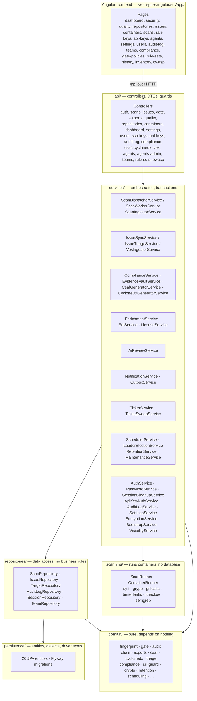
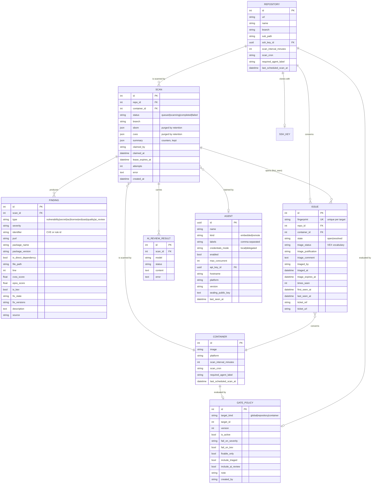
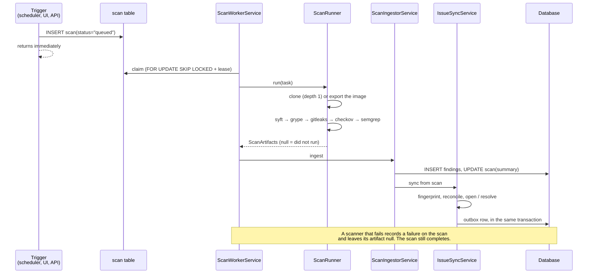

# Vectispire — Technical Documentation

This document describes Vectispire's internal architecture, its database schema, and the scan
pipeline's runtime flow. For features and quick start, see [`README.md`](../README.md). For
the reasoning behind the structural choices, see [`docs/architecture/`](architecture/) and
its [decision register](architecture/decisions/).

---

### Origin & Philosophy of the Name: *Vectispire*

The name **Vectispire** is the synthesis of two pillars of software supply chain security:
- **`Vectis`** *(Latin for "Security Lever & Lock")*: The platform acts as the **cryptographic security lever and policy gatekeeper** of your delivery pipeline. It enforces hard quality and security gates, signs in-toto attestations, generates DSSE Cosign signatures, deterministic SBOMs, and verifiable VEX statements (OASIS CSAF 2.0, OpenVEX, CycloneDX) with a tamper-evident cryptographic audit chain.
- **`Spire`** *(The Elevated ASPM Watchtower & Posture Horizon)*: The platform provides a **panoramic, elevated vantage point** across your entire application portfolio — mapping multi-tier dependency trees, measuring blast radius dispersion, evaluating open-source license copyleft conflicts, and tracking vulnerability remediation velocity (MTTR) across all Git repositories and container fleets.

---

## 1. Layered architecture

Two artifacts, built by different toolchains: a Spring Boot control plane in `vectispire-java/`
and an Angular front end in `vectispire-angular/` that talks to it over the same HTTP API a CI
pipeline or a remote agent uses.



**Dependency injection is Spring's**, by constructor. Every collaborator a class needs is a
parameter it cannot be built without, which is also what makes the unit suites possible: a
test hands a stub where the container hands a bean, and nothing has to be intercepted.

**The layering is enforced, not documented.**
[`ArchitectureTest`](../vectispire-java/vectispire-core/src/test/java/com/asmolabs/vectispire/core/ArchitectureTest.java)
reads the import graph with ArchUnit and fails the suite when a layer imports from above
itself, or when a `domain` class imports a framework.

**The agent's isolation is stronger than that test.** `vectispire-agent` does not depend on
`vectispire-core`, so no JDBC driver is on its compile classpath and the violation fails to
compile rather than failing a suite somebody could delete — a security property, not a style
rule, see [decision 0003](architecture/decisions/0003-long-polling-for-agents.md). A rule
written
only in a document is true the day it is written and false six months later.

`domain` is pure because it carries the calculations where a mistake raises no exception but
destroys data: an issue's fingerprint, the audit chain, the gate verdict, the export formats.
It depends on nothing but the JDK, BouncyCastle and Jackson.

## 2. Database schema

The schema belongs to **Flyway migrations**, under
[`src/main/resources/db/migration/{vendor}/`](../vectispire-java/vectispire-core/src/main/resources/db/migration/) — one native SQL set per
engine (`postgresql`, `mariadb`, `mysql`, `sqlite`). `ddl-auto` is `validate`
and stays that way: Hibernate must never alter the schema at runtime.

`VECTISPIRE_DB_DIALECT` accepts `postgres` (default), `mysql`, `mariadb` and `sqlite`. All
four pass the whole integration campaign
([decision 0009](architecture/decisions/0009-four-engines.md), [decision 0013](architecture/decisions/0013-flyway-multi-dialect-migrations.md)).
[`SchemaParityIntegrationTest`](../vectispire-java/vectispire-core/src/integrationTest/java/com/asmolabs/vectispire/core/persistence/SchemaParityIntegrationTest.java)
asks on each engine whether the entities and schema agree.

### The scan and issue model



### The service tables

Outside the main model, and each one load-bearing:

| Table | What it holds | Why it exists |
|---|---|---|
| `user` | accounts, **Argon2id** password, role, `must_change_password` | — |
| `session` | the token's **SHA-256** as primary key — never the token, `created_at`, `last_seen_at`, `expires_at`, IP, user agent | a **revocable** session: a token that cannot be invalidated, so nobody could be logged out. Storing the token itself would make every dump of this table a set of live sessions |
| `team_webhook` | one team's notification channel | its own table rather than a column on `team`: a webhook URL is a bearer capability that has no business being carried by every query over teams — and `addColumn` on `team` destroys the access tables' foreign keys on SQLite |
| `team` / `team_member` / `team_target` | teams, who is in them, what they own | restricted visibility, made administrable: an account sees the union of what its teams own and what was assigned to it directly. The per-account table stays for the exception a team cannot express |
| `login_attempt` | `counter_key`, `occurred_at` | anti-stuffing counted per user **and** per client; one axis alone is defeatable |
| `api_key` | **Argon2id** hash, prefix for display, scopes, target restriction, expiry | the raw secret is returned once and never stored. The prefix is what makes a memory-hard hash affordable here: it narrows the lookup to a handful of rows before hashing |
| `ssh_key` | AES-GCM ciphertext bound to its row by associated data | without the binding, key A's ciphertext copied into row B decrypts cleanly |
| `setting` | key/value, including the four remediation windows | the `Setting` catalog decides what is exposed. A deadline is a setting and not a column: it is a policy an organisation writes, and storing it per issue would freeze each one at the policy in force the day it was found |
| `audit_log` | entry hash, previous hash, IP, user agent | chained: makes **selective** editing detectable |
| `outbox_message` | payload, `status`, `attempts`, `next_attempt_at`, `team_id` (null = the global webhook) | written in the transaction that produces the result, so a crash before the POST loses nothing |
| `processed_message` | `message_id` UK, `agent_id` | deduplicates an at-least-once agent report; the fingerprint alone would still inflate `times_seen` |
| `leader_lease` | `name`, `holder`, `expires_at` | one instance holds the periodic tick; a table rather than an advisory lock because it is **observable** |

## 3. Scan pipeline

Triggering does not execute. A trigger inserts a `queued` row and returns; a worker loop
claims and runs it. That is what lets a remote agent, or a second instance, take the work
([decision 0002](architecture/decisions/0002-the-database-carries-the-queue.md)).



Points that are not obvious from the diagram:

- **`null` is not `[]`.** In `ScanArtifacts`, `[]` is the positive claim *"the step ran and
  found nothing"*, which **resolves** that type's issues; `null` means it did not run, and
  the backlog is left alone. A port that normalized nulls into empty lists would silently
  resolve hundreds of security issues with no error anywhere
  ([decision 0007](architecture/decisions/0007-none-is-not-an-empty-list.md)).
- **Failure does not only show in the exit code.** A Semgrep run where most files timed out
  exits 0 with a short list. `errors[]` and `paths.scanned` are inspected, and past a 25%
  error ratio the result is `null`.
- **Semgrep produces two finding types from one pass.** Each rule's `metadata.category`
  decides: `security` becomes a `sast` finding, gated like any vulnerability; anything else
  becomes `quality`, which no policy can let into a verdict
  ([decision 0005](architecture/decisions/0005-quality-never-blocks-the-gate.md)). Both
  come from the same run, so they enter the scanned-types list together.
- **The analyzers' configuration comes from Vectispire, never from the target.** gitleaks
  falls back to the scanned repository's `.gitleaks.toml` when given no `--config`, and
  Semgrep honours the analyzed tree's `.gitignore` unless told otherwise — in both cases
  the audited repository would decide what is looked for in it.
- **Rules are copied into the scan's workspace.** Counter-intuitive but mandatory: volume
  paths are resolved by the Docker *daemon*, so a directory inside Vectispire's own image is
  invisible to the sibling scanner container. See
  [`RulePlacement`](../vectispire-java/vectispire-common/src/main/java/com/asmolabs/vectispire/common/scanning/RulePlacement.java), which also
  merges the operator's `VECTISPIRE_SEMGREP_RULES_DIR`.
- **Secrets, IaC and SAST never run on a container image.** They look in source code;
  declaring them scanned would silently resolve that target's whole history for those
  types. They stay `null`.

## 4. The scanners

Each is an ephemeral container, pinned **by digest**, with `cap_drop: ALL`,
`no-new-privileges`, memory and PID caps, and the network cut off when the tool has nothing
to fetch.

| Step | Image | Network | Produces |
|---|---|---|---|
| SBOM | `anchore/syft` | open (registry) | component inventory |
| Vulnerabilities | `anchore/grype` | open (vulnerability database) | `vulnerability` findings |
| Secrets | `gitleaks` | **cut off** | `secret` findings |
| IaC | `bridgecrew/checkov` | **cut off** | `iac` findings |
| Source code | `semgrep/semgrep` | **cut off** | `sast` and `quality` findings |
| Licenses | *(none)* | — | derived from the SBOM |
| End of life | endoflife.date | outbound, opt-in | `eol` findings |
| AI review | local Ollama | local, opt-in | `ai_review` findings |

There is **one** runner, [`ScanRunner`](../vectispire-java/vectispire-common/src/main/java/com/asmolabs/vectispire/common/scanning/ScanRunner.java), and it runs
Docker. An earlier design had a `ScannerEngine` interface with three implementations; the
port kept only the Docker one and
[decision 0010](architecture/decisions/0010-one-scan-runner.md) abandons the seam rather
than rebuilding it around a single implementation. Moving execution elsewhere is done by
running an agent elsewhere.

**No analysis container sees the Docker socket.** The image SBOM step used to mount it so
Syft could pull the image itself — handing root on the host to a process whose input is
hostile by definition. Vectispire now pulls and exports the image, and presents the container
with a read-only archive.

### AI code review (Ollama), off by default

[`AiReviewService`](../vectispire-java/vectispire-core/src/main/java/com/asmolabs/vectispire/core/services/AiReviewService.java) is a light complement to
the scanners, not a SAST engine: one prompt, no guaranteed reproducibility. The sample sent
is a sorted, extension-filtered concatenation of source files capped at 40,000 characters —
no chunking, so large repositories are truncated.

Three things about it are security decisions, not features:

- **The URL guard is inverted here.** This endpoint receives the scanned repository's source
  code, so the risk is not that it points inward but that it points **outward**. A
  well-formed public URL is exactly what an exfiltration channel looks like, so a public
  destination is refused unless explicitly allowed.
- **Its findings enter no gate verdict by default.** A hostile repository can steer a model
  it has been handed the code of, and an invented `critical` would fail somebody's build.
- **An LLM is not a trust boundary.** The sample is wrapped in an explicit delimiter and the
  prompt asks the model to *report* an injection attempt rather than obey it. That is a
  mitigation, and the reason its verdict blocks nothing.

The model list is read live from Ollama's `GET /api/tags`, so what the operator has actually
pulled is what becomes selectable; a two-entry fallback is shown as a *suggestion* when
Ollama is unreachable, never as installed. Parsing is defensive — a response that does not
parse yields an empty list and never raises.

## 5. Service and repository reference

| Service | Responsibility |
|---|---|
| `ScanDispatcherService` | Claims scans transactionally and hands tasks to agents; holds the credentials decision (`credentialsMode`) and the sealing. |
| `ScanWorkerService` | The built-in worker: claims, runs, ingests. |
| `ScanIngestorService` | Normalizes artifacts into `Finding` rows and updates the scan. Knows the database; runs no container. |
| `IssueSyncService` | Reconciles findings against issues across scans: fingerprint, `times_seen`, open/resolve. Writes the outbox row in the same transaction. |
| `IssueTriageService` | Applies a validated triage decision, and expires the ones past their review date. |
| `EnrichmentService` | EPSS scores and the CISA KEV catalog. Best-effort: never turns a completed scan into a failure. |
| `EolService` · `LicenseService` | End-of-life matching, and the license blocklist over SBOM data already collected. |
| `AiReviewService` | See §4. |
| `NotificationService` · `OutboxService` | Selects what deserves a message, and relays the outbox with capped backoff. |
| `TicketService` · `TicketSweepService` | Opens one tracker ticket per issue that would fail a build, under the same gate policy — no second threshold. |
| `SchedulerService` | The periodic tick: due scans, retention, triage expiry, outbox, ticket sweep. |
| `LeaderElectionService` | The lease that makes exactly one instance run that tick. |
| `RetentionService` · `MaintenanceService` | Purge of raw payloads, and periodic housekeeping. |
| `AuthService` · `PasswordService` · `SessionCleanupService` | Login, throttling, hashing, session expiry. |
| `ApiKeyAuthService` | Key verification, scopes, target restriction, expiry. |
| `AuditLogService` | Chained audit entries. Recording never raises: a logging failure must not break the action being audited. |
| `EncryptionService` | AES-GCM at rest, with the context bound to the row, and multi-key rotation. |
| `SettingsService` · `BootstrapService` | Key/value settings, and first-run account creation. |

Five repositories only — `Scan`, `Issue`, `Target`, `AuditLog`, `Session` — each a thin
wrapper around the queries its callers actually need. There is no generic base repository.
A service writes no SQL, and a repository holds no business rule;
`ArchitectureTest` enforces both.

## 6. The front end

Angular 21 with [Optimus UI](https://github.com/openng/optimus-ui), the community fork of
PrimeNG v21 — PrimeTek archived PrimeNG and moved v22 to a commercial license. The shell
comes from the Sakai template (MIT). `primeicons` is pinned to exactly `7.0.0`: 8.0.0
followed PrimeNG under a proprietary license, which is what moving to Optimus was meant to
avoid. See [`vectispire-angular/README.md`](../vectispire-angular/README.md).

The view models the browser receives are typed and computed server-side
([`core/api.models.ts`](../vectispire-angular/src/app/core/api.models.ts)): finished values, not
arithmetic. In particular the gate verdict shown on the Security screen is the one
`POST /api/v1/gate` returns, because both go through the same `PolicyGate` — not a
second implementation in SQL, which would agree today and diverge the first time a policy
flag was added.

`npm test` starts with `scripts/check-assets.mjs`, which refuses any reference to a
third-party domain in `index.html` and `styles.scss` and verifies the declared fonts exist
and are real `woff2`. Not zeal: the CSP refuses third-party stylesheets, and such a
reference breaks nothing visible — the request is blocked, the page falls back to the system
font, and nothing reports it. That is exactly how a typography never
reached production.

## 7. Testing approach

The unit suite runs with no database: `npm test`.

The integration suites start a real engine through **testcontainers**, apply every
migration, and roll each test back in its own transaction — so the schema under test is the
one production will receive, and the cases cannot see each other.

```bash
cd vectispire-java && ./gradlew integrationTest                # PostgreSQL
cd vectispire-java && ./gradlew integrationTestAll             # all four engines
```

Two rules the harness enforces on itself:

- **It does not skip when Docker is missing.** A run that verifies nothing must fail loudly.
  That is a defect this harness once had.
- **A concurrency guarantee not executed against a real server is not a guarantee.** Ten
  concurrent claimants against a real engine is what revealed that six of them came back
  empty-handed while twenty scans waited — invisible on SQLite and to a careful reading.

## 8. Dependency Graph & Blast Radius Explorer

- **Blast Radius Analysis Engine (`BlastRadiusService`)**: In-memory relational mapping linking Target (Git repository / Container image) $\rightarrow$ Package dependency (Direct vs Transitive) $\rightarrow$ CVE security advisories.
- **Organizational Risk Scoring**: 0-100 score weighing fleet target dispersion, direct vs transitive inclusion, reachability call graph, and peak CVSS score.
- **REST Endpoints**:
  - `GET /api/v1/blast-radius/explore?q={package|CVE}`: Full node/edge dependency graph and impacted target breakdown.
  - `GET /api/v1/blast-radius/top-impact?limit=10`: Top highest blast radius packages across the enterprise.

## 9. Multi-Channel Notification Hub & Transactional Outbox

- **Supported Notification Channels**:
  - **Slack** (`SlackNotificationChannel`, `SlackBlockKit`): Interactive Block Kit cards with header, findings breakdown, and direct deep links.
  - **Microsoft Teams** (`TeamsNotificationChannel`, `TeamsCard`): Adaptive Cards v1.4 sent via Power Automate workflows.
  - **Discord** (`DiscordNotificationChannel`, `DiscordEmbed`): Rich Embeds with dynamic severity color codes.
  - **Email** (`MailNotificationChannel`): Multipart HTML/text delivery to distribution lists.
  - **Generic Webhook / SIEM** (`NotificationService`): Standard JSON POST with HMAC-SHA256 signature verification (`X-Vectispire-Signature`).
- **Resiliency & Outbox Guarantee**:
  - Outbox rows are inserted into `t_outbox_message` in the exact transaction that reconciles scan results. Deliveries use capped exponential backoff with per-destination isolation.
- **REST Endpoints**:
  - `GET /api/v1/notifications/channels`: Overview of configured channels and subscribed events.
  - `POST /api/v1/notifications/test/{channelType}`: Immediate simulated delivery test with diagnostic results.

## 10. Local AI Vulnerability & Triage Explainer Advisor

- **Explainer & Remediation Engine (`AiReviewService`, `AiAdvisorController`)**:
  - Generates contextual vulnerability explanations, exploit mechanics analysis, static reachability exposure verdict, exact upgrade CLI commands (`mvn`, `npm`), and formal VEX justification statements.
  - Dual-mode operation: Local Ollama model inference (zero third-party data leakage) or instantaneous deterministic heuristic fallback.
- **REST Endpoints**:
  - `GET /api/v1/ai-advisor/status`: Status of the local AI inference engine and available models.
  - `POST /api/v1/ai-advisor/explain/issue/{issueId}`: Contextual explanation and VEX statement for a persisted issue.
  - `POST /api/v1/ai-advisor/explain/cve/{cveId}`: On-the-fly explanation for any CVE identifier with optional package metadata.

## 11. Open Source License Legal Risk & Copyleft Matrix

- **Cross-Compatibility & Viral Contamination Matrix (`LicenseConflictMatrix`, `LicenseGovernanceService`)**:
  - Identifies viral copyleft risks (GPL-3.0, AGPL-3.0) that legally mandate disclosing proprietary source code upon distribution.
  - Classifies dynamic linking requirements for weak copyleft (LGPL, MPL, EPL) and permissive attribution notices (MIT, Apache-2.0, BSD).
  - Actionable legal remediation guidance per target (replacement recommendations or component architectural isolation).
- **REST Endpoints**:
  - `GET /api/v1/licenses/conflicts?proprietary=true`: Detailed list of detected legal incompatibilities and risk justifications.
  - `GET /api/v1/licenses/matrix`: Official cross-license compatibility reference rules.

## 12. Security Posture Trends & Multi-Echelon MTTR Analytics

- **Posture Analytics Engine (`PostureTrendAnalytics`, `DashboardController`)**:
  - Pure Java calendar-day calculation of Mean Time to Remediate (MTTR) broken down by severity echelon (Critical, High, Medium, Low).
  - Net burndown resolution velocity KPI tracking resolution speed against discovery rate.
  - Target Maturity Scoreboard ranking repositories and containers with Grades (`A` to `F`) and 0-100 posture scores.
- **REST Endpoints**:
  - `GET /api/v1/dashboard/posture-analytics?days=30`: Aggregated MTTR by severity, net burndown rate, daily time series, and target maturity rankings.

## 13. Attack Surface Discovery & Exposed API Inventory

- **Static API & Route Extraction Engine (`ApiDiscoveryScanner`, `ApiInventoryService`)**:
  - AST-free, regex-based static analysis discovering HTTP endpoints across Spring Boot (`@GetMapping`, `@PostMapping`, `@RequestMapping`), Express / NestJS (`app.get`, `router.post`), FastAPI / Flask (`@app.get`, `@bp.route`), and Go Gin (`r.GET`, `group.POST`).
  - OpenAPI 3.0 / Swagger 2.0 specification parser (`ApiContract`) reading JSON/YAML contracts.
  - Kubernetes Ingress route extractor mapping public hostname paths directly to discovered services.
- **Shadow API & Attack Surface Drift Detection**:
  - Automatically identifies **Shadow APIs** (active HTTP endpoints discovered in source code but missing from OpenAPI specifications).
  - Flags **Sensitive Unprotected Endpoints** (e.g. unauthenticated `/admin`, `/actuator`, `/debug`, `/metrics`, `/env` routes) mapped to OWASP API Security Top 10 risks (API1: BOLA, API2: Broken Authentication, API9: Improper Asset Management).
  - Dynamically synthesizes compliant OpenAPI 3.0.3 specifications from discovered code routes for undocumented legacy services.
- **REST Endpoints**:
  - `GET /api/v1/attack-surface`: Global cross-repository attack surface summary, frameworks inventory, and high-risk exposed endpoints.
  - `GET /api/v1/repositories/{id}/apis`: Discovered endpoints, contracts, and shadow API status for a repository.
  - `GET /api/v1/repositories/{id}/apis/export/openapi`: Synthesized OpenAPI 3.0.3 specification export for a repository.
