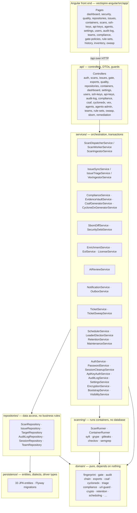
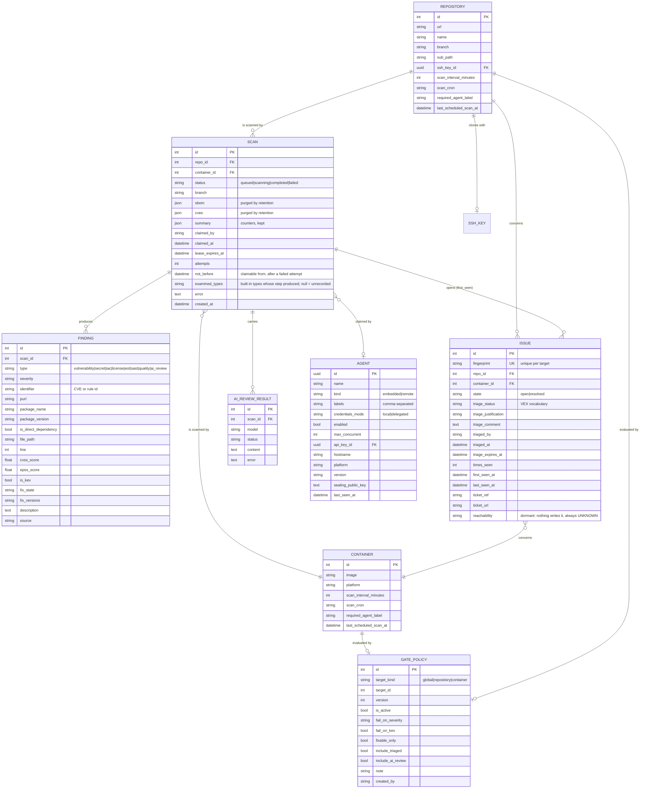
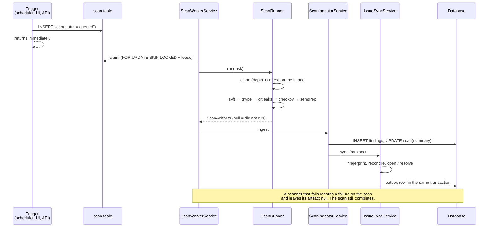

# Vectispire — Technical Documentation

This document describes Vectispire's internal architecture, its database schema, and the scan
pipeline's runtime flow. For features and quick start, see [`README.md`](../../README.md). For
the reasoning behind the structural choices, see [`docs/architecture/`](../architecture/en/) and
its [decision register](../architecture/en/decisions/).

---

### Origin & Philosophy of the Name: *Vectispire*

The name **Vectispire** is the synthesis of two pillars of software supply chain security:
- **`Vectis`** *(Latin for "Security Lever & Lock")*: The platform acts as the **cryptographic security lever and policy gatekeeper** of your delivery pipeline. It enforces hard quality and security gates, signs in-toto attestations, generates DSSE Cosign signatures, deterministic SBOMs, and verifiable VEX statements (OASIS CSAF 2.0, OpenVEX, CycloneDX) with a tamper-evident cryptographic audit chain.
- **`Spire`** *(The Elevated ASPM Watchtower & Posture Horizon)*: The platform provides a **panoramic, elevated vantage point** across your entire application portfolio — mapping multi-tier dependency trees, measuring blast radius dispersion, evaluating open-source license copyleft conflicts, and tracking vulnerability remediation velocity (MTTR) across all Git repositories and container fleets.

---

## 1. Layered architecture

Two artifacts, built by different toolchains: a Spring Boot control plane in `vectispire-java/`
and an Angular front end in `vectispire-angular/` that talks to it over the same HTTP API a CI
pipeline or a remote agent uses.


```mermaid
flowchart TB
    subgraph front["Angular front end — vectispire-angular/src/app/"]
        Pages["Pages<br/>dashboard, security, quality, repositories, issues,<br/>containers, scans, ssh-keys, api-keys, agents,<br/>settings, users, audit-log, teams, compliance,<br/>gate-policies, rule-sets, history, inventory, owasp"]
    end

    subgraph api["api/ — controllers, DTOs, guards"]
        Routes["Controllers<br/>auth, scans, issues, gate, exports, quality,<br/>repositories, containers, dashboard, settings,<br/>users, ssh-keys, api-keys, audit-log, compliance,<br/>csaf, cyclonedx, vex, agents, agents-admin, teams, rule-sets, owasp,<br/>sbom, remediation"]
    end

    subgraph services["services/ — orchestration, transactions"]
        Scan["ScanDispatcherService / ScanWorkerService<br/>ScanIngestorService"]
        Issue["IssueSyncService / IssueTriageService / VexIngestorService"]
        Comp["ComplianceService · EvidenceVaultService · CsafGeneratorService · CycloneDxGeneratorService"]
        Remed["SbomDiffService · SecurityDebtService"]
        Enrich["EnrichmentService · EolService · LicenseService"]
        Ai["AiReviewService"]
        Notify["NotificationService · OutboxService"]
        Ticket["TicketService · TicketSweepService"]
        Ops["SchedulerService · LeaderElectionService<br/>RetentionService · MaintenanceService"]
        Auth["AuthService · PasswordService · SessionCleanupService<br/>ApiKeyAuthService · AuditLogService · SettingsService<br/>EncryptionService · BootstrapService · VisibilityService"]
    end

    subgraph repos["repositories/ — data access, no business rules"]
        R["ScanRepository · IssueRepository · TargetRepository<br/>AuditLogRepository · SessionRepository · TeamRepository"]
    end

    subgraph persistence["persistence/ — entities, dialects, driver types"]
        Ent["33 JPA entities · Flyway migrations"]
    end

    subgraph domain["domain/ — pure, depends on nothing"]
        D["fingerprint · gate · audit chain · exports · csaf · cyclonedx · triage<br/>compliance · url-guard · crypto · retention · scheduling · …"]
    end

    subgraph scanning["scanning/ — runs containers, no database"]
        S["ScanRunner · ContainerRunner<br/>syft · grype · gitleaks · checkov · semgrep"]
    end

    Pages -->|"/api over HTTP"| Routes
    Routes --> services
    services --> repos
    repos --> persistence
    services --> scanning
    services --> domain
    repos --> domain
    scanning --> domain
```

**Dependency injection is Spring's**, by constructor. Every collaborator a class needs is a
parameter it cannot be built without, which is also what makes the unit suites possible: a
test hands a stub where the container hands a bean, and nothing has to be intercepted.

**The layering is enforced, not documented.**
[`ArchitectureTest`](../../vectispire-java/vectispire-core/src/test/java/com/asmolabs/vectispire/core/ArchitectureTest.java)
reads the import graph with ArchUnit and fails the suite when a layer imports from above
itself, or when a `domain` class imports a framework.

**The agent's isolation is stronger than that test.** `vectispire-agent` does not depend on
`vectispire-core`, so no JDBC driver is on its compile classpath and the violation fails to
compile rather than failing a suite somebody could delete — a security property, not a style
rule, see [decision 0003](../architecture/en/decisions/0003-long-polling-for-agents.md). A rule
written
only in a document is true the day it is written and false six months later.

`domain` is pure because it carries the calculations where a mistake raises no exception but
destroys data: an issue's fingerprint, the audit chain, the gate verdict, the export formats.
It depends on nothing but the JDK, BouncyCastle and Jackson.

## 2. Database schema

The schema belongs to **Flyway migrations**, under
[`src/main/resources/db/migration/`](../../vectispire-java/vectispire-core/src/main/resources/db/migration/) — native SQL, written once
in `common/` with per-engine type placeholders when only the column types differ, and once per
engine (`postgresql`, `mysql`) when the structure does
([ADR 0027](../architecture/en/decisions/0027-common-migrations-with-type-placeholders.md); the
`sqlite` set went with the fixture, [ADR 0034](../architecture/en/decisions/0034-mysql-replaces-the-sqlite-fixture.md)). `ddl-auto` is `validate`
and stays that way: Hibernate must never alter the schema at runtime.

**The engine is chosen by `VECTISPIRE_DB_URL` and nothing else** — Hibernate and Flyway both read
it from the JDBC URL, so there is no separate dialect setting to keep in step with it. MySQL is
the default, the engine `docker-compose.yml` ships. All four pass the whole integration campaign
([decision 0009](../architecture/en/decisions/0009-four-engines.md), [decision 0013](../architecture/en/decisions/0013-flyway-multi-dialect-migrations.md)).
[`SchemaParityIntegrationTest`](../../vectispire-java/vectispire-core/src/integrationTest/java/com/asmolabs/vectispire/core/persistence/SchemaParityIntegrationTest.java)
asks on each engine whether the entities and schema agree.

### The scan and issue model


```mermaid
erDiagram
    REPOSITORY ||--o{ SCAN : "is scanned by"
    CONTAINER  ||--o{ SCAN : "is scanned by"
    SCAN       ||--o{ FINDING : "produces"
    SCAN       ||--o{ ISSUE : "opens (first_seen)"
    SCAN       ||--o{ AI_REVIEW_RESULT : "carries"
    SCAN       }o--o| AGENT : "claimed by"
    ISSUE      }o--|| REPOSITORY : "concerns"
    ISSUE      }o--|| CONTAINER : "concerns"
    REPOSITORY ||--o| SSH_KEY : "clones with"
    REPOSITORY ||--o| GATE_POLICY : "evaluated by"
    CONTAINER  ||--o| GATE_POLICY : "evaluated by"

    REPOSITORY {
        int id PK
        string url
        string name
        string branch
        string sub_path
        uuid ssh_key_id FK
        int scan_interval_minutes
        string scan_cron
        string required_agent_label
        datetime last_scheduled_scan_at
    }
    CONTAINER {
        int id PK
        string image
        string platform
        int scan_interval_minutes
        string scan_cron
        string required_agent_label
        datetime last_scheduled_scan_at
    }
    SCAN {
        int id PK
        int repo_id FK
        int container_id FK
        string status "queued|scanning|completed|failed"
        string branch
        json sbom "purged by retention"
        json cves "purged by retention"
        json summary "counters, kept"
        string claimed_by
        datetime claimed_at
        datetime lease_expires_at
        int attempts
        datetime not_before "claimable from, after a failed attempt"
        string examined_types "built-in types whose step produced; null = unrecorded"
        text error
        datetime created_at
    }
    FINDING {
        int id PK
        int scan_id FK
        string type "vulnerability|secret|iac|license|eol|sast|quality|ai_review"
        string severity
        string identifier "CVE or rule id"
        string purl
        string package_name
        string package_version
        bool is_direct_dependency
        string file_path
        int line
        float cvss_score
        float epss_score
        bool is_kev
        string fix_state
        string fix_versions
        text description
        string source
    }
    ISSUE {
        int id PK
        string fingerprint UK "unique per target"
        int repo_id FK
        int container_id FK
        string state "open|resolved"
        string triage_status "VEX vocabulary"
        string triage_justification
        text triage_comment
        string triaged_by
        datetime triaged_at
        datetime triage_expires_at
        int times_seen
        datetime first_seen_at
        datetime last_seen_at
        string ticket_ref
        string ticket_url
        string reachability "dormant: nothing writes it, always UNKNOWN"
    }
    AI_REVIEW_RESULT {
        int id PK
        int scan_id FK
        string model
        string status
        text content
        text error
    }
    GATE_POLICY {
        int id PK
        string target_kind "global|repository|container"
        int target_id
        int version
        bool is_active
        string fail_on_severity
        bool fail_on_kev
        bool fixable_only
        bool include_triaged
        bool include_ai_review
        string note
        string created_by
    }
    AGENT {
        uuid id PK
        string name
        string kind "embedded|remote"
        string labels "comma-separated"
        string credentials_mode "local|delegated"
        bool enabled
        int max_concurrent
        uuid api_key_id FK
        string hostname
        string platform
        string version
        text sealing_public_key
        datetime last_seen_at
    }
```

### The service tables

Outside the main model, and each one load-bearing:

| Table | What it holds | Why it exists |
|---|---|---|
| `user` | accounts, **Argon2id** password, role, `must_change_password` | — |
| `session` | the token's **SHA-256** as primary key — never the token, `created_at`, `last_seen_at`, `expires_at`, IP, user agent | a **revocable** session: a token that cannot be invalidated, so nobody could be logged out. Storing the token itself would make every dump of this table a set of live sessions |
| `team_webhook` | one team's notification channel | its own table rather than a column on `team`: a webhook URL is a bearer capability that has no business being carried by every query over teams — and `addColumn` on `team` destroyed the access tables' foreign keys on the SQLite fixture of the time |
| `team` / `team_member` / `team_target` | teams, who is in them, what they own | restricted visibility, made administrable: an account sees the union of what its teams own and what was assigned to it directly. The per-account table stays for the exception a team cannot express |
| `login_attempt` | `counter_key`, `occurred_at` | anti-stuffing counted per user **and** per client; one axis alone is defeatable |
| `api_key` | **Argon2id** hash, prefix for display, scopes, target restriction, expiry | the raw secret is returned once and never stored. The prefix is what makes a memory-hard hash affordable here: it narrows the lookup to a handful of rows before hashing |
| `ssh_key` | AES-GCM ciphertext bound to its row by associated data | without the binding, key A's ciphertext copied into row B decrypts cleanly |
| `setting` | key/value, including the four remediation windows | the `Setting` catalog decides what is exposed. A deadline is a setting and not a column: it is a policy an organisation writes, and storing it per issue would freeze each one at the policy in force the day it was found |
| `audit_log` | entry hash, previous hash, IP, user agent | chained: makes **selective** editing detectable |
| `outbox_message` | payload, `status`, `attempts`, `next_attempt_at`, `team_id` (null = the global webhook) | written in the transaction that produces the result, so a crash before the POST loses nothing |
| `processed_message` | `message_id`, `agent_id` | **created by `V1` and never written**: nothing maps it any more. An agent's repeated report is refused by the scan itself — the result is recorded only while the scan is still `scanning` and leased to that agent (`ScanQueue.holdForWrite`), and recording it ends both, so a second copy writes nothing and `times_seen` does not move. The table stays because `V1` is never edited |
| `leader_lease` | `name`, `holder`, `expires_at` | one instance holds the periodic tick; a table rather than an advisory lock because it is **observable** |

## 3. Scan pipeline

Triggering does not execute. A trigger inserts a `queued` row and returns; a worker loop
claims and runs it. That is what lets a remote agent, or a second instance, take the work
([decision 0002](../architecture/en/decisions/0002-the-database-carries-the-queue.md)).


```mermaid
sequenceDiagram
    participant T as Trigger<br/>(scheduler, UI, API)
    participant Q as scan table
    participant W as ScanWorkerService
    participant R as ScanRunner
    participant I as ScanIngestorService
    participant S as IssueSyncService
    participant DB as Database

    T->>Q: INSERT scan(status="queued")
    T-->>T: returns immediately
    W->>Q: claim (FOR UPDATE SKIP LOCKED + lease)
    W->>R: run(task)
    R->>R: clone (depth 1) or export the image
    R->>R: syft → grype → gitleaks → checkov → semgrep
    R-->>W: ScanArtifacts (null = did not run)
    W->>I: ingest
    I->>DB: INSERT findings, UPDATE scan(summary)
    I->>S: sync from scan
    S->>S: fingerprint, reconcile, open / resolve
    S->>DB: outbox row, in the same transaction
    Note over W,DB: A scanner that fails records a failure on the scan<br/>and leaves its artifact null. The scan still completes.
```

Points that are not obvious from the diagram:

- **`null` is not `[]`.** In `ScanArtifacts`, `[]` is the positive claim *"the step ran and
  found nothing"*, which **resolves** that type's issues; `null` means it did not run, and
  the backlog is left alone. A port that normalized nulls into empty lists would silently
  resolve hundreds of security issues with no error anywhere
  ([decision 0007](../architecture/en/decisions/0007-none-is-not-an-empty-list.md)).
- **Failure does not only show in the exit code.** A Semgrep run where most files timed out
  exits 0 with a short list. `errors[]` and `paths.scanned` are inspected, and past a 25%
  error ratio the result is `null`.
- **Semgrep produces two finding types from one pass.** Each rule's `metadata.category`
  decides: `security` becomes a `sast` finding, gated like any vulnerability; anything else
  becomes `quality`, which no policy can let into a verdict
  ([decision 0005](../architecture/en/decisions/0005-quality-never-blocks-the-gate.md)). Both
  come from the same run, so they enter the scanned-types list together.
- **The analyzers' configuration comes from Vectispire, never from the target.** gitleaks
  falls back to the scanned repository's `.gitleaks.toml` when given no `--config`, and
  Semgrep honours the analyzed tree's `.gitignore` unless told otherwise — in both cases
  the audited repository would decide what is looked for in it.
- **Rules are copied into the scan's workspace.** Counter-intuitive but mandatory: volume
  paths are resolved by the Docker *daemon*, so a directory inside Vectispire's own image is
  invisible to the sibling scanner container. See
  [`RulePlacement`](../../vectispire-java/vectispire-common/src/main/java/com/asmolabs/vectispire/common/scanning/RulePlacement.java), which also
  merges the operator's `VECTISPIRE_SEMGREP_RULES_DIR`.
- **Secrets, IaC and SAST never run on a container image.** They look in source code;
  declaring them scanned would silently resolve that target's whole history for those
  types. They stay `null`.

## 4. The scanners

Each is an ephemeral container, pinned **by digest**, with `cap_drop: ALL`,
`no-new-privileges`, memory and PID caps, and the network cut off when the tool has nothing
to fetch.

| Step | Image | Network | Produces |
|---|---|---|---|
| SBOM | `anchore/syft` | open (registry) | component inventory |
| Vulnerabilities | `anchore/grype` | open (vulnerability database) | `vulnerability` findings |
| Secrets | `gitleaks` | **cut off** | `secret` findings |
| IaC | `bridgecrew/checkov` | **cut off** | `iac` findings |
| Source code | `semgrep/semgrep` | **cut off** | `sast` and `quality` findings |
| Licenses | *(none)* | — | derived from the SBOM |
| End of life | endoflife.date | outbound, opt-in | `eol` findings |
| AI review | local Ollama | local, opt-in | `ai_review` findings |
| Plugins | yours, pinned by digest, per project | **cut off** unless declared with a justification | `plugin` findings — produced, not applicable or absent |

There is **one** runner, [`ScanRunner`](../../vectispire-java/vectispire-common/src/main/java/com/asmolabs/vectispire/common/scanning/ScanRunner.java), and it runs
Docker. An earlier design had a `ScannerEngine` interface with three implementations; the
port kept only the Docker one and
[decision 0010](../architecture/en/decisions/0010-one-scan-runner.md) abandons the seam rather
than rebuilding it around a single implementation. Moving execution elsewhere is done by
running an agent elsewhere.

**A plugin is one more scanner, not an exception to them**
([decision 0017](../architecture/en/decisions/0017-custom-checks-as-container-images.md)): the same
`ContainerRunner` and closed shape, as the workspace owner, the analysed tree read-only and nothing
else of the workspace, one writable output directory for its SARIF. It runs only where one of its
declared languages is present; otherwise it is *not applicable*, a third state beside "ran" and "did
not run" that resolves nothing and fails nothing. SARIF from an internal tool — never a service
outside the organisation — is imported through a declared source instead.

**No analysis container sees the Docker socket.** The image SBOM step used to mount it so
Syft could pull the image itself — handing root on the host to a process whose input is
hostile by definition. Vectispire now pulls and exports the image, and presents the container
with a read-only archive.

### AI code review (Ollama), off by default

[`AiReviewService`](../../vectispire-java/vectispire-core/src/main/java/com/asmolabs/vectispire/core/ai/AiReviewService.java) is a light complement to
the scanners, not a SAST engine: one prompt, no guaranteed reproducibility. The sample sent
is a sorted, extension-filtered concatenation of source files capped at 40,000 characters —
no chunking, so large repositories are truncated.

Three things about it are security decisions, not features:

- **The URL guard is inverted here.** This endpoint receives the scanned repository's source
  code, so the risk is not that it points inward but that it points **outward**. A
  well-formed public URL is exactly what an exfiltration channel looks like, so a public
  destination is refused unless explicitly allowed.
- **Its findings enter no gate verdict by default.** A hostile repository can steer a model
  it has been handed the code of, and an invented `critical` would fail somebody's build.
- **An LLM is not a trust boundary.** The sample is wrapped in an explicit delimiter and the
  prompt asks the model to *report* an injection attempt rather than obey it. That is a
  mitigation, and the reason its verdict blocks nothing.

The model list is read live from Ollama's `GET /api/tags`, so what the operator has actually
pulled is what becomes selectable; a two-entry fallback is shown as a *suggestion* when
Ollama is unreachable, never as installed. Parsing is defensive — a response that does not
parse yields an empty list and never raises.

## 5. Service and repository reference

| Service | Responsibility |
|---|---|
| `ScanDispatcherService` | Claims scans transactionally and hands tasks to agents; holds the credentials decision (`credentialsMode`) and the sealing. |
| `ScanWorkerService` | The built-in worker: claims, runs, ingests. |
| `ScanIngestorService` | Normalizes artifacts into `Finding` rows and updates the scan. Knows the database; runs no container. |
| `IssueSyncService` | Reconciles findings against issues across scans: fingerprint, `times_seen`, open/resolve. Writes the outbox row in the same transaction. |
| `IssueTriageService` | Applies a validated triage decision, and expires the ones past their review date. |
| `EnrichmentService` | EPSS scores and KEV status, both read from the stored feeds — a scan asks no third party. Before a feed's first synchronisation it sets nothing: unknown, never zero. |
| `ThreatIntelFeedService` | The CISA KEV catalogue: fetched outside any transaction (`KevCatalogSource`, `VECTISPIRE_KEV_URL`), refused unless whole and not older than the one in use, stored — new entries 500 to a statement — and applied to the open issues 500 at a time, each page its own transaction under the sync row's lock, so that `CRITICAL_KEV_DETECTED` is raised once for a newly listed one however many synchronisations run. Every six hours through `KevCatalogueSyncTask`, one instance elected by a conditional update; audited as `THREAT_INTEL_SYNCED`, a failure included. |
| `EpssFeed` | FIRST's daily EPSS file: downloaded outside any transaction (`EpssFileSource`, `VECTISPIRE_EPSS_URL`, one same-origin redirect), read as a stream by `EpssFile` — refused unless whole (gzip checksum, at least 100,000 rows and nine tenths of the file in use, scores in [0, 1], 128 MiB inflated at most) and not older than the one in use — written under a new generation of `t_epss_score` in 5,000-row transactions, switched to in one conditional update, then applied to the open issues a page at a time; the generation it replaced is kept until the next file is applied — a reader that read the sync row just before the switch still finds its rows — and the one before it is deleted in batches. A lease on the sync row keeps one synchronisation at a time. Daily through `EpssScoresSyncTask`; each attempt audited under `THREAT_INTEL_SYNCED`. |
| `EolService` · `LicenseService` | End-of-life matching, and the license blocklist over SBOM data already collected. |
| `AiReviewService` | See §4. |
| `NotificationService` · `OutboxService` | Selects what deserves a message, and relays the outbox with capped backoff. |
| `TicketService` · `TicketSweepService` | Opens one tracker ticket per issue that would fail a build, under the same gate policy — no second threshold. |
| `SchedulerService` | The periodic tick: due scans, retention, triage expiry, outbox, ticket sweep. |
| `LeaderElectionService` | The lease that makes exactly one instance run that tick. |
| `RetentionService` · `MaintenanceService` | Purge of raw payloads, and periodic housekeeping. |
| `AuthService` · `PasswordService` · `SessionCleanupService` | Login, throttling, hashing, session expiry. |
| `ApiKeyAuthService` | Key verification, scopes, target restriction, expiry. |
| `AuditLogService` | Chained audit entries. Recording never raises: a logging failure must not break the action being audited. |
| `EncryptionService` | AES-GCM at rest, with the context bound to the row, and multi-key rotation. |
| `SettingsService` · `BootstrapService` | Key/value settings, and first-run account creation. |

One repository per entity that is read on its own, in its module's `persistence` and named
after the entity — `ScanRepository`, `IssueRepository`, `AuditLogRepository`, `SessionRepository`… —
each a thin wrapper around the queries its callers actually need. There is no generic base repository.
A service writes no SQL, and a repository holds no business rule;
`ArchitectureTest` enforces both.

## 6. The front end

Angular 22 and TypeScript 6.0 with [Optimus UI](https://github.com/openng-org/optimus-ui) 2, the
community fork of PrimeNG v21 — PrimeTek archived PrimeNG and moved v22 to a commercial
license; Optimus 2 is that fork carried to Angular 22. The shell comes from the Sparked template
(MIT), OpenNG's port of PrimeTek's Sakai onto Optimus, and its Tailwind utilities from
`@openng/optimus-ui-tailwindcss`, OpenNG's MIT fork of `tailwindcss-primeui`. The icons are
`@openng/icons`, OpenNG's MIT fork of `primeicons` 7.0.0: primeicons 8.x followed PrimeNG under a proprietary license, which is what moving to Optimus was meant to avoid. See [`vectispire-angular/README.md`](../../vectispire-angular/README.md).

The view models the browser receives are typed and computed server-side
([`core/api.models.ts`](../../vectispire-angular/src/app/core/api.models.ts)): finished values, not
arithmetic. In particular the gate verdict shown on the Security screen is the one
`POST /api/v1/gate` returns, because both go through the same `PolicyGate` — not a
second implementation in SQL, which would agree today and diverge the first time a policy
flag was added.

`npm test` starts with `scripts/check-assets.mjs`, which refuses any reference to a
third-party domain in `index.html` and `styles.scss` and verifies the declared fonts exist
and are real `woff2`. Not zeal: the CSP refuses third-party stylesheets, and such a
reference breaks nothing visible — the request is blocked, the page falls back to the system
font, and nothing reports it. That is exactly how a typography never
reached production.

The same script fails on any `pi-*` icon class the installed `openng-icons.css` does not define:
an unknown class renders an empty box and reports nothing either, and four had been shipped
blank that way.

## 7. Testing approach

`./gradlew build` runs the unit, architecture and HTTP suites; the context and HTTP suites run on
MySQL, the engine `docker-compose.yml` ships — a Testcontainers container, so Docker must be running,
or the server `VECTISPIRE_TEST_DB_URL` names, as CI's `jvm` job does with a job service. Without
either they fail rather than skip, and Hibernate validates the schema at every context start
([ADR 0034](../architecture/en/decisions/0034-mysql-replaces-the-sqlite-fixture.md)). The interface's
suite is `npm test`.

The integration suites start a real engine through **testcontainers**, apply every
migration, and roll each test back in its own transaction — so the schema under test is the
one production will receive, and the cases cannot see each other.

```bash
cd vectispire-java && ./gradlew integrationTest                # MySQL (-Pdialect=postgres)
cd vectispire-java && ./gradlew integrationTestAll             # both engines
```

Two rules the harness enforces on itself:

- **It does not skip when Docker is missing.** A run that verifies nothing must fail loudly.
  That is a defect this harness once had.
- **A concurrency guarantee not executed against a real server is not a guarantee.** Ten
  concurrent claimants against a real engine is what revealed that six of them came back
  empty-handed while twenty scans waited — invisible on SQLite and to a careful reading.

## 8. Dependency Graph & Blast Radius Explorer

- **Blast Radius Analysis Engine (`BlastRadiusService`)**: In-memory relational mapping linking Target (Git repository / Container image) $\rightarrow$ Package dependency (Direct vs Transitive) $\rightarrow$ CVE security advisories.
- **Organizational Risk Scoring**: 0-100 score weighing fleet target dispersion, direct vs transitive inclusion, and peak CVSS score. Reachability is not a term of it: no analysis establishes whether a component's vulnerable code is called — there is no call-graph analysis — and the report carries no reachability per target.
- **REST Endpoints**:
  - `GET /api/v1/blast-radius/explore?q={package|CVE}`: Full node/edge dependency graph and impacted target breakdown.
  - `GET /api/v1/blast-radius/top-impact?limit=10`: Top highest blast radius packages across the enterprise.

## 9. Remediation Plan

- **What it answers.** The findings list says what is wrong; the remediation plan says what to do
  about it. One row is one action — an upgrade — not one vulnerability: fourteen findings of the
  same library across six repositories are one decision, and a team that only has the findings
  list triages noise instead of removing risk.
- **Ranking (`SecurityDebtService.rank`)**: leverage = (distinct CVEs x 2 + critical x 3 + high x
  1.5) / effort, effort being 1h plus 0.1h per distinct CVE. Ties break on package name so two
  runs over the same data agree. Ten rows at most, and the estate is ranked on aggregate rows —
  the identifiers and target names are read for the survivors alone.
- **Recommended version.** Taken from the `fix_versions` the scanners report on each finding, and
  compared with `Versions` rather than as text: `2.9.0` sorts after `2.17.1` lexicographically, and
  recommending it would leave the vulnerability open. Null when no finding announces a fix, and the
  screen says so rather than recommending an upgrade that does not exist. This field previously
  carried the literal string `latest-patch` for every package.
- **REST Endpoints**:
  - `GET /api/v1/remediation/high-impact-fixes?repoId=&containerId=&limit=`: the ranked work
    order, visibility-scoped. `limit` defaults to 10 and is clamped to [1, 50] rather than
    refused — a work order is not a place to answer 400.
  - `GET /api/v1/remediation/debt`: the totals that give the plan its scale.
- **Screen**: `/remediation`, open to any signed-in account. Each row expands to the CVEs it
  closes — each linking into the filtered findings list — and the targets it touches.

## 10. Multi-Channel Notification Hub & Transactional Outbox

- **Supported Notification Channels**:
  - **Slack** (`SlackNotificationChannel`, `SlackBlockKit`): Interactive Block Kit cards with header, findings breakdown, and direct deep links.
  - **Microsoft Teams** (`TeamsNotificationChannel`, `TeamsCard`): Adaptive Cards v1.4 sent via Power Automate workflows.
  - **Discord** (`DiscordNotificationChannel`, `DiscordEmbed`): Rich Embeds with dynamic severity color codes.
  - **Email** (`MailNotificationChannel`): Multipart HTML/text delivery to distribution lists.
  - **Generic Webhook / SIEM** (`NotificationService`): Standard JSON POST with HMAC-SHA256 signature verification (`X-Vectispire-Signature`).
- **Resiliency & Outbox Guarantee**:
  - Outbox rows are inserted into `t_outbox_message` in the exact transaction that reconciles scan results. Deliveries use capped exponential backoff with per-destination isolation.
- **REST Endpoints**:
  - `GET /api/v1/notifications/channels`: Overview of configured channels and subscribed events.
  - `POST /api/v1/notifications/test/{channelType}`: Immediate simulated delivery test with diagnostic results.

## 11. Local AI Vulnerability & Triage Explainer Advisor

- **Explainer & Remediation Engine (`AiReviewService`, `AiAdvisorController`)**:
  - Generates contextual vulnerability explanations, what is known of the vulnerability's exploitation, a suggested upgrade command when a fixed version is recorded and the component's purl names an ecosystem the command can be written for — one command, for that ecosystem only (Maven, npm, PyPI, Cargo, NuGet, Composer, Go), and none otherwise — and a VEX status suggestion — `affected` or `under_investigation`, never a justification; `affected` only for a listed CVE an issue carries, never for an identifier no visible issue carries. No reachability is passed to the model or to the fallback, since nothing computes it: the fallback says the exposure was not assessed, and `not_affected` is never offered, even when a model answers it.
  - **Exploitation is read from the stored feeds, never assumed.** The KEV listing comes from the synchronised CISA catalogue (`deterministic.kev`: `LISTED`, `NOT_LISTED`, or `UNKNOWN` before the first synchronisation and for an identifier that is not a CVE) and the EPSS score from the EPSS file in use (`deterministic.exploitProbability`, null when unknown); an issue's own flag and score are used where it carries them. An unknown value is shown as unknown on screen and sent to the model as `unknown`, with the instruction not to estimate it. A component, version or fixed version nobody recorded is null, and no upgrade is proposed without a fixed version.
  - The model is asked to answer in the reader's language — the one the screen is shown in, passed as `language` (`en`, `fr`; English when absent, another value refused with 400). No account or instance setting records a language.
  - Dual-mode operation: the configured model (Ollama or an OpenAI-compatible API, held to an internal address unless the remote risk is acknowledged) or an instantaneous deterministic fallback. The explanation of a CVE the estate does not carry is always the deterministic one: nothing about it is sent to a model.
- **REST Endpoints**:
  - `GET /api/v1/ai-advisor/status`: Status of the local AI inference engine and available models.
  - `POST /api/v1/ai-advisor/explain/issue/{issueId}?language=`: Contextual explanation and VEX statement for a persisted issue.
  - `POST /api/v1/ai-advisor/explain/cve/{cveId}?language=`: On-the-fly explanation for any CVE identifier — from the first visible issue carrying it, or from its KEV listing and EPSS score in the stored feeds alone. The `reachability`, `packageName`, `currentVersion` and `fixVersion` parameters are no longer read: the caller's word was printed as the advice's facts. The route accepts no integration key.

## 12. Open Source License Legal Risk & Copyleft Matrix

- **Cross-Compatibility & Viral Contamination Matrix (`LicenseConflictMatrix`, `LicenseGovernanceService`)**:
  - Identifies viral copyleft risks (GPL-3.0, AGPL-3.0) that legally mandate disclosing proprietary source code upon distribution.
  - Classifies dynamic linking requirements for weak copyleft (LGPL, MPL, EPL) and permissive attribution notices (MIT, Apache-2.0, BSD).
  - Actionable legal remediation guidance per target (replacement recommendations or component architectural isolation).
- **REST Endpoints**:
  - `GET /api/v1/licenses/conflicts?proprietary=true`: Detailed list of detected legal incompatibilities and risk justifications.
  - `GET /api/v1/licenses/matrix`: Official cross-license compatibility reference rules.

## 13. Security Posture Trends & Multi-Echelon MTTR Analytics

- **Posture Analytics Engine (`PostureTrendAnalytics`, `DashboardController`)**:
  - Pure Java calendar-day calculation of Mean Time to Remediate (MTTR) broken down by severity echelon (Critical, High, Medium, Low).
  - Net burndown resolution velocity KPI tracking resolution speed against discovery rate.
  - Target Maturity Scoreboard ranking repositories and containers by **their scorecard's score and grade** (`A_PLUS` to `F`, `SecurityGrade`): `SecurityScorecardService.gradeEach` runs the per-target card's own computation (KEV 25, critical 8, high 4, disallowed licence 5, +5 for a completed scan, clamped to 0–100; settled triage — `not_affected`, `fixed` — excluded) over one grouped read of the caller's allowance (`IssueCatalog.countForGradingByTarget`, which the cards read too), the completed scans' targets narrowed in Java, and each visible target's licence violations (`LicenseGovernanceService.violationsByTarget`: the inventory's own count, kept per target as how many entries declare each licence and recounted only when a census of the target's scans read at every load — count, newest id, statuses, SBOMs held, SBOM scans with components — has moved; the policy judges the licences at each read, and a tally is never served beyond the reader's allowance); `PostureScoreboards` only lists and orders. The ranking lists every visible target holding an open issue or a completed scan — a clean scanned one at 100, `A_PLUS` — and those with closed issues only. A target holding no completed scan ranks last as `NO_DATA` with a null score, as on its scorecard: absent is not empty (decision 0007). `openMedium` and `openLow` are shown and not scored; an issue with no severity is counted as medium. The former rule of its own (100 minus 25/10/3/1 per open issue, A ≥ 90…) is gone: it saturated at 0 and disagreed with the card and the badge.
  - **Distinct from the security scorecard** (`SecurityScorecardService`, `GET /api/v1/scorecards/...`), which grades A+ to F on open issues whose triage is not settled — KEV −25, critical −8, high −4, disallowed licence −5, completed scan +5 — and feeds the public README badge. Nothing holding a completed scan is `NO_DATA`, no score; a portfolio, project or solution scanned in part is capped at the scanned share. The user guide's repository page gives the full rule.
- **REST Endpoints**:
  - `GET /api/v1/dashboard/posture-analytics?days=30`: Aggregated MTTR by severity, net burndown rate, daily time series, and target maturity rankings.

## 14. Attack Surface Discovery & Exposed API Inventory

- **Static API & Route Extraction Engine (`ApiDiscoveryScanner`, `ApiInventoryService`)**:
  - AST-free, regex-based static analysis discovering HTTP endpoints across Spring Boot (`@GetMapping`, `@PostMapping`, `@RequestMapping`), Express / NestJS (`app.get`, `router.post`), FastAPI / Flask (`@app.get`, `@bp.route`), and Go Gin (`r.GET`, `group.POST`).
  - OpenAPI 3.0 / Swagger 2.0 specification parser (`ApiContract`) reading JSON/YAML contracts.
  - Kubernetes Ingress route extractor mapping public hostname paths directly to discovered services.
- **Shadow API & Attack Surface Drift Detection**:
  - Automatically identifies **Shadow APIs** (active HTTP endpoints discovered in source code but missing from OpenAPI specifications).
  - Flags **Sensitive Unprotected Endpoints** (e.g. unauthenticated `/admin`, `/actuator`, `/debug`, `/metrics`, `/env` routes) mapped to OWASP API Security Top 10 risks (API1: BOLA, API2: Broken Authentication, API9: Improper Asset Management).
  - Dynamically synthesizes compliant OpenAPI 3.0.3 specifications from discovered code routes for undocumented legacy services.
- **REST Endpoints**:
  - `GET /api/v1/attack-surface`: Global cross-repository attack surface summary, frameworks inventory, and high-risk exposed endpoints.
  - `DELETE /api/v1/attack-surface`: Atomically purges all discovered endpoints and contracts across the platform.
  - `GET /api/v1/repositories/{id}/apis`: Discovered endpoints, contracts, and shadow API status for a repository.
  - `DELETE /api/v1/repositories/{id}/apis`: Purges endpoints and contracts for a specific repository.
  - `GET /api/v1/repositories/{id}/apis/export/openapi`: Synthesized OpenAPI 3.0.3 specification export for a repository.

## 15. OpenAPI 3.0 Documentation & REST Reference

- **Static Reference Documentation**:
  - [`docs/en/api/rest_api_reference.md`](api/rest_api_reference.md): Complete bilingual reference of all REST endpoints, headers, request bodies, responses, and `curl` examples.
- **Optional OpenAPI 3.0 & Swagger UI**:
  - In production deployments, Swagger UI and `/v3/api-docs` are **strictly disabled by default** (`springdoc.swagger-ui.enabled: false`) to avoid unnecessary exposure.
  - Can be activated in development or staging environments via `VECTISPIRE_SWAGGER_UI_ENABLED=true` and `VECTISPIRE_API_DOCS_ENABLED=true`.
  - Who may read them is a second setting, closed by default: `vectispire.security.anonymous-api-docs` decides whether an anonymous caller is allowed. A complete endpoint catalogue is exactly the reconnaissance a control plane like this one reports on other people's deployments.

