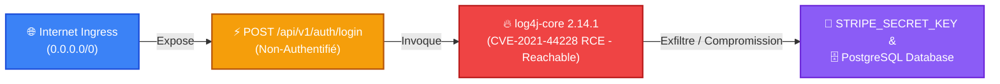

# Guide du Visualiseur de Chemins d'Attaque (Attack Path Visualizer)

Le **Visualiseur Interactif de Chemins d'Attaque** de Vectispire cartographie et corrèle les vulnérabilités isolées en scénarios réels d'exploitation bout-en-bout.

Il permet aux équipes de sécurité, RSSI et développeurs de distinguer immédiatement une vulnérabilité théorique d'une **faille critique directement exploitable depuis l'extérieur**.

---

## 🎯 Le Flux d'Exploitation Topologique

Vectispire modélise l'architecture selon une chaîne à 4 niveaux d'exposition :

$$\text{1. Exposition Ingress / Internet} \longrightarrow \text{2. Endpoint API Non-Authentifié} \longrightarrow \text{3. Composant Vulnérable (RCE)} \longrightarrow \text{4. Asset / Base de Données}$$

---

## 🚀 Fonctionnalités Clés

1. **Corrélation Multi-Sources en Temps Réel** :
   * **Points d'Entrée API (`ApiInventory`)** : Identification automatique des routes publiques et non-authentifiées (`authRequired = false`).
   * **Reachability & Exploitabilité** : Filtrage des vulnérabilités critiques (`CVSS >= 9.0`, CISA KEV, exécution de code à distance RCE, ou chemin d'appel prouvé `reachability = 'REACHABLE'`).
   * **Puits de Données & Secrets (`Gitleaks` / `SAST`)** : Clés d'API en clair, mots de passe de production et connexions base de données.

2. **Graphe Topologique Interactif** :
   * Vue en colonnes réactives avec connexions visuelles entre composants.
   * Filtre rapide : *"Afficher uniquement les chemins critiques exploitables"*.
   * Inspecteur de nœuds : Clic sur n'importe quel élément pour afficher les détails techniques (scores CVSS/EPSS, fichier source, preuves d'appel).

3. **Scénarios d'Attaque & Plan de Remédiation Actionnable** :
   * Synthèse narrative de l'attaque avec étapes concrètes de correction (verrouillage de la route API, mise à jour de la librairie, isolation réseau).

4. **Score de Risque Topologique (0 à 100)** :
   * Calcul pondéré tenant compte de la surface d'exposition externe, de la présence de failles RCE actives et des données sensibles atteignables.

---

## 📡 Endpoints d'API REST

* `GET /api/v1/attack-paths/repositories/{repoId}` : Récupère le graphe topologique et les scénarios d'attaque pour un dépôt donné.
* `GET /api/v1/attack-paths/overview` : Synthèse globale du nombre de chemins d'attaque critiques exploitables sur l'ensemble de la flotte de dépôts.
