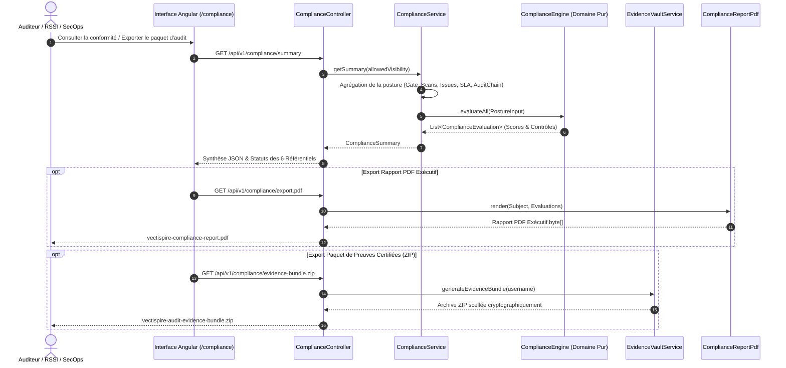

# Moteur de Calcul de la Conformité Réglementaire & Coffre-Fort de Preuves

Le sous-système de conformité réglementaire de Vectispire (`ComplianceEngine`, `ComplianceService`, `EvidenceVaultService`, `ComplianceReportPdf`) évalue automatiquement et de manière déterministe la posture de sécurité de votre organisation par rapport à cinq référentiels internationaux majeurs :

- **Directive NIS 2** (UE 2022/2555 — Gestion des risques cyber & Sécurité de la chaîne d'approvisionnement)
- **Règlement DORA** (UE 2022/2554 — Résilience opérationnelle numérique pour le secteur financier)
- **ISO/IEC 27001:2022** (Système de management de la sécurité de l'information — Contrôles de l'Annexe A)
- **PCI-DSS v4.0** (Standard de sécurité des données de l'industrie des cartes de paiement)
- **Cyber Resilience Act (EU CRA)** (Règlement européen sur la cyber-résilience des produits numériques)
- **SOC 2 Type II** (AICPA Trust Services Criteria — Sécurité, Disponibilité et Confidentialité)

---

## 1. Architecture de Conformité & Flux de Données



---

## 2. Référentiels et Cartographie des Contrôles

| Référentiel | Code Contrôle | Titre du Contrôle | Catégorie d'Évaluation |
|---|---|---|---|
| **NIS 2** | `NIS2-ART21-VULN` | Traitement et remédiation des vulnérabilités | `VULNERABILITY_MANAGEMENT` |
| **NIS 2** | `NIS2-ART21-SUPPLY` | Sécurité de la chaîne d'approvisionnement & SBOM | `SUPPLY_CHAIN` |
| **NIS 2** | `NIS2-ART21-CRYPTO` | Cryptographie & Gestion des secrets | `SECRETS_MANAGEMENT` |
| **NIS 2** | `NIS2-ART21-GOV` | Gouvernance de sécurité & Blocage Gate | `GOVERNANCE` |
| **DORA** | `DORA-ART09-ICT` | Gestion des risques TIC & Tests continus | `VULNERABILITY_MANAGEMENT` |
| **DORA** | `DORA-ART11-THIRD` | Risque lié aux tiers & Gouvernance des dépendances | `SUPPLY_CHAIN` |
| **DORA** | `DORA-ART13-SECRETS` | Contrôle d'accès & Prévention des fuites de secrets | `SECRETS_MANAGEMENT` |
| **DORA** | `DORA-ART16-INCIDENT` | Piste d'audit & Rétention des preuves | `AUDIT_AND_LOGGING` |
| **ISO 27001** | `ISO-A.8.8` | Gestion des vulnérabilités techniques | `VULNERABILITY_MANAGEMENT` |
| **ISO 27001** | `ISO-A.8.28` | Pratiques de développement sécurisé | `SECURE_CODING` |
| **ISO 27001** | `ISO-A.8.9` | Sécurité des configurations & Infrastructure-as-Code | `INFRASTRUCTURE_AS_CODE` |
| **ISO 27001** | `ISO-A.5.15` | Contrôle d'accès & Protection des secrets | `SECRETS_MANAGEMENT` |
| **PCI-DSS** | `PCI-REQ-6.3` | Sécurité dans le cycle de développement logiciel | `SECURE_CODING` |
| **PCI-DSS** | `PCI-REQ-6.4` | Remédiation des vulnérabilités publiques | `VULNERABILITY_MANAGEMENT` |
| **PCI-DSS** | `PCI-REQ-6.5` | Protection contre les failles logicielles & secrets | `SECRETS_MANAGEMENT` |
| **PCI-DSS** | `PCI-REQ-10.2` | Mise en œuvre des journaux d'audit | `AUDIT_AND_LOGGING` |
| **EU CRA** | `CRA-ART11-NOTIF` | Notification ENISA / CSIRT sous 24h des failles exploitées (KEV/EPSS) | `VULNERABILITY_MANAGEMENT` |
| **EU CRA** | `CRA-ART10-SBOM` | Fourniture obligatoire d'un SBOM machine-readable | `SUPPLY_CHAIN` |
| **EU CRA** | `CRA-ART10-LIFECYCLE` | Traçabilité du support de sécurité et dates d'obsolescence (EOL) | `SUPPLY_CHAIN` |
| **EU CRA** | `CRA-ART10-VULN` | Remédiation continue et gestion des correctifs de sécurité | `VULNERABILITY_MANAGEMENT` |
| **SOC 2** | `SOC2-CC6.8` | Prévention des modifications non autorisées & Code malveillant | `SECURE_CODING` |
| **SOC 2** | `SOC2-CC7.1` | Évaluation des vulnérabilités & Détection des menaces | `VULNERABILITY_MANAGEMENT` |
| **SOC 2** | `SOC2-CC6.6` | Sécurité des accès logiques & Gestion des secrets | `SECRETS_MANAGEMENT` |
| **SOC 2** | `SOC2-CC7.2` | Surveillance des incidents & Traçabilité d'audit infalsifiable | `AUDIT_AND_LOGGING` |

---

## 3. Catégories d'Évaluation & Formules Mathématiques

### ① Gestion des Vulnérabilités (`VULNERABILITY_MANAGEMENT`)
Le score initial est de **100 points**, diminué par des pénalités cumulatives :
$$\text{Score} = \max\Big(0,\; 100 - P_{\text{critique}} - P_{\text{kev}} - P_{\text{sla}} - P_{\text{high}}\Big)$$

- **Failles Critiques ouvertes** : $-20\text{ pts}$ par faille (plafonné à $-50\text{ pts}$) :
  $$P_{\text{critique}} = \min(50,\, N_{\text{critique}} \times 20)$$
- **Vulnérabilités CISA KEV (exploitées activement)** : $-15\text{ pts}$ par faille (plafonné à $-30\text{ pts}$) :
  $$P_{\text{kev}} = \min(30,\, N_{\text{kev}} \times 15)$$
- **Dépassement d'échéance SLA (Overdue)** : $-10\text{ pts}$ par faille (plafonné à $-40\text{ pts}$) :
  $$P_{\text{sla}} = \min(40,\, N_{\text{overdue}} \times 10)$$
- **Backlog Sévérité Élevée** : Si $N_{\text{high}} > 5$, déduction forfaitaire de $-10\text{ pts}$.

---

### ② Sécurité de la Chaîne d'Approvisionnement & SBOM (`SUPPLY_CHAIN`)
Mesure le taux de cibles monitorées disposant d'un inventaire SBOM actif généré par Syft/Grype :
$$\text{Score} = \text{round}\left(\frac{N_{\text{cibles avec SBOM actif}}}{N_{\text{total cibles surveillées}}} \times 100\right)$$

---

### ③ Gestion des Secrets & Fuite d'Identifiants (`SECRETS_MANAGEMENT`)
- **0 secret détecté** : $\text{Score} = 100$, Statut = **CONFORME (`COMPLIANT`)**.
- **$\ge 1$ secret en clair** (jeton d'API, clé privée, mot de passe) :
  $$\text{Score} = \max(0,\; 100 - N_{\text{secrets}} \times 25)$$
  **Statut = NON CONFORME (`NON_COMPLIANT`) immédiat.** Tout secret non révoqué casse la conformité.

---

### ④ Pratiques de Développement Sécurisé / SAST (`SECURE_CODING`)
Évalue les anomalies de code source custom détectées par Semgrep :
- Si 0 anomalie SAST : $\text{Score} = 100$.
- Si anomalies présentes :
  $$\text{Score} = \max(20,\; 100 - N_{\text{sast}} \times 5)$$

---

### ⑤ Sécurité de l'Infrastructure-as-Code (`INFRASTRUCTURE_AS_CODE`)
Évalue les mauvaises configurations de déploiement (Terraform, Kubernetes, Dockerfile) :
- Si 0 anomalie IaC : $\text{Score} = 100$.
- Si anomalies présentes :
  $$\text{Score} = \max(30,\; 100 - N_{\text{iac}} \times 10)$$

---

### ⑥ Gouvernance de Sécurité & Politiques de Gate (`GOVERNANCE`)
Mesure le pourcentage de cibles respectant les règles bloquantes du Quality Gate :
$$\text{Score} = \text{round}\left(\frac{N_{\text{cibles passant le Gate}}}{N_{\text{total cibles}}} \times 100\right)$$

---

### ⑦ Traçabilité & Registre d'Audit Immuable (`AUDIT_AND_LOGGING`)
Vérifie l'intégrité cryptographique du chaînage HMAC-SHA256 du journal d'audit :
- **Chaîne intacte et validée** : $\text{Score} = 100$, Statut = **CONFORME (`COMPLIANT`)**.
- **Altération ou rupture détectée** : $\text{Score} = 0$, Statut = **NON CONFORME (`NON_COMPLIANT`)**.

---

## 4. Détermination des Statuts & Règle d'Étanchéité au Risque

### Seuils par Contrôle
$$\text{Statut Contrôle} = \begin{cases} 
\text{CONFORME (COMPLIANT)} & \text{si } \text{Score} \ge 90 \\
\text{PARTIEL (PARTIAL)} & \text{si } 60 \le \text{Score} < 90 \\
\text{NON CONFORME (NON\_COMPLIANT)} & \text{si } \text{Score} < 60 
\end{cases}$$

### Score Global du Référentiel
$$\text{Score Global} = \text{round}\left(\frac{1}{K} \sum_{i=1}^{K} \text{Score}(\text{Contrôle}_i)\right)$$

### Statut Global du Référentiel (Principe de Non-Dilution)
1. **NON CONFORME (`NON_COMPLIANT`)** : Dès qu'au moins **un contrôle** est non conforme ($N_{\text{non\_compliant}} > 0$) OU si le score global $< 70\%$.
2. **PARTIELLEMENT CONFORME (`PARTIAL`)** : Si aucun contrôle n'est en échec critique mais qu'au moins un contrôle est partiel ($N_{\text{partial}} > 0$) OU si le score global $< 95\%$.
3. **CONFORME (`COMPLIANT`)** : Uniquement si **100% des contrôles sont conformes** ET score global $\ge 95\%$.

---

## 5. Coffre-Fort de Preuves d'Audit (Evidence Vault)

Vectispire produit des paquets de preuves directement opposables aux auditeurs externes :

1. **Rapport PDF Exécutif (`/api/v1/compliance/export.pdf`)** :
   - Synthèse de la posture, scores par référentiel, détail des 20 contrôles et plan de remédiation priorisé.
2. **Paquet de Preuves Certifié (`/api/v1/compliance/evidence-bundle.zip`)** :
   - `manifest.json` & `manifest.json.sig` : Manifeste d'audit scellé et sa signature détachée Cosign (ECDSA P-256).
   - `00_vectispire_public_key.pub` : Clé publique PEM de l'instance pour vérification indépendante.
   - `01_compliance_frameworks.json` : Évaluations continues des 5 référentiels (NIS 2, DORA, ISO 27001, PCI-DSS, EU CRA).
   - `02_immutable_audit_log.jsonl` : Journal d'audit scellé HMAC-SHA256.
   - `03_triage_and_exemptions.json` : Registre des décisions de triage et approbations 4-yeux.
   - `04_attestations/` : Attestations in-toto et enveloppes signées DSSE (RFC 9615).
   - `05_openvex_advisory.json` & `.sig` : Avis VEX OpenVEX v0.2.0 et signature Cosign.
   - `06_csaf_2_0_vex.json` & `.sig` : Avis standardisé OASIS CSAF 2.0 et signature Cosign.
   - `07_license_compliance.json` : Inventaire des licences et analyse de risque copyleft.
   - `08_cyclonedx_1_5_vex.json` & `.sig` : SBOM CycloneDX 1.5 enrichi et signature Cosign.

### 5.1 Ce que la piste d'audit prouve, et ce qu'elle ne prouve pas

Un paquet de preuves est lu par quelqu'un qui va signer quelque chose sur sa foi : les limites de
la chaîne d'audit ont donc leur place ici, et pas seulement dans le code source.

**Ce que la chaîne prouve.** Chaque entrée porte l'empreinte de la précédente sur ses propres
champs, séparés par des octets NUL et avec l'horodatage canonisé à la milliseconde. Modifier une
ligne passée casse toutes les empreintes qui suivent : une modification **sélective** est donc
détectable — c'est la menace réaliste quand la ligne intéressante est une parmi des milliers.

**Ce qu'elle ne prouve pas.** La chaîne ne rend pas le journal immuable : qui peut écrire dans la
table peut recalculer toutes les empreintes à partir de la ligne modifiée, et le résultat se
vérifie parfaitement. En particulier, **la suppression d'une entrée dont personne ne descend est
indétectable** — la dernière écrite, ou la pointe d'une branche concurrente. Rien ne pointe vers
elle, donc rien ne manque une fois qu'elle a disparu. C'est l'entrée qu'un attaquant supprime, et
c'est énoncé franchement ici parce qu'un évaluateur qui le découvre seul a raison de dévaluer le
reste du rapport.

Cette concession est délibérée et sa raison mérite d'être dite : exiger une chaîne strictement
linéaire faisait bifurquer deux instances écrivant dans le même instant, et un journal parfaitement
honnête se déclarait rompu. Une fausse alerte dans un contrôle d'intégrité est pire qu'inutile —
on apprend à l'ignorer, et elle couvre ensuite les vraies. Clore le cas en base signifierait
sérialiser chaque écriture d'audit derrière toutes les autres.

**Ce qui le ferme.** Le **miroir d'audit** (`vectispire.audit.mirror-path`) : une seconde copie,
ajoutée hors de la base, une ligne NDJSON par entrée. `/api/v1/audit-log/verify` compare les deux
et signale `missingFromTable` — les entrées que le miroir détient et que la table n'a plus, ce qui
*est* le cas de la feuille supprimée. Le miroir ne rend pas la copie infalsifiable ; il oblige à
faire la modification **deux fois, dans deux médias, avec deux jeux de permissions**, et un
collecteur de journaux l'expédie normalement hors de la machine en quelques secondes, hors de
portée de qui détient la base.

Un système de points de contrôle en base ne s'y substituerait pas. Qui peut écrire dans la table
d'audit peut réécrire une table de points de contrôle de façon cohérente : cela déplacerait le
problème d'un cran tout en ayant l'air d'une preuve.

**Le rapport dit laquelle des deux vous avez.** Sans miroir configuré, les contrôles
`AUDIT_AND_LOGGING` (`DORA-ART16-INCIDENT`, `PCI-REQ-10.2`) sont plafonnés à **PARTIAL** quoi que
dise la chaîne, avec la raison ci-dessus en détail du contrôle. Une pastille verte sur un contrôle
d'audit dont le cas de suppression est ouvert est exactement le genre de conclusion que ce
document existe pour ne pas produire.

---

## 6. Interopérabilité VEX & Échange B2B (OpenVEX, CSAF 2.0 & CycloneDX VEX)

Vectispire supporte le triptyque complet des formats VEX mondiaux :

### 1. Ingestion Multi-Formats Amont (*Upstream Suppression Cascade*)
Vectispire permet d'ingérer automatiquement les avis VEX officiels publiés par les éditeurs tiers ou mainteneurs open-source aux formats **OpenVEX**, **CSAF 2.0** et **CycloneDX 1.5/1.6 VEX** :
- **Endpoint API** : `POST /api/v1/vex/ingest` (détection automatique du format JSON).
- **Interface Web** : Bouton `Importer VEX` sur `/compliance`.
- **Comportement** : Lorsqu'un éditeur publie une déclaration `not_affected` (ex: code vulnérable non exécutable ou mitigation en ligne), Vectispire classe automatiquement les CVEs correspondantes dans le parc avec traçabilité d'audit (`origin: upstream_vex`).

### 2. Export Standardisé OASIS CSAF 2.0
- `GET /api/v1/csaf/scans/{scanId}/csaf.json` : Avis CSAF par scan de release.
- `GET /api/v1/csaf/aggregate.json` : Avis CSAF agrégé de l'ensemble du parc applicatif.

### 3. Export CycloneDX 1.5/1.6 BOM-Linked VEX
- `GET /api/v1/cyclonedx/scans/{scanId}/cyclonedx-vex.json` : SBOM de la cible avec analyse VEX par composant.
- `GET /api/v1/cyclonedx/aggregate.json` : Inventaire agrégé du parc avec statut de justification VEX intégré.

---

## 7. Gouvernance des Dérogations : Principe des "Quatre Yeux" (4-Eyes Workflow)

Pour satisfaire aux exigences strictes de DORA (Art. 9/13), NIS 2 et ISO 27001 (A.8.8) sur les dérogations et acceptations de risques :

1. **Rôle `SECURITY_CHAMPION`** :
   - Délégué sécurité au sein des équipes de développement (`administrative = false`, `globalSecurityScope = false`).
   - Habilité à valider et approuver les dérogations techniques (`canApproveTriage = true`).

2. **Statut `PENDING_APPROVAL` (En attente d'approbation)** :
   - Toute demande d'exemption (`not_affected` / `accepted_risk`) initiée par un développeur (`USER`) bascule automatiquement en `PENDING_APPROVAL`.
   - **Tant que la demande n'est pas approuvée, la Gate de déploiement CI/CD reste bloquante** (`isSettled() == false`).

3. **Demandeur ≠ Approbateur** :
   - L'approbation est refusée lorsque le compte approbateur est celui enregistré comme ayant demandé la dérogation. Sans cela le contrôle est une barrière de rôle et non un contrôle à quatre yeux, et un évaluateur lisant littéralement DORA art. 9 ou NIS 2 art. 21 a raison de le rejeter.

4. **Double Validation & Piste d'Audit** :
   - L'approbation par un `SECURITY_CHAMPION`, `CISO` ou `ADMIN` consigne un événement d'audit scellé avec l'origine `"approval"`.

---

## 8. Signature Cryptographique des Preuves (Cosign & DSSE RFC 9615)

Vectispire intègre une signature numérique de niveau **SLSA 3 / Sigstore** garantissant la non-répudiation des livrables :

- **Paire de clés de signature** : ECDSA P-256 (courbe `secp256r1`) avec condensé SHA-256.
- **Export Clé Publique** : `GET /api/v1/crypto/public-key.pub` (téléchargeable publiquement pour audit).
- **Enveloppes DSSE** : Attestations in-toto empaquetées au standard Dead Simple Signing Envelope (`application/vnd.in-toto+json`).
- **Signatures Détachées Cosign** : Tous les SBOMs et avis VEX de l'archive Evidence Vault sont accompagnés de leur signature `.sig`.
- **Vérification CLI** :
  ```bash
  cosign verify-blob --key vectispire-signing-key.pub --signature manifest.json.sig manifest.json
  ```

---

## 9. Comparateur Différentiel SBOM (SBOM Drift & Diff Viewer)

Le comparateur de versions de SBOM (`SbomDiffService`, `SbomDiffController`) permet de suivre déterministement l'évolution des dépendances logicielles entre deux scans :

- **Endpoints API** :
  - `GET /api/v1/sbom/diff?fromScanId={id1}&toScanId={id2}` : Comparatif complet entre deux scans quelconques.
  - `GET /api/v1/sbom/diff/latest?repoId={id}` : Comparatif automatique entre les deux derniers scans d'une cible.
- **Indicateurs calculés** :
  - **Composants ajoutés / supprimés** : Nouveaux packages introduits ou retirés de la release.
  - **Changements de versions & de licences** : Détection des migrations et des dérives de licences open-source (ex: passage silencieux en GPL/AGPL).
  - **Balance nette des CVEs** : Décompte précis des vulnérabilités résolues par rapport aux nouvelles vulnérabilités introduites.

---

## 10. Indicateur de Dette de Sécurité & Actions à Fort Impact (*High-Impact Fixes*)

Le module d'optimisation de la remédiation (`SecurityDebtService`, `SecurityDebtController`) quantifie l'effort d'ingénierie nécessaire pour résorber le backlog de sécurité et identifie les actions correctives à ROI maximal :

- **Endpoints API** :
  - `GET /api/v1/remediation/debt` : Synthèse globale du temps estimé en heures et jours-hommes (J/H).
  - `GET /api/v1/remediation/high-impact-fixes` : Classement des actions prioritaires par score de levier.
- **Barème d'effort estimé** — chaque type de finding compté porte une estimation, et la somme des postes fait le total :
  - Patch mineur de dépendance : ~0.8h à 1.5h
  - Rotation de secret et révocation : 2.0h
  - Refactoring de code source (SAST et qualité) : 2.5h
  - Misconfiguration IaC : 1.0h
  - Conflit de licence (remplacer la dépendance, ou obtenir une dérogation) : 3.0h
  - Composant en fin de support (une migration, pas une édition) : 4.0h

  Les findings de revue par IA sont exclus du rapport dans son ensemble — du décompte des
  anomalies comme de l'estimation. Leur sévérité est produite par un modèle local lisant un
  dépôt potentiellement hostile : les chiffrer permettrait à un dépôt de gonfler sa propre
  estimation de remédiation.
- **Score de Levier (ROI Sécurité)** :
  $$\text{Levier} = \frac{N_{\text{CVEs résolues}} \times 2.0 + N_{\text{Critiques}} \times 3.0 + N_{\text{Élevées}} \times 1.5}{\text{Effort Estimé (h)}}$$
  Ce calcul met en lumière la montée de version unique qui résout le plus grand nombre de CVEs sur le parc d'applications.

