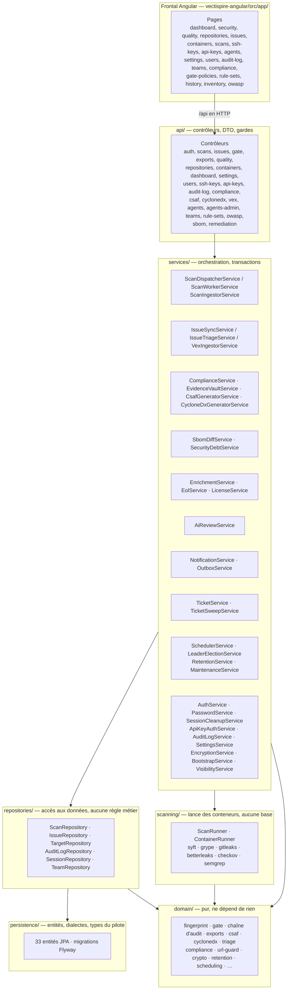
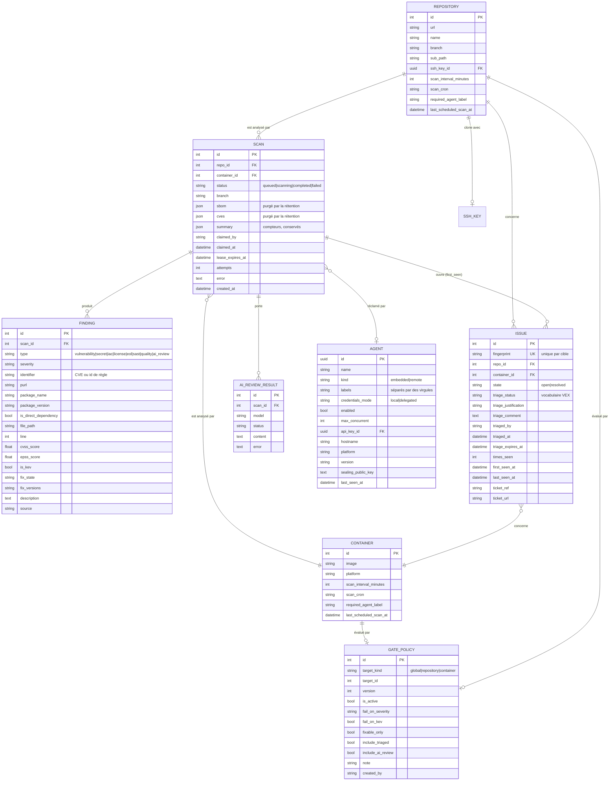
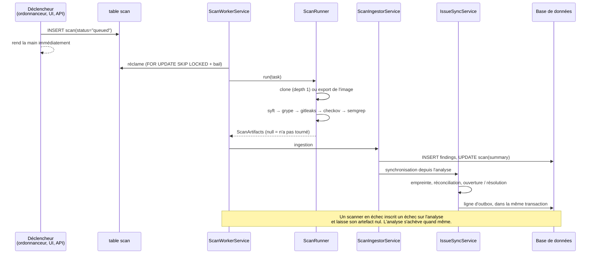

# Vectispire — Documentation Technique

Ce document décrit l'architecture interne de Vectispire, son schéma de base de données et le
déroulement du pipeline d'analyse à l'exécution. Pour les fonctionnalités et le démarrage rapide,
voir [`README.md`](../../README.md). Pour le raisonnement derrière les choix structurels, voir
[`docs/architecture/`](../architecture/fr/) et son
[registre de décisions](../architecture/fr/decisions/).

---

### Origine & Philosophie du Nom : *Vectispire*

Le nom **Vectispire** est la synthèse de deux piliers de la sécurité de la chaîne d'approvisionnement logicielle :
- **`Vectis`** *(latin pour « levier de sécurité et verrou »)* : la plateforme agit comme le **levier cryptographique de sécurité et le gardien de politique** de votre chaîne de livraison. Elle impose des barrières strictes de qualité et de sécurité, signe des attestations in-toto, génère des signatures DSSE Cosign, des SBOM déterministes et des déclarations VEX vérifiables (OASIS CSAF 2.0, OpenVEX, CycloneDX) avec une chaîne d'audit cryptographique à intégrité vérifiable.
- **`Spire`** *(la vigie ASPM élevée et l'horizon de posture)* : la plateforme offre un **point de vue panoramique et surélevé** sur l'ensemble de votre portefeuille applicatif — cartographie des arbres de dépendances multi-niveaux, mesure de la dispersion du rayon d'impact, évaluation des conflits de copyleft des licences open source, et suivi de la vélocité de remédiation des vulnérabilités (MTTR) sur tous les dépôts Git et flottes de conteneurs.

---

## 1. Architecture en couches

Deux artefacts, construits par des chaînes d'outils différentes : un control plane Spring Boot dans
`vectispire-java/` et un frontal Angular dans `vectispire-angular/` qui lui parle via la même API
HTTP qu'utilisent un pipeline de CI ou un agent distant.



**L'injection de dépendances est celle de Spring**, par constructeur. Chaque collaborateur dont une
classe a besoin est un paramètre sans lequel elle ne peut pas être construite, ce qui est aussi ce
qui rend les campagnes unitaires possibles : un test passe un bouchon là où le conteneur passe un
bean, et rien n'a à être intercepté.

**Le découpage en couches est imposé, pas documenté.**
[`ArchitectureTest`](../../vectispire-java/vectispire-core/src/test/java/com/asmolabs/vectispire/core/ArchitectureTest.java)
lit le graphe d'imports avec ArchUnit et fait échouer la campagne quand une couche importe
au-dessus d'elle, ou qu'une classe de `domain` importe un framework.

**L'isolation de l'agent est plus forte que ce test.** `vectispire-agent` ne dépend pas de
`vectispire-core`, donc aucun pilote JDBC n'est sur son classpath de compilation et la violation
échoue à la compilation plutôt qu'à une campagne que quelqu'un pourrait supprimer — une propriété
de sécurité, pas une règle de style, voir la
[décision 0003](../architecture/fr/decisions/0003-long-polling-for-agents.md). Une règle écrite
seulement dans un document est vraie le jour où elle est écrite et fausse six mois plus tard.

`domain` est pur parce qu'il porte les calculs où une erreur ne lève aucune exception mais détruit
des données : l'empreinte d'une anomalie, la chaîne d'audit, le verdict de la gate, les formats
d'export. Il ne dépend que du JDK, de BouncyCastle et de Jackson.

## 2. Schéma de base de données

Le schéma appartient aux **migrations Flyway**, sous
[`src/main/resources/db/migration/{vendor}/`](../../vectispire-java/vectispire-core/src/main/resources/db/migration/) — un jeu SQL natif par
moteur (`postgresql`, `mysql`, `sqlite`). `ddl-auto` vaut `validate`
et le reste : Hibernate ne doit jamais altérer le schéma à l'exécution.

**Le moteur est choisi par `VECTISPIRE_DB_URL` et rien d'autre** — Hibernate et Flyway le lisent
tous deux depuis l'URL JDBC, il n'existe donc aucun réglage de dialecte séparé à tenir en phase
avec elle. MySQL est le défaut, le moteur que livre `docker-compose.yml`. Les quatre
passent l'intégralité de la campagne d'intégration
([décision 0009](../architecture/fr/decisions/0009-four-engines.md), [décision 0013](../architecture/fr/decisions/0013-flyway-multi-dialect-migrations.md)).
[`SchemaParityIntegrationTest`](../../vectispire-java/vectispire-core/src/integrationTest/java/com/asmolabs/vectispire/core/persistence/SchemaParityIntegrationTest.java)
demande sur chaque moteur si les entités et le schéma s'accordent.

### Le modèle des analyses et des anomalies



### Les tables de service

Hors du modèle principal, et chacune porteuse :

| Table | Ce qu'elle contient | Pourquoi elle existe |
|---|---|---|
| `user` | comptes, mot de passe **Argon2id**, rôle, `must_change_password` | — |
| `session` | le **SHA-256** du jeton comme clé primaire — jamais le jeton, `created_at`, `last_seen_at`, `expires_at`, IP, agent utilisateur | une session **révocable** : un jeton qu'on ne peut pas invalider, et personne ne peut plus être déconnecté. Stocker le jeton lui-même ferait de chaque dump de cette table un jeu de sessions vivantes |
| `team_webhook` | le canal de notification d'une équipe | sa propre table plutôt qu'une colonne sur `team` : une URL de webhook est une capacité porteuse qui n'a rien à faire dans chaque requête sur les équipes — et `addColumn` sur `team` détruit les clés étrangères des tables d'accès sur SQLite |
| `team` / `team_member` / `team_target` | les équipes, qui en fait partie, ce qu'elles possèdent | visibilité restreinte, rendue administrable : un compte voit l'union de ce que possèdent ses équipes et de ce qui lui a été assigné directement. La table par compte demeure pour l'exception qu'une équipe ne peut pas exprimer |
| `login_attempt` | `counter_key`, `occurred_at` | anti-bourrage compté par utilisateur **et** par client ; un seul axe se contourne |
| `api_key` | empreinte **Argon2id**, préfixe d'affichage, portées, restriction de cible, expiration | le secret brut est renvoyé une fois et jamais stocké. Le préfixe est ce qui rend ici une empreinte à coût mémoire abordable : il réduit la recherche à quelques lignes avant hachage |
| `ssh_key` | chiffré AES-GCM lié à sa ligne par les données associées | sans ce lien, le chiffré de la clé A recopié dans la ligne B se déchiffre parfaitement |
| `setting` | clé/valeur, dont les quatre fenêtres de remédiation | le catalogue `Setting` décide de ce qui est exposé. Une échéance est un réglage et non une colonne : c'est une politique qu'une organisation écrit, et la stocker par anomalie figerait chacune sur la politique en vigueur le jour de sa découverte |
| `audit_log` | empreinte de l'entrée, empreinte précédente, IP, agent utilisateur | chaînée : rend détectable une modification **sélective** |
| `outbox_message` | charge utile, `status`, `attempts`, `next_attempt_at`, `team_id` (nul = le webhook global) | écrite dans la transaction qui produit le résultat, de sorte qu'un plantage avant le POST ne perd rien |
| `processed_message` | `message_id` UK, `agent_id` | déduplique un compte rendu d'agent au-moins-une-fois ; l'empreinte seule gonflerait quand même `times_seen` |
| `leader_lease` | `name`, `holder`, `expires_at` | une seule instance porte le tic périodique ; une table plutôt qu'un verrou consultatif parce qu'elle est **observable** |

## 3. Pipeline d'analyse

Déclencher n'exécute pas. Un déclenchement insère une ligne `queued` et rend la main ; une boucle
de travail la réclame et l'exécute. C'est ce qui permet à un agent distant, ou à une seconde
instance, de prendre le travail
([décision 0002](../architecture/fr/decisions/0002-the-database-carries-the-queue.md)).



Les points que le diagramme ne montre pas :

- **`null` n'est pas `[]`.** Dans `ScanArtifacts`, `[]` est l'affirmation positive *« l'étape a
  tourné et n'a rien trouvé »*, qui **résout** les anomalies de ce type ; `null` signifie qu'elle
  n'a pas tourné, et le backlog est laissé intact. Un portage qui normaliserait les nuls en listes
  vides résoudrait silencieusement des centaines d'anomalies de sécurité sans la moindre erreur
  ([décision 0007](../architecture/fr/decisions/0007-none-is-not-an-empty-list.md)).
- **L'échec ne se lit pas seulement dans le code de sortie.** Une exécution Semgrep où la plupart
  des fichiers ont expiré sort en 0 avec une liste courte. `errors[]` et `paths.scanned` sont
  inspectés, et au-delà de 25 % d'erreurs le résultat est `null`.
- **Semgrep produit deux types d'anomalies en une passe.** Le `metadata.category` de chaque règle
  tranche : `security` devient une anomalie `sast`, soumise à la gate comme n'importe quelle
  vulnérabilité ; tout le reste devient `quality`, qu'aucune politique ne peut faire entrer dans un
  verdict ([décision 0005](../architecture/fr/decisions/0005-quality-never-blocks-the-gate.md)).
  Les deux viennent de la même exécution, donc elles entrent ensemble dans la liste des types
  analysés.
- **La configuration des analyseurs vient de Vectispire, jamais de la cible.** gitleaks se rabat
  sur le `.gitleaks.toml` du dépôt analysé quand aucun `--config` ne lui est donné, et Semgrep
  honore le `.gitignore` de l'arbre analysé sauf indication contraire — dans les deux cas, le dépôt
  audité déciderait de ce qu'on cherche en lui.
- **Les règles sont recopiées dans l'espace de travail de l'analyse.** Contre-intuitif mais
  obligatoire : les chemins de volume sont résolus par le *démon* Docker, donc un répertoire situé
  dans l'image de Vectispire est invisible pour le conteneur de scan voisin. Voir
  [`RulePlacement`](../../vectispire-java/vectispire-common/src/main/java/com/asmolabs/vectispire/common/scanning/RulePlacement.java),
  qui fusionne aussi le `VECTISPIRE_SEMGREP_RULES_DIR` de l'exploitant.
- **Secrets, IaC et SAST ne tournent jamais sur une image de conteneur.** Ils cherchent dans du
  code source ; les déclarer analysés résoudrait silencieusement tout l'historique de cette cible
  pour ces types. Ils restent `null`.

## 4. Les scanners

Chacun est un conteneur éphémère, épinglé **par digest**, avec `cap_drop: ALL`,
`no-new-privileges`, des plafonds de mémoire et de PID, et le réseau coupé quand l'outil n'a rien
à aller chercher.

| Étape | Image | Réseau | Produit |
|---|---|---|---|
| SBOM | `anchore/syft` | ouvert (registre) | inventaire des composants |
| Vulnérabilités | `anchore/grype` | ouvert (base de vulnérabilités) | anomalies `vulnerability` |
| Secrets | `gitleaks` | **coupé** | anomalies `secret` |
| IaC | `bridgecrew/checkov` | **coupé** | anomalies `iac` |
| Code source | `semgrep/semgrep` | **coupé** | anomalies `sast` et `quality` |
| Licences | *(aucune)* | — | dérivé du SBOM |
| Fin de vie | endoflife.date | sortant, sur activation | anomalies `eol` |
| Revue IA | Ollama local | local, sur activation | anomalies `ai_review` |

Il y a **un** exécuteur, [`ScanRunner`](../../vectispire-java/vectispire-common/src/main/java/com/asmolabs/vectispire/common/scanning/ScanRunner.java), et il
lance Docker. Une conception antérieure avait une interface `ScannerEngine` avec trois
implémentations ; le portage n'a gardé que celle sur Docker et la
[décision 0010](../architecture/fr/decisions/0010-one-scan-runner.md) abandonne la couture plutôt
que de la reconstruire autour d'une implémentation unique. Déplacer l'exécution ailleurs se fait
en lançant un agent ailleurs.

**Aucun conteneur d'analyse ne voit la socket Docker.** L'étape de SBOM d'image la montait
autrefois pour que Syft tire l'image lui-même — ce qui revient à donner root sur l'hôte à un
processus dont l'entrée est hostile par définition. Vectispire tire et exporte désormais l'image,
et présente au conteneur une archive en lecture seule.

### Revue de code par IA (Ollama), désactivée par défaut

[`AiReviewService`](../../vectispire-java/vectispire-core/src/main/java/com/asmolabs/vectispire/core/services/AiReviewService.java) est un
complément léger aux scanners, pas un moteur SAST : une invite, aucune reproductibilité garantie.
L'échantillon envoyé est une concaténation triée et filtrée par extension de fichiers source
plafonnée à 40 000 caractères — sans découpage, donc les gros dépôts sont tronqués.

Trois choses le concernant sont des décisions de sécurité, pas des fonctionnalités :

- **Le garde d'URL est inversé ici.** Cet endpoint reçoit le code source du dépôt analysé, donc le
  risque n'est pas qu'il pointe vers l'intérieur mais vers l'**extérieur**. Une URL publique bien
  formée est exactement ce à quoi ressemble un canal d'exfiltration, donc une destination publique
  est refusée sauf autorisation explicite.
- **Ses constats n'entrent dans aucun verdict de gate par défaut.** Un dépôt hostile peut orienter
  un modèle à qui on a remis son code, et un `critical` inventé ferait échouer la construction de
  quelqu'un.
- **Un LLM n'est pas une frontière de confiance.** L'échantillon est encadré par un délimiteur
  explicite et l'invite demande au modèle de *signaler* une tentative d'injection plutôt que d'y
  obéir. C'est une atténuation, et la raison pour laquelle son verdict ne bloque rien.

La liste des modèles est lue en direct depuis le `GET /api/tags` d'Ollama, de sorte que ce que
l'exploitant a réellement tiré est ce qui devient sélectionnable ; un repli à deux entrées est
affiché comme *suggestion* quand Ollama est injoignable, jamais comme installé. L'analyse est
défensive — une réponse qui ne se parse pas donne une liste vide et ne lève jamais.

## 5. Référence des services et des repositories

| Service | Responsabilité |
|---|---|
| `ScanDispatcherService` | Réclame les analyses de façon transactionnelle et remet les tâches aux agents ; porte la décision sur les identifiants (`credentialsMode`) et le scellement. |
| `ScanWorkerService` | Le worker intégré : réclame, exécute, ingère. |
| `ScanIngestorService` | Normalise les artefacts en lignes `Finding` et met l'analyse à jour. Connaît la base ; ne lance aucun conteneur. |
| `IssueSyncService` | Réconcilie les constats avec les anomalies d'une analyse à l'autre : empreinte, `times_seen`, ouverture/résolution. Écrit la ligne d'outbox dans la même transaction. |
| `IssueTriageService` | Applique une décision de triage validée, et fait expirer celles qui ont dépassé leur date de revue. |
| `EnrichmentService` | Scores EPSS et catalogue CISA KEV. Au mieux : ne transforme jamais une analyse achevée en échec. |
| `EolService` · `LicenseService` | Correspondance de fin de vie, et liste de licences interdites sur les données SBOM déjà collectées. |
| `AiReviewService` | Voir §4. |
| `NotificationService` · `OutboxService` | Choisit ce qui mérite un message, et relaie l'outbox avec un backoff plafonné. |
| `TicketService` · `TicketSweepService` | Ouvre un ticket de suivi par anomalie qui ferait échouer une construction, sous la même politique de gate — pas de second seuil. |
| `SchedulerService` | Le tic périodique : analyses dues, rétention, expiration de triage, outbox, balayage des tickets. |
| `LeaderElectionService` | Le bail qui fait qu'exactement une instance exécute ce tic. |
| `RetentionService` · `MaintenanceService` | Purge des charges utiles brutes, et entretien périodique. |
| `AuthService` · `PasswordService` · `SessionCleanupService` | Connexion, bridage, hachage, expiration des sessions. |
| `ApiKeyAuthService` | Vérification des clés, portées, restriction de cible, expiration. |
| `AuditLogService` | Entrées d'audit chaînées. L'enregistrement ne lève jamais : un échec de journalisation ne doit pas casser l'action auditée. |
| `EncryptionService` | AES-GCM au repos, avec le contexte lié à la ligne, et rotation multi-clés. |
| `SettingsService` · `BootstrapService` | Réglages clé/valeur, et création du compte au premier démarrage. |

Cinq repositories seulement — `Scan`, `Issue`, `Target`, `AuditLog`, `Session` — chacun une fine
enveloppe autour des requêtes dont ses appelants ont réellement besoin. Il n'y a pas de repository
de base générique. Un service n'écrit aucun SQL, et un repository ne porte aucune règle métier ;
`ArchitectureTest` impose les deux.

## 6. Le frontal

Angular 21 avec [Optimus UI](https://github.com/openng/optimus-ui), le fork communautaire de
PrimeNG v21 — PrimeTek a archivé PrimeNG et fait passer la v22 sous licence commerciale. La coque
vient du gabarit Sakai (MIT). `primeicons` est épinglé exactement à `7.0.0` : la 8.0.0 a suivi
PrimeNG sous licence propriétaire, ce que le passage à Optimus visait précisément à éviter. Voir
[`vectispire-angular/README.md`](../../vectispire-angular/README.md).

Les modèles de vue que le navigateur reçoit sont typés et calculés côté serveur
([`core/api.models.ts`](../../vectispire-angular/src/app/core/api.models.ts)) : des valeurs finies, pas
de l'arithmétique. En particulier le verdict de gate affiché sur l'écran Sécurité est celui que
renvoie `POST /api/v1/gate`, parce que les deux passent par le même `PolicyGate` — et non par une
seconde implémentation en SQL, qui s'accorderait aujourd'hui et divergerait dès l'ajout d'un
drapeau de politique.

`npm test` commence par `scripts/check-assets.mjs`, qui refuse toute référence à un domaine tiers
dans `index.html` et `styles.scss` et vérifie que les polices déclarées existent et sont de vrais
`woff2`. Pas du zèle : la CSP refuse les feuilles de style tierces, et une telle référence ne casse
rien de visible — la requête est bloquée, la page se rabat sur la police système, et rien ne le
signale. C'est exactement ainsi qu'une typographie n'a jamais atteint la production.

## 7. Approche des tests

La campagne unitaire tourne sans base : `npm test`.

Les campagnes d'intégration démarrent un moteur réel via **testcontainers**, appliquent toutes les
migrations et annulent chaque test dans sa propre transaction — de sorte que le schéma sous test
est celui que la production recevra, et que les cas ne peuvent pas se voir entre eux.

```bash
cd vectispire-java && ./gradlew integrationTest                # MySQL (-Pdialect=postgres ou sqlite)
cd vectispire-java && ./gradlew integrationTestAll             # les deux moteurs
```

Deux règles que le harnais s'impose à lui-même :

- **Il ne s'esquive pas quand Docker manque.** Une exécution qui ne vérifie rien doit échouer
  bruyamment. C'est un défaut que ce harnais a déjà eu.
- **Une garantie de concurrence non exécutée contre un serveur réel n'est pas une garantie.** Dix
  réclamants simultanés contre un moteur réel, c'est ce qui a révélé que six d'entre eux
  revenaient bredouilles pendant que vingt analyses attendaient — invisible sur SQLite et à la
  lecture attentive.

## 8. Graphe de dépendances & explorateur de rayon d'impact

- **Moteur d'analyse du rayon d'impact (`BlastRadiusService`)** : cartographie relationnelle en mémoire reliant Cible (dépôt Git / image de conteneur) $\rightarrow$ Dépendance de paquet (directe ou transitive) $\rightarrow$ Avis de sécurité CVE.
- **Score de risque organisationnel** : score de 0 à 100 pondérant la dispersion des cibles dans la flotte, l'inclusion directe ou transitive, le graphe d'appels d'atteignabilité, et le score CVSS maximal.
- **Endpoints REST** :
  - `GET /api/v1/blast-radius/explore?q={package|CVE}` : graphe complet nœuds/arêtes des dépendances et ventilation des cibles impactées.
  - `GET /api/v1/blast-radius/top-impact?limit=10` : paquets au plus fort rayon d'impact dans l'entreprise.

## 9. Centre de notifications multi-canaux & outbox transactionnelle

- **Canaux de notification pris en charge** :
  - **Slack** (`SlackNotificationChannel`, `SlackBlockKit`) : cartes Block Kit interactives avec en-tête, ventilation des constats et liens profonds directs.
  - **Microsoft Teams** (`TeamsNotificationChannel`, `TeamsCard`) : Adaptive Cards v1.4 envoyées via des workflows Power Automate.
  - **Discord** (`DiscordNotificationChannel`, `DiscordEmbed`) : Rich Embeds avec codes couleur dynamiques par sévérité.
  - **Courriel** (`MailNotificationChannel`) : remise multipart HTML/texte vers des listes de diffusion.
  - **Webhook générique / SIEM** (`NotificationService`) : POST JSON standard avec vérification de signature HMAC-SHA256 (`X-Vectispire-Signature`).
- **Résilience & garantie d'outbox** :
  - Les lignes d'outbox sont insérées dans `t_outbox_message` dans la transaction exacte qui réconcilie les résultats d'analyse. Les remises utilisent un backoff exponentiel plafonné avec isolation par destination.
- **Endpoints REST** :
  - `GET /api/v1/notifications/channels` : vue d'ensemble des canaux configurés et des événements souscrits.
  - `POST /api/v1/notifications/test/{channelType}` : test de remise simulée immédiate avec résultats de diagnostic.

## 10. Conseiller IA local d'explication des vulnérabilités et de triage

- **Moteur d'explication et de remédiation (`AiReviewService`, `AiAdvisorController`)** :
  - Génère des explications contextuelles de vulnérabilité, une analyse des mécanismes d'exploitation, un verdict d'exposition par atteignabilité statique, les commandes CLI exactes de mise à niveau (`mvn`, `npm`), et des déclarations formelles de justification VEX.
  - Fonctionnement double : inférence par modèle Ollama local (aucune fuite de données vers un tiers) ou repli heuristique déterministe instantané.
- **Endpoints REST** :
  - `GET /api/v1/ai-advisor/status` : état du moteur d'inférence IA local et modèles disponibles.
  - `POST /api/v1/ai-advisor/explain/issue/{issueId}` : explication contextuelle et déclaration VEX pour une anomalie persistée.
  - `POST /api/v1/ai-advisor/explain/cve/{cveId}` : explication à la volée pour tout identifiant CVE, avec métadonnées de paquet facultatives.

## 11. Risque juridique des licences open source & matrice de copyleft

- **Matrice de compatibilité croisée et de contamination virale (`LicenseConflictMatrix`, `LicenseGovernanceService`)** :
  - Identifie les risques de copyleft viral (GPL-3.0, AGPL-3.0) qui imposent juridiquement de divulguer du code source propriétaire lors de la distribution.
  - Classe les exigences de liaison dynamique pour le copyleft faible (LGPL, MPL, EPL) et les avis d'attribution permissifs (MIT, Apache-2.0, BSD).
  - Conseils de remédiation juridique actionnables par cible (recommandations de remplacement ou isolation architecturale du composant).
- **Endpoints REST** :
  - `GET /api/v1/licenses/conflicts?proprietary=true` : liste détaillée des incompatibilités juridiques détectées et justifications de risque.
  - `GET /api/v1/licenses/matrix` : règles de référence officielles de compatibilité croisée des licences.

## 12. Tendances de posture de sécurité & analyse MTTR multi-échelons

- **Moteur d'analyse de posture (`PostureTrendAnalytics`, `DashboardController`)** :
  - Calcul en Java pur, par jour calendaire, du délai moyen de remédiation (MTTR) ventilé par échelon de sévérité (Critical, High, Medium, Low).
  - Indicateur de vélocité de résolution nette suivant la vitesse de résolution face au rythme de découverte.
  - Tableau de maturité des cibles classant dépôts et conteneurs avec des notes (`A` à `F`) et des scores de posture de 0 à 100.
- **Endpoints REST** :
  - `GET /api/v1/dashboard/posture-analytics?days=30` : MTTR agrégé par sévérité, taux de résolution nette, séries temporelles quotidiennes et classements de maturité des cibles.

## 13. Découverte de la surface d'attaque & inventaire des API exposées

- **Moteur d'extraction statique d'API et de routes (`ApiDiscoveryScanner`, `ApiInventoryService`)** :
  - Analyse statique sans AST, par expressions régulières, découvrant les endpoints HTTP sur Spring Boot (`@GetMapping`, `@PostMapping`, `@RequestMapping`), Express / NestJS (`app.get`, `router.post`), FastAPI / Flask (`@app.get`, `@bp.route`) et Go Gin (`r.GET`, `group.POST`).
  - Analyseur de spécifications OpenAPI 3.0 / Swagger 2.0 (`ApiContract`) lisant les contrats JSON/YAML.
  - Extracteur de routes Kubernetes Ingress associant les chemins d'hôtes publics directement aux services découverts.
- **Détection des API fantômes et de la dérive de surface d'attaque** :
  - Identifie automatiquement les **API fantômes** (endpoints HTTP actifs découverts dans le code source mais absents des spécifications OpenAPI).
  - Signale les **endpoints sensibles non protégés** (par exemple les routes `/admin`, `/actuator`, `/debug`, `/metrics`, `/env` non authentifiées) rattachés aux risques de l'OWASP API Security Top 10 (API1 : BOLA, API2 : authentification défaillante, API9 : gestion inadéquate des actifs).
  - Synthétise dynamiquement des spécifications OpenAPI 3.0.3 conformes à partir des routes découvertes dans le code, pour les services hérités non documentés.
- **Endpoints REST** :
  - `GET /api/v1/attack-surface` : synthèse globale inter-dépôts de la surface d'attaque, inventaire des frameworks et endpoints exposés à haut risque.
  - `DELETE /api/v1/attack-surface` : purge atomique de tous les endpoints et contrats découverts sur la plateforme.
  - `GET /api/v1/repositories/{id}/apis` : endpoints découverts, contrats et statut d'API fantôme pour un dépôt.
  - `DELETE /api/v1/repositories/{id}/apis` : purge des endpoints et contrats d'un dépôt précis.
  - `GET /api/v1/repositories/{id}/apis/export/openapi` : export de la spécification OpenAPI 3.0.3 synthétisée pour un dépôt.

## 14. Documentation OpenAPI 3.0 & référence REST

- **Documentation de référence statique** :
  - [`docs/fr/api/rest_api_reference.md`](api/rest_api_reference.md) : référence bilingue complète de tous les endpoints REST, en-têtes, corps de requête, réponses et exemples `curl`.
- **OpenAPI 3.0 & Swagger UI facultatifs** :
  - En déploiement de production, Swagger UI et `/v3/api-docs` sont **strictement désactivés par défaut** (`springdoc.swagger-ui.enabled: false`) pour éviter une exposition inutile.
  - Ils s'activent en développement ou en pré-production via `VECTISPIRE_SWAGGER_UI_ENABLED=true` et `VECTISPIRE_API_DOCS_ENABLED=true`.
  - Qui peut les lire est un second réglage, fermé par défaut : `vectispire.security.anonymous-api-docs` décide si un appelant anonyme y a droit. Le catalogue complet des endpoints est exactement la reconnaissance qu'un control plane comme celui-ci signale chez les autres.
