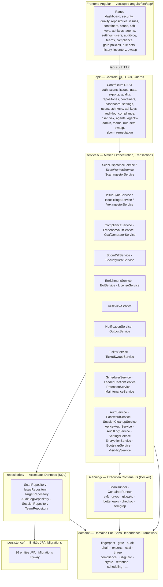

# Documentation Technique — Vectispire

Ce document décrit l'architecture interne de Vectispire, son modèle de données, et le flux d'exécution du pipeline d'analyse de sécurité.

---

### Origine & Philosophie du Nom : *Vectispire*

Le nom **Vectispire** est la fusion de deux piliers fondamentaux de la gouvernance de sécurité logicielle :
- **`Vectis`** *(latin pour le Levier de Sûreté & Verrou)* : La plateforme agit comme le **verrou cryptographique et le garde-fou politique** de la chaîne de livraison logicielle. Elle garantit l'opposabilité légale et technique par la signature DSSE Cosign, les attestations in-toto, les SBOMs déterministes, les avis VEX opposables (CSAF 2.0, OpenVEX, CycloneDX) et une chaîne d'audit inviolable.
- **`Spire`** *(la Tour de Guet & Posture globale)* : Offre un **point de vue panoramique élevé (ASPM)** sur l'ensemble du patrimoine applicatif — cartographie des dépendances multi-niveaux, calcul du rayon d'impact (*Blast Radius*), matrice des conflits de licences copyleft, et vélocité de remédiation MTTR sur l'ensemble des dépôts et parcs de conteneurs.

---

## 1. Architecture en Couches

Le système est découpé en deux composants distincts :
- Le **Control Plane** (Spring Boot 4.1 / JDK 25) dans `vectispire-java/`.
- L'**Interface Web** (Angular 21 / Optimus UI) dans `vectispire-angular/`.

### Règles d'Architecture Clés
1. **Domaine Pur** : La couche `common.domain` ne dépend d'aucun framework (pas de Spring, pas d'Hibernate, pas de JDBC). Cela garantit l'isolation, la testabilité exhaustive et la réutilisation sur l'agent distant.
2. **Isolation de l'Agent** : `vectispire-agent` ne dépend pas de `vectispire-core`. Aucun pilote JDBC ni accès base de données n'est présent sur le classpath de l'agent.
3. **Contrôle ArchUnit** : `ArchitectureTest` vérifie automatiquement à chaque build que les couches supérieures n'importent jamais de couches inférieures.

---

## 2. Modèle de Données & Schéma de Base de Données

Le schéma est géré par **Flyway** (`src/main/resources/db/migration/{vendor}/`) sur 4 moteurs de base de données :
- **PostgreSQL** : `BIGINT GENERATED ALWAYS AS IDENTITY`, `TIMESTAMPTZ`, `char(36)` UUID.
- **SQLite** : `INTEGER PRIMARY KEY AUTOINCREMENT`, `NUMERIC` (epoch ms), clés étrangères inline.
- **MySQL** : `BIGINT AUTO_INCREMENT`, `DATETIME(6)`, `BIT(1)`.
- **MariaDB** : `BIGINT AUTO_INCREMENT`, `DATETIME(6)`, `BOOLEAN`.

### Les 26 Tables de l'Application :
- **Cibles & Scans** : `t_repository`, `t_container`, `t_ssh_key`, `t_scan`, `t_ai_review_result`, `t_component`.
- **Vulnérabilités & Triage** : `t_issue`, `t_finding`, `t_issue_triage_event`, `t_gate_policy`, `t_semgrep_rule_set`.
- **Utilisateurs, Équipes & Accès** : `t_user`, `t_session`, `t_user_target`, `t_team`, `t_team_member`, `t_team_target`, `t_team_webhook`, `t_api_key`, `t_login_attempt`.
- **Système & Agents** : `t_agent`, `t_leader_lease`, `t_outbox_message`, `t_processed_message`, `t_audit_log`, `t_setting`.

---

## 3. Pipeline d'Analyse & Sécurité des Scanners

Chaque scanner s'exécute dans un conteneur éphémère Docker sous isolation stricte :
1. **Syft** : Génération du SBOM (Software Bill of Materials).
2. **Grype** : Analyse des dépendances et CVEs associées.
3. **Gitleaks & Betterleaks** : Détection multi-moteurs des secrets et identifiants exposés.
4. **Checkov / Semgrep** : Analyse statique (SAST) et Infrastructure-as-Code (IaC).

**Sécurité Conteneurs** :
- `cap_drop: ALL`, `no-new-privileges`.
- Montages en lecture seule (`read-only`).
- Réseau coupé (`network: none`) pour les scanners d'analyse locale.
- Images épinglées par digest SHA-256 immuable.

---

## 4. Conformité Réglementaire & Preuves d'Audit

Le moteur de conformité évalue en continu 5 référentiels majeurs :
- **NIS 2 Directive**, **DORA**, **ISO/IEC 27001:2022**, **PCI-DSS v4.0**, et **Cyber Resilience Act (EU CRA)**.
- **Export OASIS CSAF 2.0** (`/api/v1/csaf/aggregate.json`), **CycloneDX 1.5 BOM-Linked VEX** (`/api/v1/cyclonedx/aggregate.json`), et **OpenVEX v0.2.0** (`/api/v1/vex/aggregate.json`).
- **Ingestion VEX Amont Multi-Formats** (`POST /api/v1/vex/ingest`) pour l'extinction automatisée des vulnérabilités certifiées par les mainteneurs (OpenVEX / CSAF / CycloneDX).
- **Coffre de Preuves Scellé** (`/api/v1/compliance/evidence-bundle.zip`) incluant attestations in-toto, SBOMs, CSAF, OpenVEX, CycloneDX VEX, et piste d'audit cryptographique.

---

## 5. Gouvernance 4-Yeux & Rôles

- **Rôle `SECURITY_CHAMPION`** : Délégué sécurité d'équipe habilité à statuer sur les exemptions techniques.
- **Statut `PENDING_APPROVAL`** : Blocage préventif des Gates CI/CD sur toute dérogation initiée par un développeur jusqu'à validation par un pair qualifié.

---

## 6. Graphe de Dépendances & Rayon d'Impact (Blast Radius)

- **Moteur d'Impact (`BlastRadiusService`)** : Corrèle en mémoire l'arbre relationnel Cible (Dépôt Git / Conteneur) $\rightarrow$ Dépendance (Directe / Transitive) $\rightarrow$ CVE.
- **Calcul du Score de Rayon d'Impact** : Score 0-100 pondéré par la dispersion dans le parc, le caractère direct de l'inclusion, et le score CVSS maximal.
- **Endpoints API** :
  - `GET /api/v1/blast-radius/explore?q={package|CVE}` : Arbre relationnel et inventaire des cibles touchées.
  - `GET /api/v1/blast-radius/top-impact?limit=10` : Palmarès des composants à plus fort risque organisationnel.

---

## 7. Centre de Notifications Multi-Canaux & Outbox Transactionnelle

- **Canaux Supportés** :
  - **Slack** (`SlackNotificationChannel`, `SlackBlockKit`) : Alertes interactives formatées en blocs Block Kit.
  - **Microsoft Teams** (`TeamsNotificationChannel`, `TeamsCard`) : Adaptive Cards version 1.4 acheminées via Power Automate Workflow.
  - **Discord** (`DiscordNotificationChannel`, `DiscordEmbed`) : Rich Embeds avec couleur contextuelle selon sévérité.
  - **Email** (`MailNotificationChannel`) : Diffusion MIME/HTML sur listes de distribution.
  - **Webhook Générique / SIEM** (`NotificationService`) : JSON POST universel avec signature cryptographique HMAC-SHA256 (`X-Vectispire-Signature`).
- **Garanties Transactionnelles** :
  - Les messages sont écrits dans `t_outbox_message` dans la même transaction que le résultat de scan, avec politique de retry et backoff exponentiel isolé par canal.
- **Endpoints API** :
  - `GET /api/v1/notifications/channels` : Liste des canaux configurés et événements abonnés.
  - `POST /api/v1/notifications/test/{channelType}` : Déclenchement d'un test d'envoi immédiat avec diagnostic.

---

## 8. Assistant de Triage IA Local & Explicabilité des Vulnérabilités

- **Moteur d'Explicabilité (`AiReviewService`, `AiAdvisorController`)** :
  - Fournit une vulgarisation technique en français, détaille le scénario d'exploitation exact, analyse l'exposition réelle (reachability statique), génère les commandes CLI de mise à jour (`mvn`, `npm`, etc.) et propose une justification VEX formelle.
  - Fonctionnement hybride : inférence locale Ollama (zéro fuite de code vers des tiers) ou génération heuristique déterministe hors-ligne instantanée.
- **Endpoints API** :
  - `GET /api/v1/ai-advisor/status` : État du modèle local (Ollama) et modèles disponibles.
  - `POST /api/v1/ai-advisor/explain/issue/{issueId}` : Analyse complète et suggestion VEX pour une anomalie identifiée.
  - `POST /api/v1/ai-advisor/explain/cve/{cveId}` : Analyse à la volée d'une CVE avec paramètres optionnels de version.

---

## 9. Matrice des Risques Juridiques & Conflits de Licences (Copyleft)

- **Moteur de Compatibilité (`LicenseConflictMatrix`, `LicenseGovernanceService`)** :
  - Cartographie les compatibilités croisées entre licences open source (Permissif, Copyleft Faible, Copyleft Fort / Viral, Interdit).
  - Détecte les risques de contamination virale (ex: composant GPL-3.0 ou AGPL-3.0 intégré dans une application propriétaire obligeant légalement à la divulgation du code source).
  - Formule les conseils de remédiation juridique (remplacement par alternative MIT/Apache ou isolation en liaison dynamique).
- **Endpoints API** :
  - `GET /api/v1/licenses/conflicts?proprietary=true` : Liste des incompatibilités et violations de licences par cible.
  - `GET /api/v1/licenses/matrix` : Matrice de référence des règles d'interopérabilité juridique.

---

## 10. Tableau de Bord de Posture & Tendances MTTR Multi-Sévérités

- **Moteur d'Analytics de Posture (`PostureTrendAnalytics`, `DashboardController`)** :
  - Calcule en pur Java (indépendant du dialecte SQL) le MTTR moyen par palier de sévérité (Critique, Élevé, Moyen, Faible) sur 30j/90j/365j.
  - Suivi de la vélocité nette de remédiation (Net Burndown: nombre de résolutions vs découvertes).
  - Scoreboard de maturité sécurité par cible : classement de `A` à `F` et score 0-100 calculé selon le stock d'anomalies ouvertes et les délais de résolution.
- **Endpoints API** :
---

## 11. Découverte de la Surface d'Attaque & Inventaire des APIs Exposées

- **Moteur d'Extraction Statique d'APIs (`ApiDiscoveryScanner`, `ApiInventoryService`)** :
  - Détection automatique et statique sans AST lourd des endpoints HTTP pour Spring Boot (`@GetMapping`, `@PostMapping`, `@RequestMapping`), Express / NestJS (`app.get`, `router.post`), FastAPI / Flask (`@app.get`, `@bp.route`), et Go Gin (`r.GET`, `group.POST`).
  - Analyseur de spécifications et contrats OpenAPI 3.0 / Swagger 2.0 (JSON et YAML).
  - Découverte des règles d'exposition publique via Kubernetes Ingress.
- **Détection des Shadow APIs & Risques OWASP API Security** :
  - Identification des **Shadow APIs** (APIs non documentées actives dans le code source mais absentes des spécifications contractuelles).
  - Alerte sur les routes sensibles sans authentification (ex: `/admin`, `/actuator`, `/debug`, `/metrics`, `/env`) alignées sur les risques OWASP API Top 10 (BOLA, Broken Authentication, Improper Asset Management).
  - Export synthétisé de spécifications OpenAPI 3.0.3 pour les applications legacy non documentées.
- **Endpoints API** :
  - `GET /api/v1/attack-surface` : Résumé global de la surface d'attaque, inventaire des frameworks et endpoints à haut risque.
  - `DELETE /api/v1/attack-surface` : Purge atomique de l'ensemble des endpoints et contrats de la surface d'attaque.
  - `GET /api/v1/repositories/{id}/apis` : Inventaire complet des routes, contrats et dérive Shadow API d'un dépôt.
  - `DELETE /api/v1/repositories/{id}/apis` : Purge des endpoints et contrats d'un dépôt cible spécifique.
  - `GET /api/v1/repositories/{id}/apis/export/openapi` : Export dynamique du schéma OpenAPI 3.0.3 d'un dépôt.

---

## 12. Documentation OpenAPI 3.0 & Référence REST

- **Documentation Statique de Référence** :
  - [`docs/fr/api/rest_api_reference.md`](api/rest_api_reference.md) : Spécification complète et bilingue de l'ensemble des routes REST avec exemples `curl`.
- **OpenAPI 3.0 & Swagger UI Optionnels** :
  - En production, Swagger UI et `/v3/api-docs` sont **désactivés par défaut** pour éviter toute exposition de surface d'attaque (`springdoc.swagger-ui.enabled: false`).
  - Activables à la demande en staging ou développement via `VECTISPIRE_SWAGGER_UI_ENABLED=true` et `VECTISPIRE_API_DOCS_ENABLED=true`.

